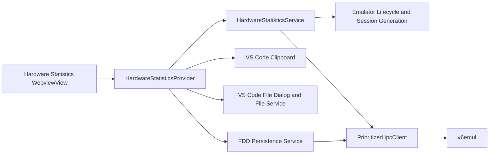

# V6 Hardware Statistics Panel Design

**Status:** Ready for extension implementation; emulator requests implemented
**Date:** 2026-08-01
**Owners:** v6vscode and v6emul maintainers
**Reference implementation:** `C:\Work\Programming\devector\src\main_imgui\main\ui\hardware_stats_window.cpp`
**Emulator protocol:** `C:\Work\Programming\v6emul\design\v6emul-hardware-statistics-design.md`

## 1. Objective

Replace the current read-only `TreeDataProvider` for **V6 Hardware Statistics** with a compact, interactive debug-sidebar view. The view presents timing, display, palette, RAM-disk, and FDC state from one emulator session and supports palette clipboard operations plus FDD mount/dismount actions. Port statistics are presented by the independent **Ports** editor panel.

The emulator is authoritative for hardware state. The extension host owns IPC, file access, clipboard access, lifecycle tracking, validation, and mutation serialization. The webview owns rendering, expansion state, focus, tooltips, and its accessible context menus; it never sends IPC or reads files directly.

## 2. Surface Decision

Keep the existing view ID, `v6.hardwareStatistics`, and its placement in the built-in Run and Debug sidebar, but change its contribution to `"type": "webview"` and register a `WebviewViewProvider`.

A native tree cannot provide the required horizontal swatch grid, separators, or item-specific Copy/Paste and Mount/Dismount menus. A `WebviewView` can provide these interactions while retaining the requested sidebar placement and view-title Refresh command.

The view uses the existing emulator lifecycle and prioritized `IpcClient`; it must not open a second connection. Replace `HardwareStatisticsView` with `HardwareStatisticsProvider`. Remove `CpuStatisticsPanel` after its remaining formatter dependencies are migrated to pure hardware-statistics formatters.

## 3. User Experience Contract

### 3.1 Layout

The view is one vertically scrolling, unframed surface. It uses compact two-column property rows and VS Code theme tokens. Sections are separated by a one-pixel horizontal rule; sections are not nested in cards.

The order is fixed:

1. Main statistics
2. Palette
3. Peripherals / RAM Disk
4. FDC

At narrow sidebar widths, labels remain fixed and values wrap or truncate with a complete tooltip. The palette may wrap from 16 to 8 or 4 columns while retaining square swatches.

### 3.2 Main Statistics

The first section has no heading and shows these rows in this exact order:

| Label | Display | Semantics |
|---|---|---|
| Up Time | `HH:MM:SS`, allowing hours above 99 | Format the server's `uptimeMs`, which accumulates emulated time since this statistics session started. It resets only for a new TCP session, not for pause/resume or reset/restart. |
| CPU Cycles | unsigned decimal | CPU cycles accumulated since this emulator session started. |
| Last Run | unsigned decimal | CPU cycles executed between the previous accepted paused snapshot and the latest stop. Derive this from the change in `cpuCycles` so paused `EXECUTE_INSTR` debugger steps are included even when the server run/stop latch is unchanged. Before the first completed run, use the server value. |
| CRT X/Y | `<pixel>/<scanline>` | Current raster pixel followed by current scanline. |
| Frame CC | unsigned decimal | CPU cycles since the start of the current frame. |
| Frame Num | unsigned decimal | Frame number since this emulator session started. |
| Display Mode | `256` or `512` | A wire mode of `0` displays `256`; a wire mode of `1` displays `512`. Reject other values as malformed. |
| Scroll V | `0xNN` | Current vertical-scroll byte in uppercase hexadecimal. |
| Rus/Lat | `True` or `False` | `True` when bit 3 of `GET_RUSLAT_HISTORY` is set, matching Devector. |
| INTE | `True` or `False` | Intel 8080 interrupt-enable output state. |
| IFF | `True` or `False` | Pending interrupt-enable flip-flop state. |
| HLTA | `True` or `False` | CPU halt state. |

Use `True` and `False` exactly, not `Yes/No`, `Set/Clear`, or symbolic checkboxes. All numeric values must be validated as non-negative safe integers at the IPC boundary.

### 3.3 Palette

After a separator, show the heading **Palette** and 16 square swatches in index order `0..15`. Each swatch has a stable square size of 18 CSS pixels, a visible focus indicator, an accessible label, and a checkerboard backing so dark colors remain distinguishable. The hardware byte is the source of truth.

Vector color format is `BBGGGRRR`. Convert it exactly as Devector does:

```text
r = (hwColor & 0x07) << 5
g = ((hwColor >> 3) & 0x07) << 5
b = ((hwColor >> 6) & 0x03) << 6
rgb24 = (r << 16) | (g << 8) | b
```

The immediate custom hover and keyboard-focus tooltip format is exactly:

```text
idx: <idx>, HW Color: 0xNN, RGB: 0xNNNNNN
```

Hex digits are uppercase and zero-padded. The tooltip is a hoverable custom element with `role="tooltip"` and `aria-describedby`; it remains within the view bounds. Do not also set the native HTML `title`, which would produce a duplicate delayed tooltip.

Right-click, the Context Menu key, or `Shift+F10` opens a custom accessible menu with:

- **Copy**: writes the canonical hardware byte, `0xNN`, to `vscode.env.clipboard`. The byte is lossless; RGB is derived and therefore is not the clipboard representation.
- **Edit**: replaces the selected swatch with an inline input initialized to `0xNN`. Enter or focus loss submits; Escape cancels. Submission accepts the same decimal, `0xNN`, `$NN`, or `NNh` byte forms as Paste and updates only after server acknowledgement.
- **Paste**: reads the clipboard in the extension host, accepts exactly one byte in decimal, `0xNN`, `$NN`, or `NNh` syntax, validates `0..255`, writes that byte to the selected palette index, then refreshes and verifies it. Invalid input leaves the palette unchanged and shows a VS Code error notification.

Paste is disabled while running, without a compatible session, or while another hardware-statistics mutation is active. Copy remains enabled for a cached valid swatch. Do not optimistically recolor a swatch before server acknowledgement.

### 3.4 Ports

Port statistics were extracted into the independent **Ports** editor panel. Hardware Statistics sends no port requests and contains no port disclosure or grid state.

### 3.5 Peripherals / RAM Disk

After a separator, show the heading **Peripherals**, then the subheading **RAM Disk** and these rows:

| Label | Display | Source semantics |
|---|---|---|
| Index | decimal `1..8` | Latest RAM disk whose mapping was enabled; wire `ramdiskIdx` is zero-based and UI is one-based, matching Devector. |
| RAM Mode | four-character mapping mask | Concatenate `8` or `-`, `AC` or `--`, and `E` or `-`; these identify enabled non-stack mapping ranges `0x8000..0x9FFF`, `0xA000..0xDFFF`, and `0xE000..0xFFFF`. |
| RAM Page | decimal `0..3` | Bank used for non-stack mapped accesses. |
| Stack Mode | `On` or `Off` | Whether stack-operation mapping is enabled. |
| Stack Page | decimal `0..3` | Bank used for stack accesses. |

When decoding the existing mapping byte: bits `0..1` are RAM Page, bits `2..3` are Stack Page, bit `4` is Stack Mode, and bits `5`, `6`, and `7` enable `A`, `8`, and `E` RAM mappings respectively. Reject out-of-range `ramdiskIdx` rather than wrapping it.

### 3.6 FDC

After a separator, show the heading **FDC** and these rows:

- **Selected Drive**: `A`, `B`, `C`, or `D` from selected drive index `0..3`.
- **Drive A**: the mounted FDD filename, or `dismounted` when empty.
- **Drive B**: the mounted FDD filename, or `dismounted` when empty.
- **Drive C**: the mounted FDD filename, or `dismounted` when empty.
- **Drive D**: the mounted FDD filename, or `dismounted` when empty.

The native delayed tooltip shows the complete mounted FDD path as plain text. A dismounted drive has the tooltip `No FDD mounted`. Do not also show the custom immediate tooltip used by palette swatches. Long paths are not placed in the visible value column. Clicking the status button opens the same mount/replace file dialog as the Mount context action.

Right-click, the Context Menu key, or `Shift+F10` opens a custom accessible menu containing:

- **Mount**: opens `vscode.window.showOpenDialog` in the extension host, limited to one file and FDD image filters. Read and validate the selected image, then send it with `driveIdx`, the normalized absolute path, and `autoBoot: false`. A cancelled dialog performs no mutation.
- **Dismount**: requests dismount of that drive. It is visible but disabled when the drive is already dismounted, while running, or while a drive mutation is active.

Mounting is allowed for either mounted or dismounted drives; choosing Mount for an occupied drive replaces its image only after handling unsaved writes. Before replacement or dismount, if `updated` is true, show a modal choice: **Save and Continue**, **Discard and Continue**, or **Cancel**. Save exports the current image to its recorded path and clears the dirty flag only after a successful write. Cancel leaves the drive unchanged. Reuse a generalized four-drive FDD persistence service rather than duplicating this logic in the provider.

After a mount or dismount acknowledgement, fetch the authoritative FDC snapshot and verify the target row. Serialize FDD mutations with existing lifecycle FDD operations so shutdown persistence cannot race a panel action.

## 4. Session, Refresh, and Failure Model

### 4.1 Session Generation

Introduce a monotonically increasing extension-host session generation. Increment it on connection/reconnection and clear snapshots on disconnect. Every webview message and asynchronous response is checked against the current generation; stale messages are ignored.

The server owns session-relative counters. A statistics session starts when the server accepts a TCP connection. The server-provided `sessionId` changes monotonically and the counters reset for the new connection. Reset/restart within the same connection does not reset Up Time, CPU Cycles, Last Run, or Frame Num.

### 4.2 Refresh Triggers

- On connection while stopped and visible: fetch the main/peripheral snapshot once.
- On every transition from running to stopped while visible: fetch a new main/peripheral snapshot.
- On hidden to visible while stopped: fetch a main/peripheral snapshot.
- On manual Refresh while stopped and visible: fetch a main/peripheral snapshot.
- While running: perform no statistics polling; display the last accepted snapshot with `Running; values refresh when paused`.
- While hidden: perform no statistics work and mark the snapshot dirty for the next visible stopped state.

Coalesce simultaneous triggers into one refresh transaction. Main/peripheral state is one atomic snapshot so values from different stops cannot be combined. Palette writes and drive mutations are serialized; refresh follows mutation acknowledgement.

### 4.3 States and Errors

The view has explicit states:

- **No session:** `No active emulator session`; no actions except Copy from a retained valid clipboard source, if intentionally retained. The default is to clear all state.
- **Running:** retain the last snapshot and show the running/stale status.
- **Synchronizing:** retain the previous snapshot, disable mutations, and show progress without replacing the layout.
- **Ready:** show the latest accepted paused snapshot.
- **Unsupported backend:** identify missing hardware-statistics capability or commands; do not fall back to hundreds of scalar reads.
- **Read failure:** retain the previous valid snapshot, mark it stale, log command and error, and expose Refresh.
- **Disconnected:** clear state, menus, pending requests, and selected rows.

One malformed field rejects the complete atomic snapshot. Mutation failures never alter the acknowledged UI state.

## 5. Data Model and Architecture

Use immutable validated models outside VS Code-dependent code:

```ts
interface HardwareMainSnapshot {
    sessionId: number;
    uptimeMs: number;
    cpuCycles: number;
    lastRunCycles: number;
    rasterPixel: number;
    rasterLine: number;
    frameCycles: number;
    frameNumber: number;
    displayMode: 0 | 1;
    scrollVertical: number;
    rusLat: boolean;
    inte: boolean;
    iff: boolean;
    hlta: boolean;
    palette: readonly number[]; // exactly 16 bytes
    ramDisk: {
        index: number;          // zero-based, 0..7
        mapping: number;        // packed byte
    };
    fdc: {
        selectedDrive: number;  // 0..3
        drives: readonly DriveSnapshot[]; // exactly four
    };
}

interface DriveSnapshot {
    mounted: boolean;
    path: string;
    updated: boolean;
}

```

Reads/writes and read/write counts may remain available to other FDD services but are not rendered by this panel.



Responsibilities:

- **HardwareStatisticsService** owns capability checks, typed requests, runtime response validation, atomic snapshots, refresh coalescing, mutation serialization, and change events. It has no DOM dependency.
- **HardwareStatisticsProvider** owns webview lifecycle, visibility, messages, file/clipboard prompts, stale-generation rejection, and posting service snapshots.
- **Webview assets** own rendering, disclosure state, keyboard interaction, tooltips, and context-menu presentation. They treat every host message as a replacement snapshot.
- **FDD persistence service** owns dirty-image save/discard/export/reset behavior for all four drives and coordinates shutdown, replacement, and dismount.

Proposed source layout:

```text
src/
  debug/
    hardware-statistics/
      hardware-statistics-model.ts
      hardware-statistics-codec.ts
      hardware-statistics-format.ts
      hardware-statistics-service.ts
    views/
      hardware-statistics-provider.ts
      hardware-statistics-messages.ts
      assets/
        hardware-statistics.css
        hardware-statistics.js
  emulator/
    persistence/
      fdd-persistence.ts
```

## 6. Emulator Request Requirements

This section records the implemented server contract and the existing requests reused by the feature. All commands must be advertised by `GET_SERVER_INFO`. The snapshot requires `capabilities.hardwareStatsSchema: 1`; palette paste requires `paletteEntryMutation: true`; dismount requires `fddDismount: true`. `hardwareStatsWhileRunning: true` advertises that snapshots are safe while running, while `runningHardwareMutations: false` confirms that palette and FDD mutations remain stopped-only. Unsupported servers show the explicit unsupported-backend state.

### 6.1 Existing Requests That Can Be Reused

| Command | ID | Use | Required change |
|---|---:|---|---|
| `GET_IO_PORTS_IN_DATA` | 30 | Fetch all 256 last-IN bytes as MessagePack binary in `{ bytes }`. | No semantic change. |
| `GET_IO_PORTS_OUT_DATA` | 31 | Fetch all 256 last-OUT bytes as MessagePack binary in `{ bytes }`. | No semantic change. |
| `MOUNT_FDD` | 92 | Mount/replace one FDD using `{ data, driveIdx, path, autoBoot: false }`. | Validate drive `0..3`, image size, and fields; return authoritative mount status. |
| `GET_FDD_IMAGE` | 25 | Export dirty image before replace/dismount. | No semantic change. |
| `RESET_UPDATE_FDD` | 49 | Clear dirty state after a successful host write. | No semantic change. |

The current `GET_HW_MAIN_STATS` response is not sufficient as the final contract: it omits session uptime and last-run cycles, exposes converted palette colors instead of raw `BBGGGRRR` bytes, and does not atomically include RAM-disk and all FDC/drive state. Composing `GET_REGS`, `GET_MEMORY_MAPPING`, `GET_FDC_INFO`, and four `GET_FDD_INFO` calls can mix values from different stop states and adds avoidable traffic.

### 6.2 Hardware Statistics Snapshot (Implemented)

Use `GET_HARDWARE_STATS`, command `96`, schema `1`. Legacy command `45`, `GET_HW_MAIN_STATS`, remains unchanged and must not be interpreted as this schema.

Request:

```json
{}
```

Response:

```json
{
  "sessionId": 7,
  "uptimeMs": 123456,
  "cpuCycles": 370368000,
  "lastRunCycles": 19874,
  "rasterPixel": 320,
  "rasterLine": 120,
  "frameCycles": 23120,
  "frameNumber": 6543,
  "displayMode": 1,
  "scrollVertical": 254,
  "rusLat": true,
  "inte": true,
  "iff": false,
  "hlta": false,
  "palette": [0, 1, 2, 3, 4, 5, 6, 7, 64, 65, 66, 67, 252, 253, 254, 255],
  "ramDisk": { "index": 0, "mapping": 176 },
  "fdc": {
    "selectedDrive": 0,
    "drives": [
      { "mounted": true, "path": "C:/disks/system.fdd", "updated": false },
      { "mounted": false, "path": "", "updated": false },
      { "mounted": false, "path": "", "updated": false },
      { "mounted": false, "path": "", "updated": false }
    ]
  }
}
```

Server semantics:

- The server serializes dispatch on the emulation thread and captures every field at one request boundary. While running, this occurs at an instruction boundary without stopping execution.
- Preserve counters across reset/restart within one connection; reset them when a new TCP connection starts a statistics session.
- Latch `lastRunCycles` when execution transitions from running to stopped. Repeated reads while stopped return the same value.
- Return raw palette bytes, not converted ABGR/RGB values.
- Return exactly 16 palette entries and exactly four drive entries.
- Keep `fdc.selectedDrive` unchanged when the selected drive has no media.
- Use 64-bit counters on the server and fail with `dispatch_error` before returning a MessagePack integer above JavaScript's maximum safe integer. A future schema must define bigint encoding before exceeding that range.

The extension intentionally refreshes this panel only while stopped even though the server advertises `hardwareStatsWhileRunning: true`; this preserves one paused snapshot across the full view and avoids competing with debug-control traffic. The running capability permits future live main-statistics refresh without a protocol change. Port requests remain independently gated by visibility and expansion.

#### Schema 1 Compatibility Handling

The live server has two representation/source details handled by the extension codec:

- `displayMode` may be emitted as a MessagePack Boolean or numeric `0 | 1`; the decoder normalizes both to numeric `0 | 1` and rejects any other representation.
- `rusLat` is derived from bit 3 of the RUS/LAT history register, matching legacy Devector statistics.

Future server versions should emit numeric `displayMode`, but accepting the live Boolean representation is an intentional schema-1 compatibility rule covered by decoder tests.

### 6.3 Set Palette Entry (Implemented)

Use `SET_IO_PALETTE_ENTRY`, command `97`, schema `1`. Require the command advertisement and `paletteEntryMutation: true`.

Request:

```json
{ "index": 0, "hwColor": 255 }
```

Response:

```json
{ "index": 0, "hwColor": 255 }
```

The request must contain exactly `index` and `hwColor`. Validate `index` in `0..15` and `hwColor` in `0..255`. The server rejects malformed input with `invalid_request` and rejects running-state mutation with `dispatch_error`; neither failure mutates hardware. This command updates the selected palette register immediately without changing palette commit timing. The extension verifies the result with `GET_HARDWARE_STATS`.

### 6.4 Dismount FDD (Implemented)

Use `DISMOUNT_FDD`, command `98`, schema `1`. Require the command advertisement and `fddDismount: true`.

Request:

```json
{ "driveIdx": 0 }
```

Response:

```json
{ "driveIdx": 0, "mounted": false }
```

The request must contain exactly `driveIdx`. Validate `driveIdx` in `0..3`. The server rejects malformed input with `invalid_request` and rejects running-state mutation with `dispatch_error`; neither failure mutates hardware. Dismount is idempotent for an already empty drive. It clears mounted state and path without implicitly saving, discarding, or clearing dirty in-memory data; the extension must resolve dirty state before sending it. If the selected drive is dismounted, reads behave as no media present while the selected-drive register remains unchanged. The extension verifies mounted state and the cleared path with `GET_HARDWARE_STATS`.

### 6.5 Port Payload (Implemented)

Both existing commands return `{ "bytes": <256-byte MessagePack binary> }`. `@msgpack/msgpack` decodes the binary as `Uint8Array`; the extension validates its exact length and each byte before displaying it. This avoids unsafe packed 64-bit integers and requires no per-byte fallback.

## 7. Webview Messages, Security, and Accessibility

Use a CSP nonce, external script/style assets, no remote sources, and narrow `localResourceRoots`. Render all path and status text through `textContent`; never interpolate emulator or clipboard data into HTML.

Host-to-webview messages are discriminated snapshots containing session generation, view state, main snapshot, pending actions, and user-facing errors. Webview-to-host messages are limited to:

- `ready`
- `refresh`
- `copyPalette` with session generation and palette index
- `pastePalette` with session generation and palette index
- `mountDrive` with session generation and drive index
- `dismountDrive` with session generation and drive index

The host re-derives the current color and drive from its acknowledged snapshot. It validates discriminants, primitive types, generation, index bounds, current execution state, and action enablement. Webview-provided values are never sent directly to IPC.

Use semantic headings, property tables, roving focus for swatches, `role="menu"` context menus, and `role="tooltip"` tooltips. Menus support arrow keys, Home/End, Enter/Space, Escape, focus return, and dismissal on scroll, blur, snapshot replacement, session change, or view disposal. Every pointer action has the stated keyboard equivalent.

## 8. Contributions and Lifecycle

Update `package.json`:

- Set `v6.hardwareStatistics` to `"type": "webview"` under `views.debug`.
- Keep `v6.refreshHardwareStatistics` in `view/title` with `$(refresh)`.
- Add `onView:v6.hardwareStatistics` if explicit activation is needed for the supported VS Code engine.

Register with `vscode.window.registerWebviewViewProvider` and use `retainContextWhenHidden: true` only for lightweight DOM expansion/focus state. Visibility still gates all IPC work. Dispose lifecycle listeners, webview listeners, in-flight refresh tokens, and service events when the provider is disposed. Hiding the view does not own or stop the emulator.

## 9. Test Strategy

### Unit Tests

- Main-row order and exact formatting, including `True/False`, `0xNN`, display mode, long uptime, zero Last Run, and safe-integer rejection.
- `BBGGGRRR` to RGB24 conversion for boundaries and representative colors; exact tooltip text.
- Clipboard parser acceptance and rejection; palette index/value validation.
- Mapping-byte decoding for every bit and one-based RAM-disk Index formatting.
- Snapshot runtime validation for array lengths, enums, drive count/index, paths, booleans, and unknown/missing fields.
- Refresh reducer behavior for visible/hidden, running/stopped, duplicate triggers, and stale generations.
- Menu enablement and dirty-drive save/discard/cancel outcomes.

### Extension Host and Integration Tests

- Webview contribution/registration, CSP, ready handshake, visibility changes, and disposal.
- Exactly one main snapshot request per coalesced paused refresh.
- Palette Copy/Paste uses host clipboard, rejects forged indices and invalid clipboard text, serializes mutation, and verifies acknowledgement.
- Drive Mount uses the host file dialog and sends the selected drive/path/data with `autoBoot: false`.
- Dismount disabled for empty media; dirty Save/Discard/Cancel behavior; authoritative post-mutation refresh.
- Disconnect/reconnect and delayed response rejection by session generation.
- Malformed server data retains the previous valid snapshot and logs a useful error.

### Real-Emulator Tests

- Compare all main fields with Devector while paused after run, step, reset, and restart.
- Verify Last Run across repeated pause/resume cycles and Frame CC at known raster positions.
- Compare all 16 swatches and tooltip bytes/RGB values against Devector.
- Execute known `IN`/`OUT` instructions and verify the corresponding port cells.
- Exercise every RAM mapping bit/page and all RAM-disk indices.
- Mount, replace, dirty-save, dirty-discard, cancel, and dismount drives A-D; verify paths and selected drive.
- Confirm no statistics traffic while hidden/running and bounded requests during 100 rapid stop/expand/collapse cycles.

## 10. Delivery Sequence

1. Define the schema 1 `displayMode` compatibility handling and `rusLat` source recorded in Section 6.2.
2. Add commands `96..98`, typed extension models, validators, formatters, port decoding, and exact server capability checks.
3. Implement `HardwareStatisticsService` with session generation, atomic refreshes, coalescing, and serialized mutations.
4. Generalize FDD persistence to all four drives and add replace/dismount dirty-state coordination.
5. Replace the native tree with the webview provider and implement the full layout, tooltips, menus, and keyboard behavior.
6. Add unit, extension-host, and real-emulator tests; update emulator, debugging, command, and protocol documentation.
7. Remove obsolete tree/CPU-statistics presentation code only after parity tests pass.

## 11. Acceptance Criteria

- The debug sidebar shows the requested main fields in the required order and formats, sourced from one paused-state snapshot.
- Palette shows 16 square swatches with exact tooltips and acknowledged Copy/Paste behavior.
- Peripherals shows the five requested RAM-disk fields with Devector-compatible mapping semantics.
- FDC shows selected drive, mounted/dismounted state and path tooltips for A-D, plus Mount/Dismount context actions with correct disabled and dirty-image behavior.
- Running, hidden, disconnected, unsupported, synchronizing, stale, and ready states are explicit and do not leak requests or stale cross-session data.
- All new server requirements are capability-negotiated and covered by protocol contract tests.

## 12. Implementation Checklist

- [x] Allocate command IDs `96..98` and advertise `hardwareStatsSchema: 1` plus mutation/running capabilities.
- [x] Implement atomic `GET_HARDWARE_STATS` with session counters, raw palette, RAM mapping, and four-drive FDC state.
- [x] Implement stopped-only `SET_IO_PALETTE_ENTRY`.
- [x] Implement stopped-only, idempotent `DISMOUNT_FDD`.
- [x] Resolve and test schema 1 `displayMode` compatibility and authoritative `rusLat` semantics.
- [x] Return a lossless 256-byte MessagePack binary port payload and cover it with protocol decoding tests.
- [x] Add extension IPC command enums, request/response models, runtime validators, and capability checks.
- [x] Add pure formatting, color conversion, mapping decoding, and clipboard parsing helpers.
- [x] Implement `HardwareStatisticsService` with session generation, coalesced snapshots, and serialized mutations.
- [x] Generalize FDD persistence and coordinate dirty Save/Discard/Cancel for all drives.
- [x] Replace `HardwareStatisticsView` with a registered `HardwareStatisticsProvider` webview view.
- [x] Implement compact main statistics, separators, 16 swatches, RAM Disk, and FDC sections.
- [x] Extract port statistics into the independent Ports editor panel.
- [x] Implement accessible palette and drive context menus, tooltips, keyboard operation, and focus restoration.
- [x] Gate palette and FDD mutations while running and verify every mutation with an authoritative snapshot.
- [x] Add unit tests for formatting, validation, decoding, refresh state, and stale-generation rejection.
- [ ] Add extension-host tests for visibility/expansion query gating, clipboard, file dialogs, FDD dirty handling, and lifecycle disposal.
- [ ] Add real-emulator protocol and behavior tests against Devector semantics.
- [x] Update `package.json`, emulator/debugging/protocol documentation, and remove obsolete presentation code after parity.
