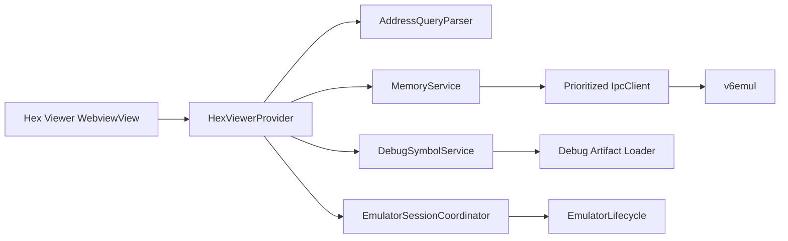

# V6 Hex Viewer Panel Plan

**Status:** Proposed
**Date:** 2026-07-31
**Owners:** v6vscode and v6emul maintainers
**Related work:** `debug-adapter-and-debug-views-plan.md`, Step 3.14

## 1. Objective

Add a responsive, read-only Hex Viewer for the active emulator session. The viewer must cover Main RAM and every supported RAM-disk bank, navigate by address or debug symbol, highlight ranges, and remain useful during both Run Project and debug sessions.

The first release intentionally excludes byte editing. Read correctness, session stability, keyboard navigation, and a protocol contract that can support future editing are higher priorities than expanding the initial surface area.

## 2. VS Code Surface Decision

Contribute **V6 Hex Viewer** as a `WebviewView` in VS Code's built-in **Run and Debug** container (`views.debug`). Use `registerWebviewViewProvider`, not an editor-tab `WebviewPanel`.

VS Code has a Hex Editor extension and custom-editor surface for files, but no supported API for supplying a live, banked, non-file address space to that editor. Mirroring emulator memory into temporary files would introduce stale snapshots, write-back ambiguity, unnecessary I/O, and lifecycle problems. A custom `WebviewView` is therefore the narrowest supported VS Code-native surface. It also places the viewer beside Hardware Statistics and preserves normal editor space.

Keep the domain, protocol, parsing, and virtualization logic independent of `vscode.WebviewView`. If VS Code later exposes an embeddable memory/hex control, only the presentation adapter should need replacement.

## 3. User Experience Contract

### 3.1 Layout

From top to bottom:

1. A search input with validation state and match summary.
2. A full-width memory-bank dropdown.
3. A virtualized hex grid filling the remaining view height.

The grid uses a fixed-width editor font and 16 bytes per row:

```text
       00 01 02 03 04 05 06 07 08 09 0A 0B 0C 0D 0E 0F   Symbols
0000   31 C0 00 ...                                       reset, boot_flag
0010   ...
...
FFF0   ...
```

The address and byte columns remain aligned at all view widths. The Symbols column lists symbols whose start address is on that row as compact `NAME @ +0C` entries, ordered by byte offset and then name. A symbol spanning bytes may highlight its known extent, but is listed only at its start address. If the view is too narrow, the Symbols column moves below the bytes for each visible row; horizontal scrolling is a last resort.

### 3.2 Memory Banks

Expose stable memory-space identities rather than deriving protocol addresses in the webview:

- `Main RAM`
- `RAM Disk 1 / Bank 0` through `RAM Disk 1 / Bank 3`
- Continue through `RAM Disk 8 / Bank 3`

This is 33 address spaces of exactly 65,536 bytes each. The extension host sends `{ kind: 'main' }` or `{ kind: 'ramDisk', disk: 1..8, bank: 0..3 }`; only the memory service translates this identity to the backend wire representation. Do not expose flattened global addresses as UI state.

Populate the dropdown from negotiated emulator capabilities. If the backend reports fewer disks or banks, show only supported spaces. The target contract is Main RAM plus 8 x 4 RAM-disk banks; absence of the geometry capability produces a clear compatibility state rather than guessed mappings.

Changing the bank:

- Cancels or invalidates in-flight reads for the previous bank.
- Preserves the current 16-bit offset, clamped to the bank.
- Re-resolves the current query in the new bank.
- Updates visible bytes and symbols atomically so data from two banks is never mixed.
- Persists the selected bank for the workspace.

### 3.3 Search and Range Grammar

The input is a go-to/range control, not a byte-pattern search. Version 1 accepts:

```ebnf
query       = location | location, "..", location ;
location    = decimal | hexPrefix | hexSuffix | hexDollar | symbol ;
decimal     = digit, { digit } ;
hexPrefix   = ("0x" | "0X"), hexDigit, { hexDigit } ;
hexSuffix   = hexDigit, { hexDigit }, ("h" | "H") ;
hexDollar   = "$", hexDigit, { hexDigit } ;
symbol      = symbolStart, { symbolPart } ;
symbolStart = letter | "_" | "." | "@" ;
symbolPart  = symbolStart | digit | "$" ;
```

Examples:

- `256` navigates to decimal address 256 (`0x0100`).
- `0x100`, `100h`, and `$100` navigate to `0x0100`.
- `main` navigates to symbol `main`.
- `$100..$17F` navigates to and highlights the inclusive 128-byte range.
- `buffer..buffer_end` resolves both symbol endpoints and highlights the inclusive range.

Rules:

- Bare digits are always decimal. Hexadecimal requires `0x`, `h`, or `$` notation.
- Whitespace around `..` is allowed; internal whitespace in a location is not.
- Ranges are inclusive at both ends and must remain in one selected 64 KiB bank.
- Both endpoints must resolve to `0x0000..0xFFFF`, and start must be less than or equal to end.
- Symbol matching is exact and case-sensitive first. A unique case-insensitive match may be offered as a suggestion, but ambiguous matches are an error with candidate names.
- Version 1 symbols are scoped to Main RAM because the current debug metadata contains only 16-bit CPU addresses and no RAM-disk identity. Selecting any RAM-disk bank disables symbol search and **Find in Source** while numeric navigation continues to work. Duplicate symbol names are presented as candidates and are never resolved by silently choosing one.
- An empty input clears search highlighting without moving the viewport.
- Invalid or incomplete text keeps the last valid viewport and highlight, shows VS Code validation styling, and never sends a memory request.
- Clicking a rendered symbol places its name in the search field and highlights its known extent without scrolling the viewport. Hovering a symbol shows its associated CPU address.

The explicit `..` delimiter avoids ambiguity with symbol characters and leaves room for future expression support. A range is only a client-side navigation and highlighting feature: it never determines the server read length or refresh scope. Server communication always depends exclusively on the currently visible rows. Arithmetic such as `symbol+4` and byte-pattern search are out of scope until a versioned expression grammar is designed.

### 3.4 Incremental Navigation

On every input event:

1. Send the current input to the extension host and parse it immediately.
2. Update validation state immediately.
3. After a short 75 ms trailing delay, resolve a valid query, scroll its first address into view, update the address/range highlight, and request the new visible rows.

Do not wait for `Enter`; the delay exists only to avoid unnecessary viewport reads while the user is still typing. Use one replaceable timer rather than a general-purpose request scheduler. If another input event arrives before the timer fires, replace the pending query. The view discards responses whose bank or session ID no longer matches current state. A query change reads the same visible rows as scrolling would; the query range never becomes a memory-read request.

Pressing `Enter` commits a valid non-empty query to history. Deduplicate consecutive identical entries and cap workspace history at 50 entries. `ArrowUp` and `ArrowDown` traverse older and newer committed queries only while focus is in the search input, matching VS Code search-field behavior. Editing after history navigation creates a draft; `Escape` restores the draft or clears the active highlight when no draft exists. History is stored in `ExtensionContext.workspaceState`, never project files.

### 3.5 Grid Interaction and Highlighting

- Header: sticky `00` through `0F` plus `Symbols`.
- Row addresses: uppercase, zero-padded `0000` through `FFF0`.
- Bytes: uppercase, zero-padded `00` through `FF`.
- Search address: focused-cell highlight.
- Search range: inclusive range highlight across all visible covered bytes.
- Current PC: a distinct outline in Main RAM only, when available.
- Symbol extent: subtle secondary decoration that must not obscure search or PC state.
- Hovering a byte highlights both its table row and that byte. The byte highlight has stronger contrast than the row highlight and must remain distinguishable from search/range, PC, and symbol decorations.
- The byte hover/focus tooltip uses the text `Address: 0xNNNN, char: C`, with an uppercase zero-padded address. For `0x21..0x7E`, `C` is the literal printable ASCII character; represent `0x20` as `space` and other values as `.`. Set tooltip content through DOM `textContent`, never `innerHTML`, so quotes, backslashes, and markup-sensitive characters remain literal text.

The grid supports keyboard focus by byte: arrow keys move one byte/row, `PageUp`/`PageDown` move by the visible page, `Home`/`End` move to row or bank boundaries using standard modifier behavior. Use a roving `tabindex`, meaningful ARIA row/column labels, and theme tokens for normal, high-contrast, and reduced-motion environments.

### 3.6 Context Menu and Source Navigation

Right-clicking a byte cell or symbol entry opens a custom DOM context menu inside the webview, anchored to the target. VS Code does not expose native context-menu contributions for arbitrary webview DOM elements. The custom menu uses `role="menu"`/`role="menuitem"`, managed focus, and arrow-key navigation. Keyboard users can open it with the Context Menu key or `Shift+F10`. The target remains highlighted while the menu is open, and focus returns to it when the menu closes.

The menu contains:

- **Copy**: for a byte, copy its displayed uppercase two-digit hexadecimal value without a prefix (for example, `7F`); for a symbol, copy the symbol name exactly as displayed. Perform the clipboard write in the extension host through `vscode.env.clipboard.writeText`, not through browser clipboard permissions.
- **Find in Source**: available only for Main RAM and only when `DebugSymbolService`/`DebugIndex.resolveAddress` returns an exact DWARF row for the target address. For a symbol, use its start address; for a byte, use the byte address. Open the related source file with `vscode.window.showTextDocument`, reveal the metadata line, and place the editor selection at the metadata column when available. Do not fall back to an enclosing symbol. Keep the item visible but disabled with the reason `Source location unavailable` for RAM-disk banks or when debug metadata is absent, stale, ambiguous, or has no exact row for the address.

Close the menu on action, `Escape`, focus loss, scrolling, bank change, or session change. Context-menu messages carry the session ID, memory-space identity, address, and optional symbol identity; the extension host validates all fields and re-resolves source metadata rather than trusting a webview-supplied file path or line number. Source navigation is supported only for memory spaces explicitly represented by the loaded debug metadata.

## 4. Architecture



### 4.1 Ownership Boundaries

**`EmulatorSessionCoordinator`** is the extension-wide authority for session identity, execution state, negotiated capabilities, stop/write invalidation events, and access to the shared `IpcClient`. Introduce this boundary before adding another direct lifecycle/client consumer. It prevents the Hex Viewer, Hardware Statistics, display panel, and DAP adapter from independently inferring state.

**`MemoryService`** owns bank validation, protocol translation, viewport reads, bounds checks, coherent-read policy, and the full session memory cache. It exposes a typed API such as:

```ts
interface MemorySpace {
    kind: 'main' | 'ramDisk';
    disk?: number;
    bank?: number;
}

interface MemoryReadResult {
    space: MemorySpace;
    offset: number;
    bytes: Uint8Array;
    unreadableBytes: number;
    snapshotId?: number;
}
```

**`DebugSymbolService`** owns the latest validated artifact and exposes immutable query methods to all extension features. The current `DebugIndex` is private to `V6DebugAdapter`; do not reach into the adapter. Extend it with ordered Main-RAM range queries (`symbolsInRange(start, end)`) and duplicate-name candidate results without changing existing DAP lookups. Loading remains atomic: consumers see either the previous complete index or the new complete index. Bank-aware symbols are a future metadata feature, not inferred in version 1.

**`AddressQueryParser`** is pure TypeScript with no VS Code or DOM dependencies. It returns a discriminated result for empty, incomplete, invalid, address, and range input. Symbol resolution is a separate step so parser tests do not require an ELF fixture.

**`HexViewerProvider`** owns webview lifecycle, typed message validation, workspace-state persistence, view visibility, context-menu command handling, clipboard writes, source-document navigation, and orchestration. It does not parse protocol payloads, derive global addresses, or trust source paths supplied by the webview.

**Webview assets** own rendering, focus, keyboard behavior, viewport calculation, and stale-response rejection. Treat every message from the webview as untrusted input and validate its type, bounds, and size in the extension host.

### 4.2 Proposed Source Layout

```text
src/
  emulator/
    memory/
      memory-space.ts
      memory-service.ts
    protocol/
      memory-models.ts
  debug/
    metadata/
      debug-symbol-service.ts
    views/
      hex-viewer-provider.ts
      hex-viewer-messages.ts
      hex-viewer-query.ts
      hex-viewer-virtualizer.ts
      assets/
        hex-viewer.css
        hex-viewer.js
test/unit/
  debug/views/
  emulator/memory/
test/features/hex-viewer/
```

Keep virtualization calculations in a DOM-independent module so row-window behavior can be exhaustively unit tested.

## 5. Emulator Protocol Contract

Do not build the viewer on repeated `GET_BYTE_RAM` calls or the undocumented shape of `GET_MEM_STRING_GLOBAL`. Use the validated `GET_MEM` command advertised through `GET_SERVER_INFO`.

Request:

```text
GET_MEM {
  addr: uint32,
  len: uint32
}
```

Response:

```text
{
  addr: uint32,
  data: byte[]
}
```

Global memory mapping:

- Main RAM is `0x00000..0x0FFFF`.
- RAM Disk 1 / Bank 0 is `0x10000..0x1FFFF`.
- The remaining 31 RAM-disk banks occupy consecutive 64 KiB intervals in disk-major, bank-minor order.

Backend requirements:

- Validate every field and reject malformed, fractional, negative, zero-length, overflowing, or out-of-global-memory requests with structured errors.
- Never wrap at the end of global memory.
- Return the requested bytes in address order.
- Contain all dispatch exceptions at the IPC boundary so an invalid viewer request cannot terminate emulation.
- Add native boundary, malformed-input, running-state, reconnect, and all-bank mapping tests.

The extension must check command `93` before enabling the grid. An older emulator shows an actionable message containing the emulator version and required command; it must not silently fall back to thousands of single-byte requests.

Memory requests use `normal` IPC priority. Debug control and stop detection remain `critical`/`high`; display frames remain `low`. A visible viewport is normally about 1 KiB and typing is low-frequency, so version 1 uses the existing serialized IPC queue. The 75 ms search delay prevents avoidable intermediate requests. Do not add a separate scheduler unless measurement shows sustained queue growth or debug-control latency.

## 6. Data Loading and Virtualization

Render only visible rows plus a bounded overscan, initially 8 rows above and below. A 64 KiB bank has 4,096 logical rows but must not create 4,096 row elements or 65,536 byte elements.

Use fixed row height measured once from VS Code font variables, with a top spacer, rendered row window, and bottom spacer. Recalculate on resize and font/theme changes without moving the selected address.

The client maintains a complete cache for Main RAM and all 32 RAM-disk banks: 33 fixed 65,536-byte value buffers plus validity state. Raw byte storage is 2,162,688 bytes (about 2.1 MiB), which is small enough to keep for the active session and substantially simplifies rendering and bank changes. Cache allocation does not cause memory reads.

Read exactly the address interval currently visible in the UI as one bulk request when it is within the backend's negotiated maximum. Split only when the visible interval exceeds that maximum, and keep every subrequest within the visible interval. Do not align requests outward and do not request overscan, prefetch, search-range, near-viewport, or full-bank data.

- Copy successful response bytes into their absolute offsets in the selected bank's cache and mark those offsets valid.
- Render visible valid bytes from the cache; render unavailable placeholders for visible offsets not yet read. Render overscan from cache only.
- Clear cache validity on session disconnect/reconnect or capability/geometry change. The fixed value buffers may be reused after validity is cleared.
- On a new paused snapshot, refresh only the visible interval.
- While emulation is running and the view is visible, request the visible interval once every second. Do not poll hidden, overscan, search-range, or non-selected-bank data. If coherent live reads are not advertised, retain and label the last coherent cache values as stale.
- On hide, stop polling. On reveal, fetch only the visible interval.

Send bytes to the webview as transferable/binary typed arrays where supported. Never expand bytes to hexadecimal strings in extension-host messages; formatting belongs in the renderer.

## 7. State, Lifecycle, and Failure Modes

Persist per workspace:

- Last selected bank.
- Last valid query and selected address.
- Up to 50 committed search-history entries.

Do not persist memory bytes, symbols, protocol capabilities, or session identifiers.

Viewer states:

- **No session:** controls remain visible; grid states that no emulator session is active.
- **Connecting:** preserve navigation state and show progress without clearing the grid prematurely.
- **Ready/paused:** current snapshot, search, symbols, and PC decorations are active.
- **Running/coherent:** the visible interval updates once per second and is labeled live.
- **Running/non-coherent:** last paused snapshot remains visible and is labeled stale.
- **Unsupported backend:** explain the minimum required emulator/protocol capability.
- **Read failure:** retain the previous good data, mark the affected rows unavailable, log structured context, and provide a Refresh command.
- **Disconnected:** reject stale responses, clear session-owned cache, retain only navigation preferences.

One failed visible-interval read or subrequest must not blank previously cached data. Retry only on explicit refresh, a new stop snapshot, the next one-second refresh, or bounded exponential backoff for transient transport errors; never create a tight retry loop.

## 8. VS Code Contributions

Add to `package.json`:

- `views.debug`: `v6.hexViewer`, type `webview`, name `V6 Hex Viewer`.
- `v6.refreshHexViewer` command with `$(refresh)` icon in `view/title`.
- Optional `v6.focusHexViewerSearch` command after the initial release if a reliable webview-focus handoff is verified.
- `onView:v6.hexViewer` activation event so opening the view activates its provider before any Run Project or debug action.

Register the provider and command in `src/extension.ts` through the existing `DisposableStore`. Use `WebviewViewProviderOptions.retainContextWhenHidden` only after measuring memory cost; correctness must not depend on retained DOM state because state is owned by the extension host and `workspaceState`.

Use a CSP nonce, no inline executable script, `localResourceRoots`, and VS Code theme variables. Keep all display text localizable in structure even if localization is not introduced in this feature.

## 9. Delivery Plan

### Phase 0 - Confirm Native Contract

1. Specify the exact v6core mapping from `(main | disk, bank, offset)` to physical memory.
2. Confirm whether Main RAM means CPU-visible mapped memory or physical base RAM; this plan assumes physical Main RAM. If users need CPU-visible mapped memory, add it later as a separately named space.
3. Implement and test bulk reads, capability geometry, coherent-read semantics, and structured failures in v6emul.
4. Update and package the minimum compatible v6emul binary.

**Gate:** A smoke client reads first/middle/last bytes from all 33 spaces and malformed requests do not destabilize the emulator.

### Phase 1 - Shared Extension Services

1. Introduce `EmulatorSessionCoordinator` without changing existing behavior.
2. Add typed capability storage and memory-space models.
3. Implement `MemoryService` with validation, viewport-only bulk reads, and the complete 33-bank session cache with per-byte validity state.
4. Extract artifact ownership into `DebugSymbolService`; preserve all DAP breakpoint behavior.
5. Add `symbolsInRange` and duplicate-name handling to `DebugIndex`.

**Gate:** Existing compile/unit/regression tests pass; service tests cover reconnects, state transitions, all bank identities, partial reads, and cache invalidation.

### Phase 2 - Query and Read-Only View

1. Implement the pure query parser and symbol resolver.
2. Contribute and register `v6.hexViewer`.
3. Build the bank selector, search/history behavior, virtualized grid, symbol column, keyboard navigation, and theme/accessibility states.
4. Add visibility-aware reads, refresh command, PC decoration, and workspace persistence.
5. Instrument debug-level timing for read latency, bytes requested, stale responses dropped, and render-window size without logging memory contents.

**Gate:** All acceptance criteria in Section 11 pass with display frame polling active.

### Phase 3 - Integration and Hardening

1. Add Extension Host tests for contribution registration, view restoration, lifecycle transitions, command routing, and unsupported backend UX.
2. Add real-emulator feature tests covering Run Project and debug sessions, all banks, rapid bank/query changes, pause/continue, reconnect, and shutdown.
3. Test Windows paths, remote extension hosts, high-contrast themes, 200% zoom, narrow sidebars, and keyboard-only operation.
4. Update `docs/debugging.md`, `docs/emulator.md`, `docs/commands.md`, and `docs/architecture.md`.
5. Remove the duplicate Hex Viewer subsection from the broader debugger plan or mark it implemented with a link to this plan.

**Gate:** No leaked timers/listeners, no stale cross-session data, and no measurable degradation to stepping or display responsiveness.

### Phase 4 - Optional Editing

Only after read-only telemetry is stable, consider byte editing while paused. It requires a separate design for write capabilities, confirmation/undo semantics, ROM/read-only regions, partial writes, cache invalidation, DAP `writeMemory`, and coordination with watchpoints. Do not infer write support from read support.

## 10. Test Strategy

### Unit Tests

- Every accepted numeric form at `0`, `255`, `256`, and `65535`.
- Invalid digits, signs, overflow, empty endpoints, reversed ranges, and more than one `..`.
- Exact, unique case-insensitive, missing, and ambiguous symbols.
- Inclusive range length and row/byte highlight boundaries.
- History traversal, draft restoration, deduplication, and 50-entry eviction.
- All 33 memory-space identities and rejection of invalid disk/bank combinations.
- Full-cache indexing for Main RAM and all 32 RAM-disk banks, validity clearing, viewport boundaries, and `0xFFFF`.
- Virtual windows at first row, middle, final row, resize, and overscan limits.
- Replacement of a pending delayed search, plus stale-response rejection after bank, session, and visibility changes.
- Symbol ordering, duplicate addresses, zero-size symbols, and range intersections.
- Hover row/byte state and tooltip formatting for printable characters, `space`, non-printable values, quotes, backslashes, and markup-sensitive characters through `textContent`.
- Context-menu target retention, byte/symbol Copy payloads, and close conditions.
- `Find in Source` resolution for exact rows, unavailable metadata, stale sessions, incompatible banks, and metadata columns.

### Integration Tests

- Webview message schema validation and CSP/resource setup.
- Search input to parser to viewport/read request flow.
- Bank change with a delayed old-bank response.
- Pause/continue behavior for coherent and non-coherent backends.
- Stop/write invalidation and refresh.
- Artifact reload while the view is open.
- Clipboard routing and source-file opening from byte and symbol context-menu targets.
- Rejection of forged source paths, stale session IDs, invalid addresses, and mismatched memory spaces from webview messages.
- View disposal/recreation and workspace-state restoration.
- Shared IPC priority under simultaneous frame, debugger, statistics, and memory requests.

### Real-Emulator Tests

- Known sentinel bytes in Main RAM and every RAM-disk bank.
- First and last 256-byte windows of each bank.
- Symbol address and symbol-range navigation against a validated ELF companion.
- Rapid scrolling and query changes for at least 60 seconds.
- Repeated launch, disconnect, reconnect, and view show/hide cycles.
- Invalid protocol requests leave emulation and the IPC server operational.

## 11. Acceptance Criteria

### Functional

- The view appears as **V6 Hex Viewer** in the built-in Run and Debug container.
- The bank list represents Main RAM and all backend-supported banks up to RAM Disk 8 / Bank 3.
- Decimal, `0xNNNN`, `NNNNh`, `$NNNN`, symbols, and inclusive `start..end` ranges behave as specified.
- Valid input navigates and highlights without requiring Enter; invalid input never moves the last valid view.
- Up/Down history navigation survives view recreation within the workspace.
- The grid displays `00..0F`, `0000..FFF0`, byte values, and address-associated symbols correctly.
- Search/range, PC, and symbol decorations remain distinguishable in default dark, default light, and high-contrast themes.
- Hovering or keyboard-focusing a byte highlights its row and the byte and shows `Address: 0xNNNN, char: C`; `C` is literal printable ASCII, `space` for `0x20`, or `.` for other values, rendered through `textContent`.
- Right-clicking a byte or symbol opens the accessible custom webview menu with **Copy** and **Find in Source**. Copy writes the specified byte value or symbol name; Find in Source opens an exact Main-RAM metadata row and is visibly disabled for RAM-disk banks or unavailable metadata.

### Performance

- Opening, scrolling, resizing, searching, and periodic refresh fetch only bytes currently visible in the UI; no server request includes overscan, prefetch, search-range, near-viewport, non-selected-bank, or full-bank data.
- The DOM contains no more than visible rows plus configured overscan, never all 4,096 rows.
- A visible-interval read of up to 1 KiB completes within 100 ms at p95 while display polling is active.
- Every search-field input event is parsed immediately without `Enter`; a 75 ms trailing delay may precede navigation, highlighting, and the resulting visible-interval read.
- While emulation is running and the view is visible, visible bytes are requested on a one-second cadence, with no overlapping Hex Viewer refresh requests.
- The complete cache contains all 33 address spaces for the active session, while server traffic remains limited to the selected bank's visible interval.
- Rapid scrolling does not grow the IPC queue without bound or delay debug control beyond existing tolerances; add a dedicated request scheduler only if measurements show this simple model is insufficient.

### Reliability and Operations

- Session and bank generations prevent stale data from appearing after reconnect or selection changes.
- Unsupported emulator versions fail with an actionable compatibility message.
- Malformed webview messages and backend errors cannot crash the extension host or emulator.
- Hidden/disposed views have no polling timers or queued refresh loop.
- Logs include session ID, space, offset, length, duration, and error code, but never dump memory content by default.

### Accessibility

- Search, bank selection, every visible byte, refresh, and byte/symbol context-menu actions are usable without a mouse.
- Focus is visible and stable through refreshes.
- Screen readers receive address/value/symbol context without announcing the entire bank.
- At 200% zoom and the minimum practical sidebar width, controls and bytes do not overlap.

## 12. Principal Risks and Mitigations

| Risk | Consequence | Mitigation |
|---|---|---|
| RAM-disk mapping is inferred incorrectly | Viewer shows plausible but wrong data | Typed space identity, backend-owned mapping, all-bank sentinel tests |
| Existing memory command is used without a schema | Crashes, truncation, version drift | New capability-gated bulk contract and boundary validation |
| Shared serialized IPC is delayed by repeated viewport changes | Debug actions and frames become sluggish | 75 ms search delay, existing priorities, visibility gating, and measurement before adding a scheduler |
| DAP privately owns symbols | Viewer and debugger disagree or duplicate loading | Shared immutable `DebugSymbolService` |
| Full-bank DOM/rendering | High memory and poor sidebar responsiveness | Fixed-row virtualization and bounded overscan |
| Late responses overwrite current state | Cross-bank or cross-session data corruption in UI | Session and bank identity checked before cache updates |
| Live reads are not coherent | Mixed-time snapshots mislead debugging | Capability-driven paused snapshots and explicit stale labeling |
| Scope expands into editing too early | Unsafe writes and unclear undo behavior | Ship read-only; require a separate editing design and capability |

## 13. Open Decisions Before Implementation

These must be answered in Phase 0 and recorded in protocol documentation:

1. Is Main RAM physical base RAM or the current CPU-visible mapped address space?
2. What exact v6core API reads a selected RAM-disk bank without mutating active mapping?
3. Can v6emul produce an atomic snapshot while running, and at what cost?
4. How are ASM and C symbols associated with RAM-disk spaces, if at all?
5. Should local/static duplicate symbol names be exposed with qualified display names?
6. Does the packaged backend support MessagePack binary payloads for the chosen response envelope?

None of these questions block the query parser, virtualizer, or view shell, but the production grid must not ship until memory-space identity and coherence semantics are verified end to end.

## 14. Implementation Checklist

### Protocol and Memory

- [x] Add typed `GET_MEM` global-memory request and response models in the extension.
- [x] Retain negotiated server capabilities for the active emulator session.
- [x] Implement the 33-space memory cache with per-byte validity state.
- [x] Implement viewport-only reads, one-second visible refresh, and stale-response rejection.
- [x] Show an actionable unsupported-backend state when bulk bank-aware reads are unavailable.
- [x] Use the packaged v6emul `GET_MEM` command and command advertisement.

### Query and Symbols

- [x] Implement and unit-test the address/range parser and 75 ms delayed navigation model.
- [x] Add duplicate-aware symbol lookup and ordered Main-RAM range queries.
- [x] Share validated debug metadata outside the DAP adapter without exposing adapter internals.
- [x] Restrict symbol search and exact **Find in Source** navigation to Main RAM.

### View and Interaction

- [x] Contribute and register the `v6.hexViewer` `WebviewView` and refresh command.
- [x] Implement the bank selector, search history, virtualized 16-byte grid, symbols, and highlights.
- [x] Implement byte hover tooltips and the accessible custom context menu.
- [x] Implement extension-host clipboard and exact source-navigation actions.
- [x] Persist navigation preferences and stop all refresh work while hidden or disposed.

### Verification and Documentation

- [ ] Add remaining unit tests for viewport calculations and browser interaction behavior.
- [ ] Add provider/message tests for stale sessions, invalid messages, and unsupported capabilities.
- [ ] Resolve the two existing ELF fixture expectations so the full unit suite is green; compile, lint, focused Hex Viewer tests, packaging, and regression tests pass.
- [x] Update architecture, emulator, debugging, and command documentation.