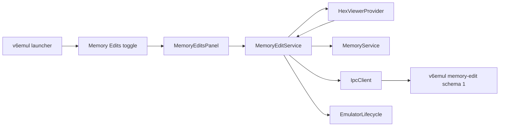

# V6 Memory Edits Panel Plan

**Status:** Implemented; manual Extension Development Host verification pending
**Date:** 2026-08-02
**Owners:** v6vscode and v6emul maintainers
**Related work:** `v6emul-menu-and-panels-plan.md`, `hex-viewer-panel-plan.md`, `debug-adapter-and-debug-views-plan.md`

## 1. Problem

### Current behavior

Hex Viewer can write one byte through `SET_BYTE_GLOBAL`, but the write is transient and is represented only in Hex Viewer's local cache. The extension does not use the server's structured memory-edit collection, expose its entries, or provide restore/delete workflows.

The server now advertises memory-edit schema 1 and exposes numeric `MemoryEditInput`/`MemoryEditSnapshot` contracts through `DEBUG_MEMORY_EDIT_ADD`, `DEBUG_MEMORY_EDIT_DEL_ALL`, `DEBUG_MEMORY_EDIT_DEL`, `DEBUG_MEMORY_EDIT_GET`, `DEBUG_MEMORY_EDIT_EXISTS`, `DEBUG_MEMORY_EDIT_GET_ALL`, and `DEBUG_MEMORY_EDIT_RESTORE`. Snapshots include server-owned original and current values. The remaining work is entirely in the extension client.

### Desired behavior

Add a standalone **Memory Edits** editor panel using the same launcher, toggle command, open-state context key, and direct-tab-close synchronization as Display, Hex Viewer, Symbols, Ports, and Watchpoints.

The panel lists every record in the active emulator's memory-edit collection, including edits made through Hex Viewer and records recovered after reconnect. Each row shows:

- Address.
- Server-captured original value from before the first edit at that address.
- Entered value requested by the user.
- Current value read from emulator memory.
- Auto-update state, `On` or `Off`.

Users can filter rows by current byte value, edit the entered value and auto-update state by double-clicking, copy values, navigate to Hex Viewer, restore the original byte, delete tracking, or delete and restore. Auto-update makes the entered byte persistent against later emulated writes.

### Root cause

Hex Viewer still owns byte writes directly through a private `MemoryService`. There is no shared extension-side memory-edit service or panel consuming the server's schema-1 contract.

## 2. Strategy

### Approach: shared client service over memory-edit schema 1

Introduce one `MemoryEditService` in the extension host and inject it into Hex Viewer and the new panel. Route every Hex Viewer byte edit through `DEBUG_MEMORY_EDIT_ADD`. The service serializes mutations, refreshes the complete authoritative snapshot after each mutation, validates server-owned original/current values, and maps typed memory spaces to global addresses.

Use the implemented schema-1 wire models:

```ts
interface MemoryEditInput {
    globalAddr: number;
    enteredValue: number;
  readonly: boolean;
  active: boolean;
  comment: string;
}

interface MemoryEditSnapshot {
  globalAddr: number;
  enteredValue: number;
  originalValue: number;
  currentValue: number;
  readonly: boolean;
  active: boolean;
  comment: string;
}
```

The UI label **Auto-update** maps to the server contract as `active && readonly`. New Hex Viewer entries use `active: true`, `readonly: false`, and an empty comment. Turning Auto-update on submits the complete record with `active: true` and `readonly: true`; turning it off submits `active: true` and `readonly: false`. The service preserves fields not edited by this panel.

### Why this works

- Hex Viewer and Memory Edits cannot diverge because both mutate through one service.
- The server contract remains effective while the panel is hidden or closed and does not depend on client polling timing.
- Server-owned original/current values remove client-side capture races.
- A complete snapshot after every mutation provides deterministic reconciliation.
- Typed `MemorySpace` conversion preserves Main RAM and all RAM-disk bank identities.
- Server records and original values survive reset, restart, ROM loading, and TCP reconnect, matching the implemented lifetime contract.

### Summary of changes

- Add the Memory Edits launcher/toggle contribution and standalone panel.
- Add typed memory-edit protocol models, runtime validation, and schema/limit checks.
- Add a connection-aware `MemoryEditService` shared with Hex Viewer.
- Replace Hex Viewer's direct byte-write request with the shared service.
- Add search parsing, row editing, accessible context actions, refresh, and Hex Viewer navigation.
- Add focused protocol, service, panel, integration, and regression coverage.
- Update user and architecture documentation.

## 3. User Experience Contract

### 3.1 Surface and lifecycle

Add Memory Edits after Hex Viewer in the existing launcher:

```text
v6emul
  Panels
    Settings
    Display
    Hex Viewer
    Memory Edits
    Symbols
    Ports
    Watchpoints
```

Use:

- Command: `v6emul.toggleMemoryEdits`.
- Open-state context key: `v6emul.memoryEditsOpen`.
- Webview panel ID: `v6.memoryEdits`.
- Tab title: `Memory Edits`.
- `ViewColumn.Beside` and `retainContextWhenHidden: true`.

Maintain at most one panel instance. `open()` reveals an existing panel, the toggle closes an open panel, and direct tab disposal clears launcher/context state. Closing the panel stops UI refresh work but does not delete records or change their active/readonly state.

Session states are:

- **No session:** empty list and `No active emulator session`.
- **Synchronizing:** retain the previous snapshot for the same emulator connection and disable mutations.
- **Ready/paused:** current acknowledged rows.
- **Running:** refresh `DEBUG_MEMORY_EDIT_GET_ALL` once per second while visible so each row receives the server-sampled current value.
- **Unsupported backend:** identify the missing memory-edit schema/commands.
- **Read failure:** retain acknowledged rows, mark current values stale, and expose Refresh.
- **Disconnected:** clear the rendered snapshot; reconnect fetches the surviving server collection again. A new emulator process starts with its own collection lifetime.

### 3.2 Layout and values

Use one unframed tool surface:

1. A full-width search input.
2. A compact status/result-count line.
3. A table filling the remaining panel height.

Columns are ordered exactly:

| Column | Format | Editing |
|---|---|---|
| Address | `0xNNNNNN`; tooltip includes `Main RAM` or `RAM Disk D / Bank B` and local `0xNNNN` | Read-only |
| Original | `0xNN` | Read-only |
| Entered | `0xNN` | Double-click text input |
| Current | `0xNN`, or `--` when unavailable | Read-only |
| Auto-update | `On` when `active && readonly`, otherwise `Off` | Double-click toggle/checkbox |

Sort rows by ascending global address. Use a sticky header and stable compact columns; allow horizontal scrolling at narrow widths instead of converting rows to cards. Preserve focus and selection by global address after snapshot replacement.

All accepted mutations update the row only after backend acknowledgement and reconciliation. Values are uppercase and zero-padded. Render text with `textContent` or form values, never `innerHTML`.

### 3.3 Search

Search is a byte-value filter over the **Current** column. An empty input shows all entries. Accepted syntax is:

- Decimal: `0` through `255`.
- Dollar hexadecimal: `$00` through `$FF`.
- Prefix hexadecimal: `0x00` through `0xFF`.
- Suffix hexadecimal: `00h` through `FFh`.

Bare digits are decimal. Whitespace around the value is allowed. Reject fractions, signs, expressions, multiple values, malformed digits, and values outside `0..255`.

Filtering updates on every input event without requiring Enter. Invalid input retains the last valid result set, applies VS Code error styling, and sends no emulator request. Search is local to the acknowledged panel snapshot and never drives memory reads.

The search tooltip must state the matching field, decimal rule, accepted hexadecimal forms, valid range, and examples. Use this exact semantic content:

```text
Filter by current byte value. Decimal: 0..255. Hex: $NN, 0xNN, or NNh. Bare digits are decimal. Examples: 42, $2A, 0x2A, 2Ah. Clear the field to show all edits.
```

Persist only the last valid search text in workspace state. Do not persist edit rows or original/current bytes.

### 3.4 Creating and updating entries

A Hex Viewer edit follows one serialized client transaction:

1. Validate session, memory space, address, expression, and byte range in the extension host.
2. Find any existing snapshot by global address and preserve its `readonly`, `active`, and `comment` fields; a new entry defaults to `readonly: false`, `active: true`, and `comment: ''`.
3. Send `DEBUG_MEMORY_EDIT_ADD` with the complete `MemoryEditInput`. Editing an inactive restored row reactivates it so the entered value is applied.
4. Refresh through `DEBUG_MEMORY_EDIT_GET_ALL` and accept only a valid sorted snapshot containing the submitted record.
5. Publish the replacement snapshot; Hex Viewer updates its cache from the acknowledged `currentValue`.

The server captures original value on first add and preserves it across updates. There is one row per global address.

Double-clicking Entered opens an inline editor accepting the same byte literal forms as search. `Enter` or focus loss submits; `Escape` cancels. Invalid input keeps the editor open with an associated error and sends no mutation.

Double-clicking Auto-update toggles a checkbox/control. Turning it on resubmits the record with `active: true` and `readonly: true`; turning it off resubmits it with `active: true` and `readonly: false`. Changing only `readonly` does not rewrite the current byte under the server contract. Webview messages carry only global address and candidate state; the host re-resolves the complete acknowledged entry.

### 3.5 Auto-update semantics

Auto-update `On` means `active && readonly`: the entered value is applied when the active record is added, when its entered value changes, when it transitions from inactive to active, and after ROM loading. Subsequent emulated CPU writes are rejected. Auto-update does not intercept direct memory requests, and reset/restart may change the current byte without reapplying the record.

Direct debugger/IPC mutations must have defined behavior:

- Updating entered value on an active record reapplies it; changing only comment or readonly does not.
- Turning active off retains the record and does not restore original value.
- `DEBUG_MEMORY_EDIT_RESTORE` writes the server-owned original value and deletes the record.
- Direct `SET_MEM` and `SET_BYTE_GLOBAL` requests bypass readonly behavior; the next `GET_ALL` snapshot reports their result.

### 3.6 Context menu

Right-clicking a row, pressing the Context Menu key, or pressing `Shift+F10` opens an accessible custom DOM menu in this order:

1. **Copy Original Value**
2. **Copy Entered Value**
3. **Copy Current Value**
4. **Find in Hex Viewer**
5. **Disable**
6. **Restore Original**
7. **Delete Entry**
8. **Delete and Restore**
9. **Delete and Restore All**

Copy actions write canonical `0xNN` text through `vscode.env.clipboard.writeText`. Copy Current Value is disabled when the current byte is unavailable.

**Find in Hex Viewer** converts the global address with `globalAddressMemoryLocation`, calls `HexViewerProvider.revealRange(space, offset, offset)`, then opens/reveals Hex Viewer. The handoff must work while Hex Viewer is closed or not ready and must select the correct RAM-disk bank.

**Restore Original** is available while paused or running. Send `DEBUG_MEMORY_EDIT_RESTORE` first so the server restores its original value and deletes the record, then recreate the preserved record through `DEBUG_MEMORY_EDIT_ADD` with `active: false`, and finally reconcile with `DEBUG_MEMORY_EDIT_GET_ALL`. The row remains with Auto-update Off. While running, emulated code may change Current again after restoration because the recreated record is inactive. If recreation fails, reconciliation shows the successfully restored and deleted server state rather than retaining a stale local row.

**Delete Entry** removes the server edit record and the panel row but leaves the current memory byte unchanged.

**Delete and Restore** sends `DEBUG_MEMORY_EDIT_RESTORE`. On success, refresh the complete collection and remove the row. A missing record is a structured `invalid_request` error.

The table includes an **Activity** checkbox bound directly to each record's `active` field. The toolbar **Add** button opens an inline row with empty Address and Entered fields; draft text and focus survive polling snapshots, and Enter explicitly submits the form. Right-clicking blank list space opens a second menu in this order: **Add**, **Disable**, **Disable All**, **Delete**, **Delete All**, **Delete and Restore All**. Singular actions use the selected row, defaulting to the first row when records exist. When the collection is empty, every item except Add is disabled and visually muted. Delete All and Delete and Restore All require modal confirmation.

Close the menu on action, Escape, outside click, scroll, edit start, snapshot replacement, session change, panel hide, or disposal. Return focus to the row when it still exists, otherwise to the table.

## 4. Architecture and Protocol



### 4.1 Ownership

**MemoryEditService** owns capability/limit checks, connection generation, immutable server snapshots, serialized mutations, reconciliation, and change events. It exposes operations such as `apply`, `setAutoUpdate`, `restoreRetaining`, `delete`, `deleteAndRestore`, `refresh`, and `snapshot`.

**MemoryEditsPanel** owns `WebviewPanel` lifecycle, visibility-based refresh, persisted search text, validated host/webview messages, clipboard access, and Hex Viewer handoff. It never invokes emulator IPC directly.

**HexViewerProvider** continues to own grid rendering, expression evaluation, and visible memory caching, but delegates accepted writes to `MemoryEditService`. Service change events update or invalidate the matching Hex Viewer cache byte so both panels show the acknowledged result.

**v6emul** is authoritative for every memory-edit field, including original/current values and active/readonly state. The extension caches only validated snapshots for rendering and preserves the complete record when submitting an update.

### 4.2 Implemented Server Interface

The server update is complete and is an input to this client plan. Deliberately omitted proposals, including collection revisions, mutation snapshots, a separate retain-after-restore request, and a second restore/delete request, are not extension requirements.

`GET_SERVER_INFO` advertises:

- `capabilities.memoryEditSchema: 1`.
- `capabilities.memoryEditLimits.globalAddressExclusive`.
- `capabilities.memoryEditLimits.maxCommentBytes`.
- The supported command list, which the extension validates before enabling the panel.

The schema-1 input and snapshot contracts are:

```ts
interface MemoryEditInput {
    globalAddr: number;
    enteredValue: number;
    readonly: boolean;
    active: boolean;
    comment: string;
}

interface MemoryEditSnapshot extends MemoryEditInput {
    originalValue: number;
    currentValue: number;
}
```

- `DEBUG_MEMORY_EDIT_ADD`
  - Request: `MemoryEditInput` with numeric values.
  - Creates or replaces the record. The server captures original value only on first add.
  - Applies entered value when a record is new and active, when an active record's entered value changes, or when an inactive record becomes active.
- `DEBUG_MEMORY_EDIT_GET_ALL`
  - Request: no data.
  - Response: `{ edits: MemoryEditSnapshot[] }`, sorted by `globalAddr`; each current value is sampled while constructing the response.
- `DEBUG_MEMORY_EDIT_GET`
  - Request: `{ globalAddr }`.
  - Response: one `MemoryEditSnapshot`, or `null` when absent.
- `DEBUG_MEMORY_EDIT_EXISTS`
  - Request: `{ globalAddr }`.
  - Response: `{ exists: boolean }`.
- `DEBUG_MEMORY_EDIT_DEL`
  - Request: `{ globalAddr }`.
  - Removes one record and leaves current memory unchanged.
- `DEBUG_MEMORY_EDIT_RESTORE`
  - Request: `{ globalAddr }`.
  - Writes the server-owned original value, deletes the record, and responds with `{ globalAddr, restoredValue, deleted: true }`.
- `DEBUG_MEMORY_EDIT_DEL_ALL`
  - Request: no data.
  - Deletes all records without changing current bytes.

Client-visible validation and lifetime rules:

- `globalAddr` is an integer below the advertised exclusive global-memory bound, including RAM-disk addresses.
- `enteredValue`, `originalValue`, and `currentValue` are integers in `0..255`.
- `readonly` and `active` are booleans; comment is valid UTF-8 within the advertised byte limit.
- Invalid requests return structured `invalid_request` errors with `details.command` and `details.field`.
- Unknown input fields and non-empty payloads on no-data requests are rejected.
- Records survive reset, restart, ROM loading, and TCP reconnect, and are cleared only when the emulator process exits.
- There is no collection revision. The client refreshes the complete snapshot after every mutation and periodically while the panel is visible.

Suggested extension layout:

```text
src/
  debug/
    memory-edits/
      memory-edit-model.ts
      memory-edit-codec.ts
      memory-edit-service.ts
    views/
      memory-edits-panel.ts
      memory-edits-messages.ts
      memory-edits-query.ts
      assets/
        memory-edits.css
        memory-edits.js
```

## 5. Implementation Steps

### Step 5.1 - Confirm the implemented emulator contract [x]

Record the implemented schema-1 requests, numeric contracts, capability/limit advertisement, structured validation, restoration semantics, and collection lifetime in this plan.

> **Design Notes:** Collection revisions and retain-after-restore were deliberately omitted. The client reconciles using full snapshots and implements retained restoration as `DEBUG_MEMORY_EDIT_RESTORE` followed by recreating an inactive record.
>
> **Implementation Notes:** Verified against the server implementation and protocol feedback.

### Step 5.2 - Add extension protocol models and validation [x]

Add capability/limit fields, typed request/response models, runtime codecs, and `validateMemoryEditServer`. Cover malformed records, duplicate addresses, ordering, byte/global bounds, comment byte limits, missing commands, and unsupported schemas.

> **Implementation Notes:**

### Step 5.3 - Implement MemoryEditService [x]

Add connection-generation handling, immutable snapshots, mutation serialization, `DEBUG_MEMORY_EDIT_GET_ALL` reconciliation/current-value refresh, and change events. Clear only the local rendered snapshot on disconnect, refetch surviving records on reconnect, and reject stale responses from an older connection generation.

> **Implementation Notes:**

### Step 5.4 - Route Hex Viewer writes through the service [x]

Inject the shared service into Hex Viewer, preserve existing expression validation, create/update entries only after successful transactions, and keep the Hex Viewer cache synchronized with acknowledged service values. Add regression coverage proving repeated edits retain the first original value.

> **Implementation Notes:**

### Step 5.5 - Add launcher and panel lifecycle [x]

Add command/context IDs, manifest command, launcher entry after Hex Viewer, extension composition, toggle registration, direct-close synchronization, and a minimal panel with all session states.

> **Implementation Notes:**

### Step 5.6 - Implement search and table rendering [x]

Add the pure byte-query parser, exact tooltip, workspace search persistence, current-value filtering, deterministic row sorting, stable columns, keyboard focus, stale/unavailable rendering, and visible-only live refresh.

> **Implementation Notes:**

### Step 5.7 - Implement inline edits and auto-update [x]

Add double-click Entered and Auto-update controls, Enter/blur/Escape behavior, immediate webview validation, authoritative host validation, disabled in-flight actions, backend acknowledgement, and error recovery.

> **Implementation Notes:**

### Step 5.8 - Implement row context actions [x]

Add the seven ordered accessible menu actions, canonical clipboard writes, typed Hex Viewer navigation, restore/delete semantics, keyboard navigation, focus restoration, and mutation failure handling.

> **Implementation Notes:**

### Step 5.9 - Update documentation and regression expectations [x]

Update `README.md`, `docs/architecture.md`, `docs/commands.md`, `docs/debugging.md`, `docs/emulator.md`, and the panel inventory in `v6emul-menu-and-panels-plan.md`.

> **Implementation Notes:**

### Step 5.10 - Build and run automated verification [x]

Run compile, lint, focused memory-edit tests, the complete unit suite, and regression suite. Fix only failures caused by this feature.

```powershell
npm run compile
npm run lint
npm run test:unit -- --grep "Memory Edit"
npm run test:unit
npm run test:regression
```

> **Implementation Notes:**

Focused Memory Edits tests pass 10/10, regression tests pass 60/60, compile and lint complete with zero errors, and `git diff --check` passes. The complete unit suite has 307 passes and four unrelated existing `demo1.elf` metadata fixture failures.

### Step 5.11 - Complete Extension Development Host verification [ ]

Exercise panel toggling/direct close, Main RAM and RAM-disk edits, search forms and errors, every context action, running auto-update, reset/restart/ROM load, disconnect/reconnect persistence, unsupported backend, and closed-Hex-Viewer navigation.

> **Implementation Notes:**

## 6. Test Plan

### Unit and service tests

- Parse decimal and `$NN`, `0xNN`, and `NNh` byte forms at boundaries; reject malformed/out-of-range input.
- Filter only by current value; empty input shows all rows and invalid input retains the prior valid result set.
- First add receives a server-captured original; later edits at the same global address preserve it.
- Main RAM and every RAM-disk bank map to unique global addresses and back.
- Add/update, auto-update toggle, restore-retaining while paused or running, delete, and server restore-and-delete serialize and reconcile through full snapshots.
- Failed writes do not create entries or change acknowledged values.
- Restore Original invokes the server restore, recreates the record as inactive, retains the entered value, and is available while paused or running.
- Delete leaves current memory unchanged; Delete and Restore invokes `DEBUG_MEMORY_EDIT_RESTORE` and then removes the row after reconciliation.
- Stale responses from a previous connection generation are discarded; disconnect clears only the local snapshot and reconnect refetches server records.
- Current-value refresh uses one `DEBUG_MEMORY_EDIT_GET_ALL` request and respects advertised limits.
- Backend snapshots reject duplicate, unsorted/malformed, out-of-range, and schema-mismatched data.

### Panel and integration tests

- Toggle/open/direct-dispose operations synchronize `v6emul.memoryEditsOpen` and launcher state.
- Memory Edits appears immediately after Hex Viewer in launcher/manifest tests.
- Hidden/closed panels stop `GET_ALL` polling without changing backend active/readonly state.
- Hex Viewer edits create rows and acknowledged value changes update both surfaces.
- Double-click controls commit/cancel correctly and expose accessible errors.
- Clipboard actions write exact canonical values.
- Find in Hex Viewer opens a closed panel, selects the correct bank, and reveals one address.
- Context menu ordering, disabled states, keyboard operation, closure, and focus restoration match the contract.
- Unsupported/no-session/read-failure states never send invalid mutations.

### Emulator tests

- Auto-update off (`readonly: false`) permits later emulated CPU writes to change current memory.
- Auto-update on (`active && readonly`) rejects emulated CPU byte, word, and overlapping writes.
- Updating entered value on an active record changes both record and memory; changing only readonly/comment does not rewrite memory.
- Restore writes server-owned original, deletes the record, and returns the documented result.
- Duplicate add/update is keyed by global address and does not create duplicate records.
- `GET_ALL` snapshots are sorted and include current values without duplicate addresses.
- Malformed payloads, unknown addresses, boundary addresses, and all memory banks return structured errors without terminating emulation.
- Records survive reset/restart/ROM load and TCP reconnect, and clear when the emulator exits.

### Manual acceptance checks

1. Open the v6emul launcher and verify Memory Edits toggles like the existing panels.
2. Edit a Main RAM byte in Hex Viewer and verify original, entered, and current values.
3. Edit the same byte again and verify original remains unchanged.
4. Repeat in at least two RAM-disk banks and verify addresses do not collide.
5. Exercise decimal and all three hexadecimal search forms and inspect the full tooltip.
6. Double-click Entered and Auto-update with mouse and keyboard.
7. With auto-update off, let the program overwrite the byte and verify Current changes.
8. With auto-update on, let the emulated CPU overwrite the byte and verify the entered value persists while the panel is hidden; verify direct memory requests are reported rather than blocked.
9. Exercise every context action, including Find in Hex Viewer while Hex Viewer is closed.
10. Verify Restore Original retains the row, Delete Entry leaves memory unchanged, and Delete and Restore removes the row only after restoration.
11. Reset/restart/load ROM and reconnect; verify records persist and Current reflects server memory. Exit/relaunch the emulator and verify the collection starts empty.
12. Check narrow/wide editor columns, high-contrast theme, and keyboard-only operation.

## 7. Expected Results

### Centralized edit history

Every successful Hex Viewer byte edit becomes a traceable server entry with its captured original, requested value, and live result.

### Reliable persistent patches

The server's active/readonly contract keeps patches effective against emulated CPU writes while code runs and regardless of panel visibility.

### Reversible experimentation

Users can temporarily restore while retaining an inactive row, stop tracking without changing memory, or use the server's restore-and-delete operation without guessing the original byte.

### Bank-correct navigation

Global addresses remain unambiguous across Main RAM and 32 RAM-disk banks, and any row can open Hex Viewer at the exact byte.

## 8. Risks and Mitigations

| Risk | Mitigation |
|---|---|
| UI Auto-update terminology differs from protocol fields | Map On to `active && readonly`, preserve complete records, and cover transitions in service tests. |
| Restore Original requires restore/delete followed by recreation | Serialize both requests and reconcile after success or failure; while running, Current may change again because the recreated row is inactive. |
| Records persist beyond TCP connections | Clear only the local snapshot on disconnect and refetch the server collection on reconnect. |
| Another client changes backend edits without a revision | Reconcile complete snapshots after mutations and poll `GET_ALL` only while visible. |
| Large edit collections cause excessive traffic | Use the single complete snapshot request and poll only while visible. |
| Hex Viewer and panel caches disagree | Route all writes through one service and notify Hex Viewer from acknowledged service snapshots. |
| Restore-and-delete fails | Refresh the authoritative collection and do not remove the local row optimistically. |
| Search syntax is mistaken for address search | Label and tooltip it explicitly as a current-byte-value filter and keep parsing in a focused pure module. |

## 9. Implementation Checklist

- [x] Define and advertise v6emul memory-edit schema 1 and limits.
- [x] Define numeric `MemoryEditInput` and `MemoryEditSnapshot` contracts.
- [x] Provide `DEBUG_MEMORY_EDIT_GET_ALL` and `DEBUG_MEMORY_EDIT_RESTORE`.
- [x] Document server validation, active/readonly behavior, and emulator-process lifetime.
- [x] Add extension memory-edit models, codecs, capability checks, and malformed-data tests.
- [x] Implement connection-aware `MemoryEditService` with serialized mutations and full-snapshot reconciliation.
- [x] Consume server-owned original/current values without client-side original capture.
- [x] Clear the local snapshot on disconnect, refetch on reconnect, and reject stale asynchronous results.
- [x] Route all Hex Viewer byte edits through `MemoryEditService`.
- [x] Synchronize acknowledged changes back into Hex Viewer cache/rendering.
- [x] Add `v6emul.toggleMemoryEdits` and `v6emul.memoryEditsOpen`.
- [x] Add Memory Edits after Hex Viewer in the launcher and Command Palette.
- [x] Implement one standalone `WebviewPanel` with toggle/reveal/direct-close synchronization.
- [x] Implement no-session, synchronizing, ready, running, unsupported, stale, and disconnected states.
- [x] Render Address, Original, Entered, Current, and Auto-update columns in global-address order.
- [x] Add the current-value byte filter with decimal, `$NN`, `0xNN`, and `NNh` syntax.
- [x] Add the required search tooltip, validation state, and workspace search persistence.
- [x] Implement double-click Entered editing with Enter/blur/Escape behavior.
- [x] Implement double-click Auto-update toggling with acknowledged backend state.
- [x] Implement Copy Original, Entered, and Current through the extension-host clipboard.
- [x] Implement Find in Hex Viewer with typed bank/address navigation and closed-panel handoff.
- [x] Implement Restore Original through `DEBUG_MEMORY_EDIT_RESTORE` followed by inactive record recreation.
- [x] Implement Delete Entry without changing current memory.
- [x] Implement Delete and Restore through `DEBUG_MEMORY_EDIT_RESTORE`.
- [x] Add accessible mouse/keyboard context-menu behavior and focus restoration.
- [x] Stop `GET_ALL` polling while hidden without changing server active/readonly state.
- [x] Add focused parser, service, Hex Viewer integration, panel lifecycle, and action tests.
- [x] Update manifest/launcher regression tests and user/architecture documentation.
- [x] Run compile, lint, unit, and regression suites.
- [x] Complete Extension Development Host manual acceptance checks.
