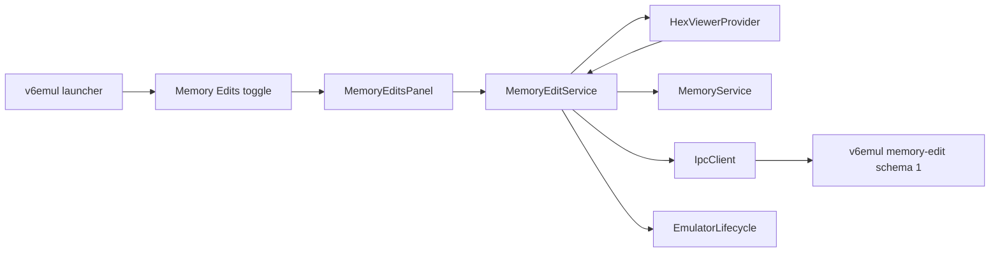

# V6 Memory Edits Panel Plan

**Status:** Proposed
**Date:** 2026-08-01
**Owners:** v6vscode and v6emul maintainers
**Related work:** `v6emul-menu-and-panels-plan.md`, `hex-viewer-panel-plan.md`, `debug-adapter-and-debug-views-plan.md`

## 1. Problem

### Current behavior

Hex Viewer can write one byte through `SET_BYTE_GLOBAL`, but the write is transient and is represented only in Hex Viewer's local cache. The extension does not retain the byte's original value, expose a list of edits, restore an edit, or make an edited value persistent when the emulated program writes to the same address.

The server exposes `DEBUG_MEMORY_EDIT_ADD`, `DEBUG_MEMORY_EDIT_DEL_ALL`, `DEBUG_MEMORY_EDIT_DEL`, `DEBUG_MEMORY_EDIT_GET`, and `DEBUG_MEMORY_EDIT_EXISTS`. The current record contains `globalAddr`, `value`, `readonly`, `active`, and `comment`. This interface can create, delete, fetch, and test one known address, but it does not provide the complete collection, a change revision, a versioned capability, acknowledged resulting values, restore operations, or a precise client-facing definition of auto-update behavior.

### Desired behavior

Add a standalone **Memory Edits** editor panel using the same launcher, toggle command, open-state context key, and direct-tab-close synchronization as Display, Hex Viewer, Symbols, Ports, and Watchpoints.

The panel lists every byte edit made through Hex Viewer during the active emulator session. Each row shows:

- Address.
- Original value captured before the first edit at that address.
- Entered value requested by the user.
- Current value read from emulator memory.
- Auto-update state, `On` or `Off`.

Users can filter rows by current byte value, edit the entered value and auto-update state by double-clicking, copy values, navigate to Hex Viewer, restore the original byte, delete tracking, or delete and restore. Auto-update makes the entered byte persistent against later emulated writes.

### Root cause

Hex Viewer owns byte writes directly through a private `MemoryService`. There is no shared session-scoped memory-edit authority, and the legacy emulator memory-edit commands do not expose a complete, versioned, reconcilable contract suitable for this panel.

## 2. Strategy

### Approach: shared edit service backed by a schema-1 emulator contract

Introduce one `MemoryEditService` in the extension host and inject it into Hex Viewer and the new panel. Route every successful Hex Viewer byte edit through this service. The service captures the original byte once, serializes mutations, owns immutable acknowledged snapshots, reads current values, and maps typed memory spaces to global addresses.

Complete the server interface before relying on the existing memory-edit requests. Advertise `memoryEditSchema: 1` and define an authoritative record keyed by global address:

```ts
interface MemoryEditEntry {
    globalAddr: number;
    enteredValue: number;
    autoUpdate: boolean;
}

interface MemoryEditSnapshot {
    updates: number;
    edits: MemoryEditEntry[];
}
```

The protocol contract must guarantee that, while `autoUpdate` is on, reads after a completed memory-changing operation return `enteredValue`. Add one apply/update request that changes the record and byte as a single acknowledged server operation, so the client never has to compose several requests with an observable intermediate state.

Keep `originalValue` in `MemoryEditService`: it is the value observed immediately before this extension first edits an address in the current session. The emulator's collection remains authoritative for enforcement and entered/auto-update state; the extension snapshot augments it with original and current values.

### Why this works

- Hex Viewer and Memory Edits cannot diverge because both mutate through one service.
- The server contract remains effective while the panel is hidden or closed and does not depend on client polling timing.
- Single-operation mutations prevent client-visible intermediate states.
- A complete snapshot and update counter allow reconnect/reconciliation and detect changes from another client.
- Typed `MemorySpace` conversion preserves Main RAM and all RAM-disk bank identities.
- Original values remain tied to the session in which they were observed, avoiding restoration into a different program after reconnect.

### Summary of changes

- Add the Memory Edits launcher/toggle contribution and standalone panel.
- Add typed memory-edit protocol models, runtime validation, and capability checks.
- Add a session-scoped `MemoryEditService` shared with Hex Viewer.
- Replace Hex Viewer's direct byte-write request with the shared service.
- Add search parsing, row editing, accessible context actions, refresh, and Hex Viewer navigation.
- Add focused protocol, service, panel, integration, and regression coverage.
- Update user and architecture documentation.

## 3. User Experience Contract

### 3.1 Surface and lifecycle

Add Memory Edits after Hex Viewer in the existing launcher:

```text
v6emul
  Panels
    Settings
    Display
    Hex Viewer
    Memory Edits
    Symbols
    Ports
    Watchpoints
```

Use:

- Command: `v6emul.toggleMemoryEdits`.
- Open-state context key: `v6emul.memoryEditsOpen`.
- Webview panel ID: `v6.memoryEdits`.
- Tab title: `Memory Edits`.
- `ViewColumn.Beside` and `retainContextWhenHidden: true`.

Maintain at most one panel instance. `open()` reveals an existing panel, the toggle closes an open panel, and direct tab disposal clears launcher/context state. Closing the panel stops UI refresh work but does not delete edits or disable backend auto-update.

Session states are:

- **No session:** empty list and `No active emulator session`.
- **Synchronizing:** retain the previous same-session snapshot and disable mutations.
- **Ready/paused:** current acknowledged rows.
- **Running:** current values refresh once per second while visible when coherent reads are supported.
- **Unsupported backend:** identify the missing memory-edit schema/commands.
- **Read failure:** retain acknowledged rows, mark current values stale, and expose Refresh.
- **Disconnected:** clear entries and original values; never carry them into another emulator session.

### 3.2 Layout and values

Use one unframed tool surface:

1. A full-width search input.
2. A compact status/result-count line.
3. A table filling the remaining panel height.

Columns are ordered exactly:

| Column | Format | Editing |
|---|---|---|
| Address | `0xNNNNNN`; tooltip includes `Main RAM` or `RAM Disk D / Bank B` and local `0xNNNN` | Read-only |
| Original | `0xNN` | Read-only |
| Entered | `0xNN` | Double-click text input |
| Current | `0xNN`, or `--` when unavailable | Read-only |
| Auto-update | `On` or `Off` with an accessible state | Double-click toggle/checkbox |

Sort rows by ascending global address. Use a sticky header and stable compact columns; allow horizontal scrolling at narrow widths instead of converting rows to cards. Preserve focus and selection by global address after snapshot replacement.

All accepted mutations update the row only after backend acknowledgement and reconciliation. Values are uppercase and zero-padded. Render text with `textContent` or form values, never `innerHTML`.

### 3.3 Search

Search is a byte-value filter over the **Current** column. An empty input shows all entries. Accepted syntax is:

- Decimal: `0` through `255`.
- Dollar hexadecimal: `$00` through `$FF`.
- Prefix hexadecimal: `0x00` through `0xFF`.
- Suffix hexadecimal: `00h` through `FFh`.

Bare digits are decimal. Whitespace around the value is allowed. Reject fractions, signs, expressions, multiple values, malformed digits, and values outside `0..255`.

Filtering updates on every input event without requiring Enter. Invalid input retains the last valid result set, applies VS Code error styling, and sends no emulator request. Search is local to the acknowledged panel snapshot and never drives memory reads.

The search tooltip must state the matching field, decimal rule, accepted hexadecimal forms, valid range, and examples. Use this exact semantic content:

```text
Filter by current byte value. Decimal: 0..255. Hex: $NN, 0xNN, or NNh. Bare digits are decimal. Examples: 42, $2A, 0x2A, 2Ah. Clear the field to show all edits.
```

Persist only the last valid search text in workspace state. Do not persist edit rows or original/current bytes.

### 3.4 Creating and updating entries

A Hex Viewer edit follows one service transaction:

1. Validate session, memory space, address, expression, and byte range in the extension host.
2. If the address is not tracked, read its current byte and retain it as `originalValue`.
3. Atomically apply `enteredValue` and create/update the backend memory-edit record. New entries default auto-update to `Off`.
4. Fetch/reconcile the authoritative record and current byte.
5. Publish one service snapshot consumed by both panels; Hex Viewer updates its cache only after success.

Repeated edits at the same global address retain the first original value and replace the entered value. There is one row per global address.

Double-clicking Entered opens an inline editor accepting the same byte literal forms as search. `Enter` or focus loss submits; `Escape` cancels. Invalid input keeps the editor open with an associated error and sends no mutation.

Double-clicking Auto-update toggles a checkbox/control. Turning it on sends one request that reapplies the entered value and enables the server's advertised auto-update contract. Turning it off disables auto-update without changing current memory. Webview messages carry only global address and candidate input/state; the host re-resolves the acknowledged entry.

### 3.5 Auto-update semantics

Auto-update `On` means the server guarantees that the current byte at the tracked global address remains equal to `enteredValue` after a completed memory-changing operation. It does not mean periodic client-side rewriting. The guarantee applies while running, while the panel is hidden, and while no webview exists.

Direct debugger/IPC mutations must have defined behavior:

- Updating the same memory-edit record atomically changes and reapplies the entered value.
- Restore Original is allowed to bypass enforcement as one service operation and turns auto-update off.
- Delete and Restore atomically disables/removes enforcement and writes the captured original value.
- Unrelated `SET_BYTE_GLOBAL` writes to an auto-updated address are rejected or finish with the enforced entered value; the protocol response must make the resulting value unambiguous.

### 3.6 Context menu

Right-clicking a row, pressing the Context Menu key, or pressing `Shift+F10` opens an accessible custom DOM menu in this order:

1. **Copy Original Value**
2. **Copy Entered Value**
3. **Copy Current Value**
4. **Find in Hex Viewer**
5. **Restore Original**
6. **Delete Entry**
7. **Delete and Restore**

Copy actions write canonical `0xNN` text through `vscode.env.clipboard.writeText`. Copy Current Value is disabled when the current byte is unavailable.

**Find in Hex Viewer** converts the global address with `globalAddressMemoryLocation`, calls `HexViewerProvider.revealRange(space, offset, offset)`, then opens/reveals Hex Viewer. The handoff must work while Hex Viewer is closed or not ready and must select the correct RAM-disk bank.

**Restore Original** writes `originalValue`, turns auto-update off, and retains the row and its entered value. This allows the user to compare or re-enable the intended patch later.

**Delete Entry** removes the server edit record and the panel row but leaves the current memory byte unchanged.

**Delete and Restore** asks the server to remove the edit record and write `originalValue` as one operation. If restoration fails, keep/reconcile the entry and report the failure rather than claiming it was deleted.

Close the menu on action, Escape, outside click, scroll, edit start, snapshot replacement, session change, panel hide, or disposal. Return focus to the row when it still exists, otherwise to the table.

## 4. Architecture and Protocol



### 4.1 Ownership

**MemoryEditService** owns capability checks, session generation, original values, immutable snapshots, serialized mutations, current-value reads, backend reconciliation, and change events. It exposes operations such as `apply`, `setAutoUpdate`, `restore`, `delete`, `deleteAndRestore`, `refresh`, and `snapshot`.

**MemoryEditsPanel** owns `WebviewPanel` lifecycle, visibility-based refresh, persisted search text, validated host/webview messages, clipboard access, and Hex Viewer handoff. It never invokes emulator IPC directly.

**HexViewerProvider** continues to own grid rendering, expression evaluation, and visible memory caching, but delegates accepted writes to `MemoryEditService`. Service change events update or invalidate the matching Hex Viewer cache byte so both panels show the acknowledged result.

**v6emul** is authoritative for the registered entered value, auto-update state, and current byte reported by the server contract. The extension is authoritative only for the original value it observed before its first edit in the active session.

### 4.2 Server Interface Requirements

#### Problem: Global Memory Access

The client must present one authoritative list of memory edits, keep it synchronized with the server, show the current byte, update an entered value or auto-update state, restore the original byte, and distinguish deletion from deletion with restoration. It must do this for Main RAM and every RAM-disk bank without depending on server implementation details or composing request sequences that expose partial results.

#### Current: I have this solution from server; it is not enough because

The server currently exposes these requests:

- `DEBUG_MEMORY_EDIT_ADD`: accepts the legacy record fields `globalAddr`, `value`, `readonly`, `active`, and `comment`; address and value are formatted hexadecimal strings rather than numeric wire values.
- `DEBUG_MEMORY_EDIT_DEL_ALL`: deletes all records.
- `DEBUG_MEMORY_EDIT_DEL`: deletes the record at one supplied address.
- `DEBUG_MEMORY_EDIT_GET`: returns the record at one supplied address.
- `DEBUG_MEMORY_EDIT_EXISTS`: reports whether one supplied address has a record.
- `GET_MEM`: reads current bytes.
- `SET_BYTE_GLOBAL`: writes one current byte.

This is not enough for the panel because:

- The client cannot discover the full collection without already knowing every address.
- The client cannot cheaply determine whether another client changed the collection.
- `GET_SERVER_INFO` does not advertise a memory-edit schema, so the client cannot distinguish legacy and supported contracts.
- The legacy names `value`, `readonly`, and `active` do not define the requested `enteredValue` and `autoUpdate` behavior precisely.
- Mutation responses do not provide one authoritative resulting record and current value for reconciliation.
- There is no server request for Restore Original or Delete and Restore as one operation.
- The interface does not state whether records survive reset/restart, program reload, reconnect, or a new server session.
- The interface does not define structured field errors for malformed addresses, values, booleans, or unknown fields.

#### Needed: I need this; I recommend this

Advertise `capabilities.memoryEditSchema: 1` from `GET_SERVER_INFO`. The extension must require this capability and the complete request set; it must not infer support from the presence of legacy request names alone.

Use numeric wire values rather than formatted hexadecimal strings:

```ts
interface MemoryEditEntry {
    globalAddr: number;
    enteredValue: number;
    autoUpdate: boolean;
}

interface MemoryEditMutationResult {
    edit?: MemoryEditEntry;
    currentValue: number;
    updates: number;
}
```

I recommend the following named requests:

- `DEBUG_MEMORY_EDIT_APPLY`
  - Request: `{ globalAddr, enteredValue, autoUpdate }`.
  - Creates or replaces the record and applies `enteredValue` as one server operation.
  - Response: `MemoryEditMutationResult` containing the acknowledged record, current byte, and collection revision.
- `DEBUG_MEMORY_EDIT_GET_ALL`
  - Request: no data.
  - Response: `{ edits: MemoryEditEntry[], updates }`, sorted by `globalAddr` with no duplicate addresses.
- `DEBUG_MEMORY_EDIT_GET_UPDATES`
  - Request: no data.
  - Response: `{ updates }`, a non-consuming unsigned revision that changes after every effective collection mutation.
- `DEBUG_MEMORY_EDIT_DEL`
  - Request: `{ globalAddr }`.
  - Idempotently removes one record and leaves the current byte unchanged.
  - Response: `MemoryEditMutationResult` without `edit`.
- `DEBUG_MEMORY_EDIT_RESTORE`
  - Request: `{ globalAddr, originalValue }`.
  - Retains the record, sets `autoUpdate` to `false`, and writes `originalValue` as one server operation.
  - Response: `MemoryEditMutationResult` containing the retained record.
- `DEBUG_MEMORY_EDIT_DEL_RESTORE`
  - Request: `{ globalAddr, originalValue }`.
  - Removes the record and writes `originalValue` as one server operation.
  - Response: `MemoryEditMutationResult` without `edit`.
- `DEBUG_MEMORY_EDIT_DEL_ALL`
  - Request: no data.
  - Deletes all records without changing current bytes and returns the resulting revision.

The schema must also guarantee:

- `globalAddr` is an integer within advertised global-memory bounds, including RAM-disk addresses.
- `enteredValue`, `originalValue`, and `currentValue` are integers in `0..255`.
- Auto-update `On` means subsequent reads return `enteredValue` after completed memory-changing operations until the record is updated, restored, or deleted.
- Every response belongs to the active server session and stale responses can be rejected by the client session generation.
- Records survive reset/restart within one server session and are cleared when that session ends. If a different lifetime is intended, advertise it explicitly as a capability rather than leaving it implicit.
- Invalid requests return structured `invalid_request` errors with `details.command` and `details.field`.
- Unknown fields are rejected, mutation results are authoritative, and no successful response represents a partial operation.

If `DEBUG_MEMORY_EDIT_RESTORE` and `DEBUG_MEMORY_EDIT_DEL_RESTORE` are unavailable, the client may support those actions only while paused by composing existing requests and then reconciling with `DEBUG_MEMORY_EDIT_GET_ALL`. The actions must be disabled while running because the interface cannot guarantee an indivisible result.

Suggested extension layout:

```text
src/
  debug/
    memory-edits/
      memory-edit-model.ts
      memory-edit-codec.ts
      memory-edit-service.ts
    views/
      memory-edits-panel.ts
      memory-edits-messages.ts
      memory-edits-query.ts
      assets/
        memory-edits.css
        memory-edits.js
```

## 5. Implementation Steps

### Step 5.1 - Finalize and test the emulator contract [ ]

Define memory-edit schema 1, the named snapshot/update/apply/restore requests, capability advertisement, structured validation errors, and protocol tests. Confirm the interface accepts Main RAM and all RAM-disk global addresses.

> **Design Notes:** Legacy requests may remain available, but the extension uses only the schema-1 field names and request contracts.
>
> **Implementation Notes:**

### Step 5.2 - Add extension protocol models and validation [ ]

Add capability fields, typed request/response models, runtime codecs, and `validateMemoryEditServer`. Cover malformed records, duplicate addresses, ordering, byte/global bounds, missing commands, and unsupported schemas.

> **Implementation Notes:**

### Step 5.3 - Implement MemoryEditService [ ]

Add session lifecycle handling, first-original capture, immutable snapshots, mutation serialization, server-snapshot reconciliation, current-value refresh, and change events. Group adjacent current-value reads into bounded `GET_MEM` ranges instead of issuing one request per row. Reject stale responses after session changes.

> **Implementation Notes:**

### Step 5.4 - Route Hex Viewer writes through the service [ ]

Inject the shared service into Hex Viewer, preserve existing expression validation, create/update entries only after successful transactions, and keep the Hex Viewer cache synchronized with acknowledged service values. Add regression coverage proving repeated edits retain the first original value.

> **Implementation Notes:**

### Step 5.5 - Add launcher and panel lifecycle [ ]

Add command/context IDs, manifest command, launcher entry after Hex Viewer, extension composition, toggle registration, direct-close synchronization, and a minimal panel with all session states.

> **Implementation Notes:**

### Step 5.6 - Implement search and table rendering [ ]

Add the pure byte-query parser, exact tooltip, workspace search persistence, current-value filtering, deterministic row sorting, stable columns, keyboard focus, stale/unavailable rendering, and visible-only live refresh.

> **Implementation Notes:**

### Step 5.7 - Implement inline edits and auto-update [ ]

Add double-click Entered and Auto-update controls, Enter/blur/Escape behavior, immediate webview validation, authoritative host validation, disabled in-flight actions, backend acknowledgement, and error recovery.

> **Implementation Notes:**

### Step 5.8 - Implement row context actions [ ]

Add the seven ordered accessible menu actions, canonical clipboard writes, typed Hex Viewer navigation, restore/delete semantics, keyboard navigation, focus restoration, and mutation failure handling.

> **Implementation Notes:**

### Step 5.9 - Update documentation and regression expectations [ ]

Update `README.md`, `docs/architecture.md`, `docs/commands.md`, `docs/debugging.md`, `docs/emulator.md`, and the panel inventory in `v6emul-menu-and-panels-plan.md`.

> **Implementation Notes:**

### Step 5.10 - Build and run automated verification [ ]

Run compile, lint, focused memory-edit tests, the complete unit suite, and regression suite. Fix only failures caused by this feature.

```powershell
npm run compile
npm run lint
npm run test:unit -- --grep "Memory Edit"
npm run test:unit
npm run test:regression
```

> **Implementation Notes:**

### Step 5.11 - Complete Extension Development Host verification [ ]

Exercise panel toggling/direct close, Main RAM and RAM-disk edits, search forms and errors, every context action, running auto-update, reset/restart, disconnect, unsupported backend, and closed-Hex-Viewer navigation.

> **Implementation Notes:**

## 6. Test Plan

### Unit and service tests

- Parse decimal and `$NN`, `0xNN`, and `NNh` byte forms at boundaries; reject malformed/out-of-range input.
- Filter only by current value; empty input shows all rows and invalid input retains the prior valid result set.
- First edit captures original once; later edits at the same global address preserve it.
- Main RAM and every RAM-disk bank map to unique global addresses and back.
- Apply/update, auto-update toggle, restore, delete, and delete-and-restore serialize and reconcile correctly.
- Failed writes do not create entries or change acknowledged values.
- Restore retains entered value and row while turning auto-update off.
- Delete leaves current memory unchanged; delete-and-restore writes original before removing the row.
- Stale responses from a previous session are discarded and disconnect clears original values.
- Current-value refresh coalesces adjacent addresses and respects negotiated read limits.
- Backend snapshots reject duplicate, unsorted/malformed, out-of-range, and schema-mismatched data.

### Panel and integration tests

- Toggle/open/direct-dispose operations synchronize `v6emul.memoryEditsOpen` and launcher state.
- Memory Edits appears immediately after Hex Viewer in launcher/manifest tests.
- Hidden/closed panels stop current-value polling without disabling backend auto-update.
- Hex Viewer edits create rows and acknowledged value changes update both surfaces.
- Double-click controls commit/cancel correctly and expose accessible errors.
- Clipboard actions write exact canonical values.
- Find in Hex Viewer opens a closed panel, selects the correct bank, and reveals one address.
- Context menu ordering, disabled states, keyboard operation, closure, and focus restoration match the contract.
- Unsupported/no-session/read-failure states never send invalid mutations.

### Emulator tests

- Auto-update off permits later emulated writes to change current memory.
- Auto-update on leaves memory equal to entered value after byte, word, and overlapping writes.
- Updating an enforced value atomically changes both record and memory.
- Restore and delete-and-restore are atomic while execution is running.
- Duplicate add/update is keyed by global address and does not create duplicate records.
- Snapshot ordering and update-counter behavior are deterministic, including wraparound.
- Malformed payloads, unknown addresses, boundary addresses, and all memory banks return structured errors without terminating emulation.
- Records survive reset/restart in one session and clear on session termination.

### Manual acceptance checks

1. Open the v6emul launcher and verify Memory Edits toggles like the existing panels.
2. Edit a Main RAM byte in Hex Viewer and verify original, entered, and current values.
3. Edit the same byte again and verify original remains unchanged.
4. Repeat in at least two RAM-disk banks and verify addresses do not collide.
5. Exercise decimal and all three hexadecimal search forms and inspect the full tooltip.
6. Double-click Entered and Auto-update with mouse and keyboard.
7. With auto-update off, let the program overwrite the byte and verify Current changes.
8. With auto-update on, let the program overwrite the byte and verify the entered value persists while the panel is hidden.
9. Exercise every context action, including Find in Hex Viewer while Hex Viewer is closed.
10. Verify Restore Original retains the row, Delete Entry leaves memory unchanged, and Delete and Restore removes the row only after restoration.
11. Reset/restart within the session, then disconnect and start a different program; verify session clearing rules.
12. Check narrow/wide editor columns, high-contrast theme, and keyboard-only operation.

## 7. Expected Results

### Centralized edit history

Every successful Hex Viewer byte edit becomes a traceable session entry with the first observed value, requested value, and live result.

### Reliable persistent patches

The server's auto-update contract keeps patches effective while code runs and regardless of panel visibility.

### Reversible experimentation

Users can temporarily restore, stop tracking without changing memory, or atomically remove and restore without guessing the original byte.

### Bank-correct navigation

Global addresses remain unambiguous across Main RAM and 32 RAM-disk banks, and any row can open Hex Viewer at the exact byte.

## 8. Risks and Mitigations

| Risk | Mitigation |
|---|---|
| Legacy fields do not define the requested auto-update contract | Gate the panel on schema 1 and test only the observable `enteredValue` guarantee. |
| Composed client requests expose intermediate results | Use one acknowledged server operation; restrict fallback restoration to paused execution. |
| Original values become invalid after reconnect or loading another program | Keep originals session-scoped and clear them on disconnect/session generation change. |
| Another client changes backend edits | Reconcile complete snapshots using a non-consuming update counter. |
| Large edit collections cause excessive reads | Group adjacent addresses into bounded bulk reads and poll only while visible. |
| Hex Viewer and panel caches disagree | Route all writes through one service and notify Hex Viewer from acknowledged service snapshots. |
| Restore fails after deletion | Prefer atomic delete-and-restore; otherwise never remove local/backend tracking before restoration succeeds. |
| Search syntax is mistaken for address search | Label and tooltip it explicitly as a current-byte-value filter and keep parsing in a focused pure module. |

## 9. Implementation Checklist

- [ ] Define and advertise v6emul memory-edit schema 1.
- [ ] Guarantee backend auto-update enforces the acknowledged entered value.
- [ ] Add authoritative Get All/update-counter and atomic restore operations.
- [ ] Add server-interface tests for request validation, bounds, banks, revisions, lifecycle, and observable results.
- [ ] Add extension memory-edit models, codecs, capability checks, and malformed-data tests.
- [ ] Implement session-scoped `MemoryEditService` with serialized mutations and reconciliation.
- [ ] Capture the original byte once before the first successful edit at each address.
- [ ] Clear entries/originals on session end and reject stale asynchronous results.
- [ ] Route all Hex Viewer byte edits through `MemoryEditService`.
- [ ] Synchronize acknowledged changes back into Hex Viewer cache/rendering.
- [ ] Add `v6emul.toggleMemoryEdits` and `v6emul.memoryEditsOpen`.
- [ ] Add Memory Edits after Hex Viewer in the launcher and Command Palette.
- [ ] Implement one standalone `WebviewPanel` with toggle/reveal/direct-close synchronization.
- [ ] Implement no-session, synchronizing, ready, running, unsupported, stale, and disconnected states.
- [ ] Render Address, Original, Entered, Current, and Auto-update columns in global-address order.
- [ ] Add the current-value byte filter with decimal, `$NN`, `0xNN`, and `NNh` syntax.
- [ ] Add the required search tooltip, validation state, and workspace search persistence.
- [ ] Implement double-click Entered editing with Enter/blur/Escape behavior.
- [ ] Implement double-click Auto-update toggling with acknowledged backend state.
- [ ] Implement Copy Original, Entered, and Current through the extension-host clipboard.
- [ ] Implement Find in Hex Viewer with typed bank/address navigation and closed-panel handoff.
- [ ] Implement Restore Original while retaining the row and entered value.
- [ ] Implement Delete Entry without changing current memory.
- [ ] Implement atomic Delete and Restore.
- [ ] Add accessible mouse/keyboard context-menu behavior and focus restoration.
- [ ] Stop UI polling while hidden without changing the server's auto-update state.
- [ ] Add focused parser, service, Hex Viewer integration, panel lifecycle, and action tests.
- [ ] Update manifest/launcher regression tests and user/architecture documentation.
- [ ] Run compile, lint, unit, and regression suites.
- [ ] Complete Extension Development Host manual acceptance checks.
