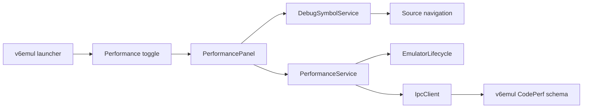

# V6 Performance Panel Plan

**Status:** Blocked on server protocol work
**Date:** 2026-08-02
**Owners:** v6vscode and v6emul maintainers
**Related work:** `v6emul-menu-and-panels-plan.md`, `symbols-panel-plan.md`, `memory-edits-panel-plan.md`, `debug-adapter-and-debug-views-plan.md`

## 1. Objective

Add a standalone **Performance** editor panel using the same launcher, toggle command, open-state context key, and direct-tab-close synchronization as Display, Hex Viewer, Memory Edits, Symbols, Ports, and Watchpoints.

The panel searches performance tests by user-defined name and presents an editable table with these columns, in this order:

| Column | Content | Editing |
|---|---|---|
| Activity | Whether the test collects samples | Double-click checkbox/toggle |
| Name | User-defined test name | Double-click text input |
| Start Global Address | Inclusive low address where measurement starts | Double-click address input |
| End Global Address | Inclusive high address where measurement ends | Double-click address input |
| Statistics | `average cc: <decimal number>, tests: <decimal number>` | Read-only |

The emulator is authoritative for test definitions, activity, and statistics. The webview is an untrusted presentation client and never invokes IPC directly.

## 2. Current Server Analysis

The existing implementation was checked in:

- `C:\Work\Programming\v6emul\libs\v6core\include\core\code_perf.h`
- `C:\Work\Programming\v6emul\libs\v6core\src\debug_data.cpp`
- `C:\Work\Programming\v6emul\libs\v6core\src\debugger.cpp`
- `C:\Work\Programming\devector\src\core\debug_data.h`
- `C:\Work\Programming\devector\src\core\debugger.cpp`

### 2.1 Existing model

`CodePerf` currently stores:

```cpp
std::string label;
Addr addrStart;
Addr addrEnd;
double averageCcDiff;
int64_t tests;
int64_t cc;
bool active;
```

`Addr` is a 16-bit CPU address. Records are stored in `std::unordered_map<Addr, CodePerf>` keyed by `addrStart`. `CheckPerf` records the clock at `addrStart`, completes a sample at `addrEnd`, and updates `averageCcDiff`. Sampling stops at `TESTS_MAX == 20000`; the current calculation continues updating the bounded average after that count is reached.

Only `label`, `addrStart`, `addrEnd`, and `active` are persisted in debug-data JSON. Runtime statistics (`averageCcDiff`, `tests`, and the in-progress `cc`) reset when debug data is loaded or a record is replaced.

### 2.2 Existing commands

The extension and server enums already agree on these command IDs:

| Command | ID | Current behavior |
|---|---:|---|
| `DEBUG_CODE_PERF_ADD` | 79 | Constructs/replaces a `CodePerf` from JSON and keys it by `addrStart` |
| `DEBUG_CODE_PERF_DEL_ALL` | 80 | Deletes every performance test |
| `DEBUG_CODE_PERF_DEL` | 81 | Deletes one test by `{ addr }` |
| `DEBUG_CODE_PERF_GET` | 82 | Gets one test by `{ addr }` |
| `DEBUG_CODE_PERF_EXISTS` | 83 | Tests for one test by `{ addr }` |

The current serialized record is:

```json
{
  "label": "name",
  "addrStart": "0x1234",
  "addrEnd": "0x1240",
  "active": true
}
```

Important limitations:

- `DEBUG_CODE_PERF_GET` is a single-address lookup, not a collection query.
- `CodePerf::ToJson()` omits `averageCcDiff` and `tests`, so no IPC request can return the requested Statistics value.
- There is no get-all command.
- There is no edit command. Reusing `ADD` replaces the object and resets its statistics. Changing `addrStart` requires a separate delete and add and is not atomic.
- There is no disable-all command. The client cannot implement it by iteration because it cannot enumerate records; replacing records through `ADD` would also reset statistics.
- The update counter in `DebugData` changes for definition mutations, but it is not exposed by a command and statistics sampling does not increment it.
- The model and commands accept local 16-bit `Addr`, not the requested global memory address.
- The server does not advertise a CodePerf schema, limits, global-address support, or mutation-while-running behavior through `GET_SERVER_INFO`.
- Parsing relies directly on JSON conversion and does not provide the structured field validation used by newer debug protocols.

The existing five commands are therefore insufficient to implement the requested panel faithfully. Section 7 defines the required server work.

## 3. User Experience Contract

### 3.1 Surface and lifecycle

Add **Performance** to the existing `v6emul` Panels launcher after Memory Edits and before Symbols:

```text
v6emul
  Panels
    Settings
    Display
    Hex Viewer
    Memory Edits
    Performance
    Symbols
    Ports
    Watchpoints
```

Use:

- Toggle command: `v6emul.togglePerformance`.
- Refresh command: `v6.refreshPerformance`.
- Open-state context key: `v6emul.performanceOpen`.
- Webview panel ID: `v6.performance`.
- Tab title: `Performance`.
- `ViewColumn.Beside` and `retainContextWhenHidden: true`.

Maintain at most one panel instance. `open()` reveals the existing panel, the toggle closes an open panel, and direct tab disposal clears both launcher state and the context key. Closing or hiding the panel stops polling but does not alter server records.

Session states are:

- **No session:** empty table and `No active emulator session`; all mutations disabled.
- **Synchronizing:** retain the last snapshot from the same connection, mark it stale, and disable mutations.
- **Ready/paused:** show the latest acknowledged snapshot and allow mutations.
- **Running:** continue statistics refresh and allow mutations only when the server advertises that capability.
- **Unsupported backend:** identify the missing schema, command, or global-address capability.
- **Read failure:** retain acknowledged rows, mark statistics stale, and expose Refresh.
- **Disconnected:** clear rows and drafts; reconnect fetches a fresh server snapshot.

### 3.2 Table and formatting

Use one unframed tool surface containing a full-width search input, compact status/result count, and a table filling the remaining height. Use a sticky header and stable column widths. At narrow widths, preserve the table through horizontal scrolling instead of converting rows to cards.

Formatting rules:

- Activity displays `Active` or `Disabled` with an accessible checkbox/state; do not rely on color alone.
- Name is rendered verbatim as plain text and truncated only visually, retaining its full tooltip and accessible name.
- Global addresses use uppercase six-digit `0xNNNNNN` notation. Tooltips include the resolved memory-space label and local `0xNNNN` offset.
- Statistics is exactly `average cc: N, tests: M`, using base-10 numbers. Round the average to the nearest integer to match the existing `CodePerf::AddrToStr()` presentation unless the agreed server schema specifies a different precision.
- Sort rows by ascending start global address, then end global address, then name.
- Preserve selection, focus, and an active draft by stable server test ID across snapshot replacement.
- Assign all server and user text through `textContent` or form values, never `innerHTML`.

### 3.3 Search

Search matches only Name. Use the established panel search behavior: update results on every input with the existing short debounce, retain a compact result count, persist the query in workspace state, and restore it after reopening the panel.

Matching is a case-insensitive substring by default. An empty query shows every test. Search is local to the latest acknowledged snapshot and sends no emulator request. Cap persisted and incoming query text at 256 characters. Reuse the Symbols panel's search controls and filtering semantics where applicable rather than introducing a separate visual pattern.

### 3.4 Add and inline editing

The table context-menu **Add** action inserts one local draft row, focuses Name, and does not contact the emulator until submission. Only one draft or edited row may exist at a time.

Double-clicking an editable cell enters inline edit mode:

- Activity uses a checkbox.
- Name uses a single-line text input.
- Start Global Address and End Global Address use single-line address inputs.
- Statistics never enters edit mode.

Address inputs accept decimal, `0x`, `$`, and `h` forms and normalize to uppercase `0xNNNNNN` after acknowledgement. Validate integer syntax, negotiated global-memory bounds, `start <= end`, supported executable memory spaces, and any server range rules. Validate Name as UTF-8 within the advertised byte limit.

Keyboard behavior:

- `Enter` validates and submits the complete candidate row.
- `Escape` cancels and restores the last acknowledged row; for Add it removes the draft.
- `Tab` and `Shift+Tab` move among editable fields without committing.
- `Space` toggles Activity when its checkbox has focus.
- Invalid input keeps edit mode open, applies VS Code error styling, connects the error with `aria-describedby`, and sends no IPC request.

The webview sends the session generation, stable test ID for an existing row, and a complete candidate. `PerformanceService` validates it again, serializes the mutation, refreshes the authoritative collection, and exits edit mode only when the acknowledged row matches. Do not optimistically replace an acknowledged row.

Changing Activity or Name must preserve statistics. Changing either address may reset statistics because it changes the measured region, but the server must perform that change atomically and return the resulting snapshot.

### 3.5 Double-click source navigation

Double-clicking an editable cell edits that cell and stops event propagation. Double-clicking Statistics or non-control row space navigates to the source line for the acknowledged start global address.

The host resolves the address through `DebugSymbolService.sourceAtExactAddress`, derives the active project root, and calls the shared `revealDebugSource` helper. Never trust a source path supplied by the webview.

If the address has no exact DWARF row, keep the panel state unchanged and report `No DWARF source line for 0xNNNNNN` in the status area. Banked/global address resolution must follow the server's agreed execution-address mapping; do not silently truncate a global address to 16 bits.

### 3.6 Context menus

VS Code cannot contribute native commands to arbitrary webview rows. Implement accessible custom DOM menus with `role="menu"`, `role="menuitem"`, roving keyboard focus, arrow-key navigation, `Escape`, the Context Menu key, and `Shift+F10`.

Right-clicking a row shows, in this order:

1. **Disable**
2. **Disable All**
3. **Delete**
4. **Delete All**

Right-clicking blank table space or the empty state shows, in this order:

1. **Add**
2. **Disable All**
3. **Delete All**

Keep inapplicable actions visible and visually muted through the native `disabled` state:

- Add is disabled without a compatible active session or while a conflicting mutation is in flight.
- Disable is disabled when the selected test is already inactive or mutation is unavailable.
- Disable All is disabled when the collection is empty, no tests are active, or mutation is unavailable.
- Delete is disabled when the selected row no longer exists or its mutation is in flight.
- Delete All is disabled when the collection is empty or mutation is unavailable, including immediately after a successful Delete All.

Disable and Disable All retain records and accumulated statistics. Delete removes one record without affecting others. Delete All removes the complete server collection and requires a VS Code modal confirmation containing the record count.

Close the menu on action, `Escape`, outside click, scroll, edit start, snapshot replacement, session change, panel hide, or disposal. Return focus to the original row when it still exists, otherwise to the table body.

## 4. Architecture



### 4.1 Ownership

**PerformanceService** owns capability checks, runtime codecs, immutable snapshots, session generation, serialized mutations, polling/reconciliation, and change events. It is the only extension component that sends CodePerf IPC requests.

**PerformancePanel** owns `WebviewPanel` lifecycle, visibility-based refresh, persisted search state, host/webview message validation, confirmation dialogs, source navigation, and mapping service events to view snapshots.

**Webview assets** own rendering, local filtering, draft/edit state, focus, keyboard behavior, and accessible menus. They never invent server state or send raw IPC payloads.

**v6emul** owns stable test identity, definitions, activity, statistics, persistence, and the mapping between global execution addresses and measured instruction execution.

### 4.2 Proposed extension layout

```text
src/
  debug/
    performance/
      performance-model.ts
      performance-codec.ts
      performance-service.ts
      performance-validator.ts
    views/
      performance-panel.ts
      performance-messages.ts
      performance-query.ts
      assets/
        performance.css
        performance.js
test/
  unit/
    debug/
      performance-codec.test.ts
      performance-service.test.ts
      performance-query.test.ts
      performance-webview.test.ts
```

### 4.3 Synchronization

- Every webview operation carries the current session generation and stable server test ID.
- Serialize mutations; do not coalesce distinct mutations.
- After every mutation, fetch and validate the complete collection before publishing it.
- While visible, poll the complete snapshot once per second so Statistics changes while execution runs. Stop polling when hidden, disposed, disconnected, or unsupported.
- Prevent overlapping polls and discard responses from older connection or request generations.
- A definition update counter may avoid unnecessary definition rerenders, but it cannot replace periodic statistics snapshots because samples change without collection mutations.
- On malformed server data, reject the whole replacement snapshot, retain the last valid snapshot as stale, log the field-level failure, and disable mutations until reconciliation succeeds.

## 5. Extension Changes

### 5.1 Contributions and registration

Update `package.json` with toggle and refresh commands and an `editor/title` refresh action enabled for `activeWebviewPanelId == v6.performance`.

Add command and context constants in `src/config/contribution-ids.ts`. Add Performance to `EmulatorPanelLauncherView.PANELS`. In `src/extension.ts`, create one `PerformanceService` and `PerformancePanel`, register commands, initialize `v6emul.performanceOpen` to false, and synchronize launcher/context state from panel open/dispose callbacks.

### 5.2 Protocol and service

Add typed request/response models and strict runtime decoders for the agreed server schema. Reject duplicate IDs, duplicate start addresses when disallowed by the schema, non-finite statistics, negative test counts, invalid booleans/strings, unsupported global addresses, and malformed collection ordering.

Add `validatePerformanceServer` beside the existing server-info validators. Require the agreed schema version, global-address semantics, mutation-while-running declaration, limits, and all commands needed by the panel before enabling mutations.

The service API should expose immutable `snapshot`, `available`, `refresh`, `add`, `edit`, `disable`, `disableAll`, `delete`, and `deleteAll` operations. Preserve server fields the panel does not edit.

### 5.3 Panel and webview

Follow `MemoryEditsPanel` for standalone editor lifecycle and mutation orchestration, `SymbolsPanel` for name search and source navigation, and the Watchpoints/Memory Edits webviews for editable rows and accessible context menus.

Use a strict Content Security Policy and nonce. Validate every incoming message in the extension host. Keep row identity and all mutation targets host-owned; resolve a webview-supplied ID against the current acknowledged snapshot before acting.

## 6. Testing and Documentation

### 6.1 Unit and integration coverage

Add focused tests for:

1. Capability negotiation and every required command.
2. Snapshot decoding, numeric boundaries, duplicate IDs, invalid statistics, malformed names, and global-address limits.
3. Service session generations, stale-response rejection, mutation serialization, post-mutation reconciliation, polling without overlap, and polling shutdown when hidden/disconnected.
4. Add, complete-row Edit, Disable, Disable All, Delete, and Delete All success/failure behavior.
5. Name filtering, empty query, case-insensitive matching, query persistence, and 256-character bounds.
6. Double-click separation: editable cells enter edit mode while row/Statistics double-click requests source navigation.
7. Address and UTF-8 name validation, Enter/Escape/Tab behavior, and no IPC message for invalid drafts.
8. Row and table context-menu ordering, keyboard access, focus restoration, and disabled/gray states for empty, inactive, deleted-all, disconnected, unsupported, and in-flight cases.
9. Statistics formatting and refresh while running.
10. Source navigation success, missing exact DWARF address, project-root resolution, and global addresses that cannot be mapped safely.
11. Launcher toggle state, direct tab close, reopen behavior, and refresh command routing.
12. Live-server contract tests proving statistics survive Name/Activity edits and Disable All, address edits are atomic, global addresses are not truncated, and collection snapshots update while execution runs.

Run `npm run compile` and the focused unit suites after each extension slice, then `npm run test:unit` and the regression suite before completion.

### 6.2 Documentation

Update:

- `docs/commands.md` with Performance toggle and refresh commands.
- `docs/debugging.md` with test lifecycle, address semantics, statistics, edit behavior, and source navigation.
- `docs/emulator.md` with required CodePerf server schema and command support.
- `docs/architecture.md` with `PerformanceService` ownership and polling behavior.
- `docs/README.md` navigation if a dedicated Performance section is added.

## 7. Server Requirements

### 7.1 Structured collection snapshots with statistics

#### Description of the feature which implementation is blocked by the server code

The table, search, Statistics column, refresh, Disable All, Delete All enablement, reconnect reconciliation, and post-mutation verification require one authoritative snapshot of every performance test including its current statistics.

#### Current server solution that is not enough

`DEBUG_CODE_PERF_GET` accepts one `{ addr }` lookup. The client cannot discover the set of keys. Its response uses `CodePerf::ToJson()`, which contains only `label`, string-form `addrStart`, string-form `addrEnd`, and `active`; it omits `averageCcDiff` and `tests`. `GetFilteredCodePerfs` and `GetCodePerfsUpdates` exist only as in-process APIs and are not exposed through IPC. The formatted in-process string is unsuitable as a structured wire contract.

#### New server functionality and recommendations

Add a versioned structured CodePerf snapshot command, recommended as `DEBUG_CODE_PERF_GET_ALL`, returning a deterministically ordered array. Each entry must include stable ID, name, numeric start/end global addresses, activity, finite numeric average clock cycles, and non-negative integer test count. Return an empty array for an empty collection. Keep statistics numeric on the wire and format the requested string in the client.

Optionally expose a non-consuming definition update counter, but still support full polling because statistics change without definition mutations. Construct each snapshot coherently on the emulator thread and document whether an in-progress sample is included.

### 7.2 Global execution-address support

#### Description of the feature which implementation is blocked by the server code

The requested Start Global Address and End Global Address fields must identify the actual executable memory space, distinguish Main RAM from RAM-disk banks, validate ranges, and allow source navigation without silently discarding bank bits.

#### Current server solution that is not enough

`CodePerf` uses 16-bit `Addr` for both endpoints, the collection is keyed by 16-bit `addrStart`, and `CheckCodePerfs` receives only the current 16-bit CPU address. Requests and persisted JSON therefore cannot distinguish two global memory locations with the same local offset. The extension's global addresses are six-digit values that encode memory-space identity.

#### New server functionality and recommendations

Define CodePerf schema 1 around numeric `GlobalAddr` endpoints and document how the currently executing CPU address maps to a global backing location at both the start and end instruction. Pass that resolved global execution address into performance matching. Reject unsupported/non-executable spaces and invalid or cross-space ranges with structured `invalid_request` details.

Persist numeric or canonical global addresses without truncation. Advertise the exclusive global-memory bound and supported executable spaces. If CodePerf is intentionally limited to the CPU's 16-bit logical address space, change the product requirement and panel labels to Start Address/End Address instead; the client must not present those values as global.

### 7.3 Atomic editing and activity changes that preserve statistics

#### Description of the feature which implementation is blocked by the server code

Inline editing, Disable, and Disable All require atomic server mutations. Name and Activity changes must retain accumulated statistics, while changing the start key must not create a transient duplicate or delete the wrong record.

#### Current server solution that is not enough

`DEBUG_CODE_PERF_ADD` replaces the complete `CodePerf` object at `addrStart`, resetting `averageCcDiff`, `tests`, and in-progress state. Changing the start address requires client-side `DEL` followed by `ADD`, which is non-atomic and loses the old record if Add fails. There is no Disable All operation, and the client cannot enumerate records to emulate it. Records have no stable identity independent of the editable start address.

#### New server functionality and recommendations

Give each record a stable server-owned ID and add an atomic edit operation that accepts the ID plus a complete validated definition. Preserve statistics when only Name or Activity changes. Reset statistics when either endpoint changes, and return or document that reset explicitly. Reject unknown IDs rather than silently adding a second record.

Add a bulk disable operation, recommended as `DEBUG_CODE_PERF_DISABLE_ALL`, that atomically sets every active record inactive, preserves statistics, and reports the affected count. Keep `DEBUG_CODE_PERF_DEL_ALL` for deletion. Define idempotent behavior for already-disabled and empty collections.

### 7.4 Capability negotiation, limits, and validation

#### Description of the feature which implementation is blocked by the server code

The extension must determine whether a connected emulator can safely support the panel, validate drafts consistently, disable unavailable actions, and report field-specific errors instead of disconnecting or accepting ambiguous payloads.

#### Current server solution that is not enough

`GET_SERVER_INFO` does not advertise a CodePerf schema, limits, global-address support, or mutations-while-running behavior. Current handlers index JSON fields directly and rely on implicit conversion. There is no negotiated maximum name length, explicit endpoint relationship rule, stable-ID contract, or structured error detail for malformed input.

#### New server functionality and recommendations

Advertise `codePerfSchema: 1`, required command IDs, global-address support, mutations-while-running support, global-memory bounds, supported executable spaces, and maximum UTF-8 name bytes. Add strict request validation for required/unknown fields, types, finite values, IDs, global-address bounds, endpoint ordering, executable spaces, and UTF-8 byte limits.

Return structured `invalid_request` errors with at least `details.command` and `details.field`. Document collection lifetime, persistence, statistics reset points, behavior during reset/restart/ROM load, maximum record count, sample-count saturation semantics, and whether `addrStart == addrEnd` is rejected. Prefer rejecting equal endpoints unless the sampling algorithm is changed, because the current `if/else if` implementation never completes such a sample.

## 8. Implementation Checklist

### Server contract

- [ ] Agree whether performance endpoints are true global addresses or rename the requested fields to local CPU addresses.
- [ ] Define and advertise CodePerf schema 1, limits, lifecycle, and mutation-while-running behavior.
- [ ] Add stable server-owned performance-test IDs.
- [ ] Add a structured get-all snapshot containing definitions and runtime statistics.
- [ ] Resolve executing instructions to global addresses and use them for CodePerf matching.
- [ ] Add strict field validation and structured errors.
- [ ] Add atomic Edit preserving statistics for Name/Activity and explicitly resetting them for endpoint changes.
- [ ] Add atomic Disable All preserving statistics.
- [ ] Define empty, missing-ID, duplicate-range, equal-endpoint, and sample-count saturation behavior.
- [ ] Add server unit and IPC contract tests for all commands, limits, persistence, statistics, and global-address mapping.

### Extension protocol and service

- [ ] Add CodePerf schema/limit capability models and `validatePerformanceServer`.
- [ ] Add typed request/response models and strict runtime codecs.
- [ ] Implement `PerformanceService` with immutable snapshots and session generations.
- [ ] Implement serialized Add/Edit/Disable/Disable All/Delete/Delete All operations.
- [ ] Add post-mutation full reconciliation and visible-only statistics polling.
- [ ] Add service, codec, validation, stale-response, and live-contract tests.

### Panel integration

- [ ] Add toggle/refresh command contributions, IDs, and open-state context key.
- [ ] Add Performance to the `v6emul` Panels launcher.
- [ ] Register and dispose the service/panel in `src/extension.ts`.
- [ ] Implement single-instance panel lifecycle and direct-tab-close synchronization.
- [ ] Implement session, loading, unsupported, stale, running, ready, disconnected, and empty states.

### Webview behavior

- [ ] Implement the five-column accessible table and exact Statistics formatting.
- [ ] Reuse established name-search behavior and persist the bounded query.
- [ ] Implement Add draft and double-click editing for Activity, Name, Start, and End.
- [ ] Implement host and webview validation plus Enter/Escape/Tab/Space behavior.
- [ ] Implement row double-click source navigation without conflicting with cell editing.
- [ ] Implement row and table context menus in the specified order.
- [ ] Implement disabled/gray states for empty, already-disabled, deleted-all, unavailable, and in-flight cases.
- [ ] Implement focus/selection preservation and menu dismissal rules.
- [ ] Add webview interaction, accessibility, formatting, and source-navigation tests.

### Completion

- [ ] Update user, command, emulator, and architecture documentation.
- [ ] Run `npm run compile`, focused unit tests, `npm run test:unit`, and regression tests.
- [ ] Verify the panel manually in an Extension Development Host while paused, running, hidden/reopened, disconnected/reconnected, and after Delete All.
- [ ] Verify against a live compatible emulator that statistics update and survive Name/Activity/Disable All mutations.