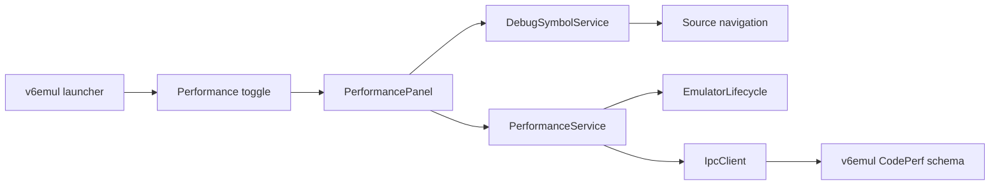

# V6 Performance Panel Plan

**Status:** Implemented; automated extension validation complete; live/manual acceptance pending
**Date:** 2026-08-02
**Owners:** v6vscode and v6emul maintainers
**Related work:** `v6emul-menu-and-panels-plan.md`, `symbols-panel-plan.md`, `memory-edits-panel-plan.md`, `debug-adapter-and-debug-views-plan.md`
**Server contract:** `C:\Work\Programming\v6emul\design\v6emul-code-perf-protocol-design.md`

## 1. Objective

Add a standalone **Performance** editor panel using the same launcher, toggle command, open-state context key, and direct-tab-close synchronization as Display, Hex Viewer, Memory Edits, Symbols, Ports, and Watchpoints.

The panel searches performance tests by user-defined name and presents an editable table with these columns, in this order:

| Column | Content | Editing |
|---|---|---|
| Activity | Whether the test collects samples | Single-click checkbox/toggle |
| Name | User-defined test name | Double-click text input |
| Start Address | Inclusive 16-bit CPU address where measurement starts | Double-click address input |
| End Address | Inclusive 16-bit CPU address where measurement ends | Double-click address input |
| Statistics | `average cc: <decimal number>, tests: <decimal number>` | Read-only |

The emulator is authoritative for test definitions, activity, and statistics. The webview is an untrusted presentation client and never invokes IPC directly.

## 2. Server Analysis

The legacy behavior, schema-1 protocol, relevant source, and compatible executable were checked in:

- `C:\Work\Programming\v6emul\libs\v6core\include\core\code_perf.h`
- `C:\Work\Programming\v6emul\libs\v6core\src\debug_data.cpp`
- `C:\Work\Programming\v6emul\libs\v6core\src\debugger.cpp`
- `C:\Work\Programming\devector\src\core\debug_data.h`
- `C:\Work\Programming\devector\src\core\debugger.cpp`
- `C:\Work\Programming\v6emul\design\v6emul-code-perf-protocol-design.md`

Live verification on 2026-08-02 used `v6emul 2026.08.01-46a9e78`. The executable advertises CodePerf schema 1 and the required commands and limits. The legacy details below remain as migration context; the extension implementation targets only schema 1.

### 2.1 Legacy executable model

`CodePerf` currently stores:

```cpp
std::string label;
Addr addrStart;
Addr addrEnd;
double averageCcDiff;
int64_t tests;
int64_t cc;
bool active;
```

`Addr` is a 16-bit CPU address. The legacy executable stores records keyed by `addrStart`. `CheckPerf` records the clock at `addrStart`, completes a sample at `addrEnd`, and updates `averageCcDiff`. The legacy test count saturates at `TESTS_MAX == 20000` while the average continues changing with a fixed weight.

Only `label`, `addrStart`, `addrEnd`, and `active` are persisted in debug-data JSON. Runtime statistics (`averageCcDiff`, `tests`, and the in-progress `cc`) reset when debug data is loaded or a record is replaced.

### 2.2 Legacy executable commands

The extension and server enums already agree on these command IDs:

| Command | ID | Current behavior |
|---|---:|---|
| `DEBUG_CODE_PERF_ADD` | 79 | Constructs/replaces a `CodePerf` from JSON and keys it by `addrStart` |
| `DEBUG_CODE_PERF_DEL_ALL` | 80 | Deletes every performance test |
| `DEBUG_CODE_PERF_DEL` | 81 | Deletes one test by `{ addr }` |
| `DEBUG_CODE_PERF_GET` | 82 | Gets one test by `{ addr }` |
| `DEBUG_CODE_PERF_EXISTS` | 83 | Tests for one test by `{ addr }` |

The current serialized record is:

```json
{
  "label": "name",
  "addrStart": "0x1234",
  "addrEnd": "0x1240",
  "active": true
}
```

Important limitations:

- `DEBUG_CODE_PERF_GET` is a single-address lookup, not a collection query.
- `CodePerf::ToJson()` omits `averageCcDiff` and `tests`, so no IPC request can return the requested Statistics value.
- There is no get-all command.
- There is no identity-preserving edit command in the current executable.
- The server does not advertise a CodePerf schema, limits, or mutation-while-running behavior through `GET_SERVER_INFO`.
- Parsing relies directly on JSON conversion and does not provide the structured field validation used by newer debug protocols.

The schema-1 protocol resolves these limitations with server-allocated IDs, create-only `DEBUG_CODE_PERF_ADD`, ID-based `GET`/`EXISTS`/`DEL`, `DEBUG_CODE_PERF_GET_ALL = 101`, and `DEBUG_CODE_PERF_EDIT = 102`. It also defines capability discovery, validation, sampling, limits, and lifecycle. The compatible server executable now implements and advertises this contract.

### 2.3 Schema-1 contract

Use these wire models exactly:

```ts
interface CodePerfInput {
  name: string;
  addrStart: number;
  addrEnd: number;
  active: boolean;
}

interface CodePerfSnapshot extends CodePerfInput {
  id: number;
  averageClockCycles: number;
  testCount: number;
}
```

Command behavior:

| Command | Request | Successful data payload |
|---|---|---|
| `DEBUG_CODE_PERF_ADD` (79) | `CodePerfInput` | Created `CodePerfSnapshot` with a new ID and zero statistics |
| `DEBUG_CODE_PERF_DEL_ALL` (80) | Empty object | Empty success; does not reset the next-ID counter |
| `DEBUG_CODE_PERF_DEL` (81) | `{ id }` | Empty success; missing ID is a no-op |
| `DEBUG_CODE_PERF_GET` (82) | `{ id }` | Matching `CodePerfSnapshot` or `null` |
| `DEBUG_CODE_PERF_EXISTS` (83) | `{ id }` | `{ exists: boolean }` |
| `DEBUG_CODE_PERF_GET_ALL` (101) | Empty object | Direct `CodePerfSnapshot[]` ordered by ascending ID |
| `DEBUG_CODE_PERF_EDIT` (102) | `{ id, ...CodePerfInput }` | Updated `CodePerfSnapshot` with the same ID |

ADD is create-only. Duplicate names, start addresses, and endpoint pairs are allowed. EDIT is a complete writable-configuration replacement and never accepts statistics. IDs are non-negative signed 32-bit integers, monotonic, stable for the in-memory collection lifetime, and not reused after deletion. A new `Debugger` instance starts a new collection and may reuse numeric IDs; the extension's session generation prevents identities from crossing that boundary.

Require `addrStart < addrEnd`, addresses in `0..65535`, valid UTF-8 names up to 1024 encoded bytes, at most 256 live records, and `testCount` in `0..20000`. The server advertises these values through `codePerfLimits` rather than requiring the client to hard-code them.

Records and completed statistics are runtime-only. They survive reset, restart, ROM loading, and TCP reconnect while the same `Debugger` remains alive; those clock-reset operations cancel only in-progress samples. Destroying the `Debugger` discards records, IDs, statistics, and in-progress samples.

### 2.4 Live contract verification

The 2026-08-02 probe connected to the server-mode executable through the extension's compiled `IpcClient` and observed:

- IPC protocol 2 and emulator version `2026.08.01-46a9e78`.
- Commands 79, 80, 81, 82, 83, 101, and 102 in `GET_SERVER_INFO.commands`.
- `codePerfSchema: 1`, server-allocated IDs, Edit support, and mutations while running.
- Limits `addressExclusive: 65536`, `maxNameBytes: 1024`, `maxRecords: 256`, and `maxTestCount: 20000`.
- Empty Get All and Delete All behavior.
- Create-only Add returning complete zero-statistics snapshots with monotonic IDs.
- Duplicate endpoint pairs retained as distinct records.
- ID-based Get, Exists, Edit, Delete, missing-ID Get/Exists/Delete behavior, and ascending-ID Get All.
- Equal endpoints rejected as structured `invalid_request` with command 79 and field `addrEnd`.

The probe cleaned up its records and exited the disposable server. This removes the server-availability blocker. Detailed sampling, reset/restart, reconnect, capacity, ID-exhaustion, and statistics-preservation scenarios remain acceptance coverage, not prerequisites for starting the extension implementation.

## 3. User Experience Contract

### 3.1 Surface and lifecycle

Add **Performance** to the existing `v6emul` Panels launcher after Memory Edits and before Symbols:

```text
v6emul
  Panels
    Settings
    Display
    Hex Viewer
    Memory Edits
    Performance
    Symbols
    Ports
    Watchpoints
```

Use:

- Toggle command: `v6emul.togglePerformance`.
- Refresh command: `v6.refreshPerformance`.
- Open-state context key: `v6emul.performanceOpen`.
- Webview panel ID: `v6.performance`.
- Tab title: `Performance`.
- `ViewColumn.Beside` and `retainContextWhenHidden: true`.

Maintain at most one panel instance. `open()` reveals the existing panel, the toggle closes an open panel, and direct tab disposal clears both launcher state and the context key. Closing or hiding the panel stops polling but does not alter server records.

Session states are:

- **No session:** empty table and `No active emulator session`; all mutations disabled.
- **Synchronizing:** retain the last snapshot from the same connection, mark it stale, and disable mutations.
- **Ready/paused:** show the latest acknowledged snapshot and allow mutations.
- **Running:** continue statistics refresh and allow mutations only when the server advertises that capability.
- **Unsupported backend:** identify the missing schema or command capability.
- **Read failure:** retain acknowledged rows, mark statistics stale, and expose Refresh.
- **Disconnected:** clear rows and drafts; reconnect fetches a fresh server snapshot.

On reconnect to the same `Debugger`, the fetched snapshot may contain the surviving IDs and statistics. A new session generation must still be used so delayed responses from an older connection cannot mutate or replace the new rendered state.

### 3.2 Table and formatting

Use one unframed tool surface containing a full-width search input, compact status/result count, and a table filling the remaining height. Use a sticky header and stable column widths. At narrow widths, preserve the table through horizontal scrolling instead of converting rows to cards.

Formatting rules:

- Activity displays `Active` or `Disabled` with an accessible checkbox/state; do not rely on color alone.
- Name is rendered verbatim as plain text and truncated only visually, retaining its full tooltip and accessible name.
- Addresses use uppercase four-digit `0xNNNN` notation and represent the server's 16-bit CPU `Addr` values directly.
- Statistics is exactly `average cc: N, tests: M`, using base-10 numbers. Round the average to the nearest integer to match the existing `CodePerf::AddrToStr()` presentation unless the agreed server schema specifies a different precision.
- Preserve the ascending server-ID order returned by `DEBUG_CODE_PERF_GET_ALL`.
- Preserve selection, focus, and an active draft by server-assigned record ID across snapshot replacement. Duplicate names, start addresses, and endpoint pairs are valid and remain separate rows.
- Assign all server and user text through `textContent` or form values, never `innerHTML`.

### 3.3 Search

Search matches only Name. Use the established panel search behavior: update results on every input with the existing short debounce, retain a compact result count, persist the query in workspace state, and restore it after reopening the panel.

Matching is a case-insensitive substring by default. An empty query shows every test. Search is local to the latest acknowledged snapshot and sends no emulator request. Cap persisted and incoming query text at 256 characters. Reuse the Symbols panel's search controls and filtering semantics where applicable rather than introducing a separate visual pattern.

### 3.4 Add and inline editing

The table context-menu **Add** action inserts one local draft row, focuses Name, and does not contact the emulator until submission. Only one draft or edited row may exist at a time.

Activity is the exception to the table's double-click editing behavior: one normal click on its checkbox immediately submits the record ID and complete writable configuration through `DEBUG_CODE_PERF_EDIT` with the toggled `active` value. Activity-only edits preserve completed statistics; disabling cancels an in-progress sample. Disable the checkbox while its mutation is in flight and restore the acknowledged state if the mutation fails. Do not require a double-click or open the rest of the row for editing.

Double-clicking any other editable cell enters inline edit mode:

- Name uses a single-line text input.
- Start Address and End Address use single-line address inputs.
- Statistics never enters edit mode.

Address inputs accept decimal, `0x`, `$`, and `h` forms and normalize to uppercase `0xNNNN` after acknowledgement. Validate integer syntax, the 16-bit range `0..0xFFFF`, and `start < end`. Validate Name as UTF-8 within `codePerfLimits.maxNameBytes`; an empty name is valid.

Keyboard behavior:

- `Enter` validates and submits the complete candidate row.
- `Escape` cancels and restores the last acknowledged row; for Add it removes the draft.
- `Tab` and `Shift+Tab` move among editable fields without committing.
- `Space` toggles Activity when its checkbox has focus.
- Invalid input keeps edit mode open, applies VS Code error styling, connects the error with `aria-describedby`, and sends no IPC request.

For Add, the webview sends the session generation and a complete `CodePerfInput`; the service sends create-only `DEBUG_CODE_PERF_ADD` without an ID or statistics and validates the returned zero-statistics snapshot. For an existing row, the webview sends the session generation, acknowledged ID, and complete writable candidate; the service sends `DEBUG_CODE_PERF_EDIT` with that unchanged ID. Refresh the authoritative collection afterward and exit edit mode only when the acknowledged row matches. Do not optimistically replace an acknowledged row.

If Add fails with `details.field = "collection"`, keep the draft open. For `details.reason = "capacity"`, report that deleting a record can free capacity. For `details.reason = "id_exhausted"`, report that no further IDs can be allocated during the current collection lifetime. Do not retry either failure automatically.

Endpoint edits reset `averageClockCycles` and `testCount` and cancel any in-progress sample. Name-only edits preserve completed statistics and the in-progress sample. Activity-only edits preserve completed statistics; disabling cancels an in-progress sample and enabling starts with no sample in progress. The server returns the resulting snapshot without changing the ID. Editing a missing ID is a structured `invalid_request` failure and triggers reconciliation.

### 3.5 Double-click source navigation

Clicking the Activity checkbox toggles Activity and stops event propagation. Double-clicking Name, Start Address, or End Address edits that cell and stops event propagation. Double-clicking Statistics or non-control row space navigates to the source line for the acknowledged start address.

The host resolves the address through `DebugSymbolService.sourceAtExactAddress`, derives the active project root, and calls the shared `revealDebugSource` helper. Never trust a source path supplied by the webview.

If the address has no exact DWARF row, keep the panel state unchanged and report `No DWARF source line for 0xNNNN` in the status area.

### 3.6 Context menus

VS Code cannot contribute native commands to arbitrary webview rows. Implement accessible custom DOM menus with `role="menu"`, `role="menuitem"`, roving keyboard focus, arrow-key navigation, `Escape`, the Context Menu key, and `Shift+F10`.

Right-clicking a row shows, in this order:

1. **Disable**
2. **Disable All**
3. **Delete**
4. **Delete All**

Right-clicking blank table space or the empty state shows, in this order:

1. **Add**
2. **Disable All**
3. **Delete All**

Keep inapplicable actions visible and visually muted through the native `disabled` state:

- Add is disabled without a compatible active session or while a conflicting mutation is in flight.
- Disable is disabled when the selected test is already inactive or mutation is unavailable.
- Disable All is disabled when the collection is empty, no tests are active, or mutation is unavailable.
- Delete is disabled when the selected row no longer exists or its mutation is in flight.
- Delete All is disabled when the collection is empty or mutation is unavailable, including immediately after a successful Delete All.

Disable sends `DEBUG_CODE_PERF_EDIT` with the selected ID and complete writable configuration except `active: false`. Disable All serially edits every active record the same way, then refreshes once; report partial failures. Both actions preserve completed statistics and cancel in-progress samples for affected records. Delete sends `DEBUG_CODE_PERF_DEL` with the selected ID; a missing ID is a successful no-op. Delete All sends `DEBUG_CODE_PERF_DEL_ALL`, removes the complete server collection, and requires a VS Code modal confirmation containing the record count.

Close the menu on action, `Escape`, outside click, scroll, edit start, snapshot replacement, session change, panel hide, or disposal. Return focus to the original row when it still exists, otherwise to the table body.

## 4. Architecture



### 4.1 Ownership

**PerformanceService** owns capability checks, runtime codecs, immutable snapshots, session generation, serialized mutations, polling/reconciliation, and change events. It is the only extension component that sends CodePerf IPC requests.

**PerformancePanel** owns `WebviewPanel` lifecycle, visibility-based refresh, persisted search state, host/webview message validation, confirmation dialogs, source navigation, and mapping service events to view snapshots.

**Webview assets** own rendering, local filtering, draft/edit state, focus, keyboard behavior, and accessible menus. They never invent server state or send raw IPC payloads.

**v6emul** owns server-allocated identity, definitions, activity, statistics, runtime collection lifetime, and matching against 16-bit CPU execution addresses.

### 4.2 Proposed extension layout

```text
src/
  debug/
    performance/
      performance-model.ts
      performance-codec.ts
      performance-service.ts
      performance-validator.ts
    views/
      performance-panel.ts
      performance-messages.ts
      performance-query.ts
      assets/
        performance.css
        performance.js
test/
  unit/
    debug/
      performance-codec.test.ts
      performance-service.test.ts
      performance-query.test.ts
      performance-webview.test.ts
```

### 4.3 Synchronization

- Every webview operation carries the current session generation and the acknowledged server-assigned ID that identifies the record.
- Serialize mutations; do not coalesce distinct mutations.
- After every mutation, fetch and validate the complete collection before publishing it.
- While visible, poll the complete snapshot once per second so Statistics changes while execution runs. Stop polling when hidden, disposed, disconnected, or unsupported.
- Prevent overlapping polls and discard responses from older connection or request generations.
- On malformed server data, reject the whole replacement snapshot, retain the last valid snapshot as stale, log the field-level failure, and disable mutations until reconciliation succeeds.

## 5. Extension Changes

### 5.1 Contributions and registration

Update `package.json` with toggle and refresh commands and an `editor/title` refresh action enabled for `activeWebviewPanelId == v6.performance`.

Add command and context constants in `src/config/contribution-ids.ts`. Add Performance to `EmulatorPanelLauncherView.PANELS`. In `src/extension.ts`, create one `PerformanceService` and `PerformancePanel`, register commands, initialize `v6emul.performanceOpen` to false, and synchronize launcher/context state from panel open/dispose callbacks.

### 5.2 Protocol and service

Add typed `CodePerfInput` and `CodePerfSnapshot` models and strict runtime decoders for schema 1. Reject duplicate IDs and IDs outside the integer range `0..2147483647`; accept duplicate names and addresses; reject non-finite statistics, test counts outside `0..codePerfLimits.maxTestCount`, invalid booleans/UTF-8 strings, addresses outside `0..0xFFFF`, `addrStart >= addrEnd`, and snapshots not ordered by ascending ID.

Add `validatePerformanceServer` beside the existing server-info validators. Require `codePerfSchema: 1`, `codePerfServerAllocatedIds: true`, `codePerfEdit: true`, `codePerfMutationsWhileRunning: true`, all four `codePerfLimits`, and commands 79 through 83 plus `DEBUG_CODE_PERF_GET_ALL = 101` and `DEBUG_CODE_PERF_EDIT = 102`.

The service API should expose immutable `snapshot`, `available`, `refresh`, `add`, `edit`, `disable`, `disableAll`, `delete`, and `deleteAll` operations. Add uses `DEBUG_CODE_PERF_ADD`; edit, disable, and each step of Disable All use `DEBUG_CODE_PERF_EDIT`; deletion uses ID-based `DEBUG_CODE_PERF_DEL` or `DEBUG_CODE_PERF_DEL_ALL`. Never send server-owned ID or statistics in Add, and never send statistics in Edit.

### 5.3 Panel and webview

Follow `MemoryEditsPanel` for standalone editor lifecycle and mutation orchestration, `SymbolsPanel` for name search and source navigation, and the Watchpoints/Memory Edits webviews for editable rows and accessible context menus.

Use a strict Content Security Policy and nonce. Validate every incoming message in the extension host. Keep row identity and all mutation targets host-owned; resolve a webview-supplied ID against the current acknowledged snapshot before acting.

## 6. Testing and Documentation

### 6.1 Unit and integration coverage

Add focused tests for:

1. Capability negotiation and every required command.
2. Input/snapshot decoding, ID and 16-bit address boundaries, ascending-ID ordering, allowed duplicate addresses/names, invalid statistics, and UTF-8 byte limits.
3. Service session generations, stale-response rejection, mutation serialization, post-mutation reconciliation, polling without overlap, and polling shutdown when hidden/disconnected.
4. Create-only Add, ID-preserving Edit, Disable, serial Disable All, ID-based Delete, and Delete All success/failure behavior, including capacity/ID-exhaustion Add failures, partial Disable All, and missing-ID reconciliation.
5. Name filtering, empty query, case-insensitive matching, query persistence, and 256-character bounds.
6. Click separation: one click on Activity submits its toggle, double-clicking other editable cells enters edit mode, and row/Statistics double-click requests source navigation.
7. Address and UTF-8 name validation, Enter/Escape/Tab behavior, and no IPC message for invalid drafts.
8. Row and table context-menu ordering, keyboard access, focus restoration, and disabled/gray states for empty, inactive, deleted-all, disconnected, unsupported, and in-flight cases.
9. Statistics formatting and refresh while running.
10. Source navigation success, missing exact DWARF address, and project-root resolution.
11. Launcher toggle state, direct tab close, reopen behavior, and refresh command routing.
12. Live-server contract tests proving Add returns a distinct ID, endpoint edits reset statistics, name/activity edits preserve completed statistics, duplicates remain distinct, 16-bit boundaries are enforced, and collection snapshots update while execution runs. Basic CRUD and capability behavior is already manually verified; automate it and add sampling/lifecycle coverage.

Run `npm run compile` and the focused unit suites after each extension slice, then `npm run test:unit` and the regression suite before completion.

### 6.2 Documentation

Update:

- `docs/commands.md` with Performance toggle and refresh commands.
- `docs/debugging.md` with test lifecycle, address semantics, statistics, edit behavior, and source navigation.
- `docs/emulator.md` with required CodePerf server schema and command support.
- `docs/architecture.md` with `PerformanceService` ownership and polling behavior.
- `docs/README.md` navigation if a dedicated Performance section is added.

## 7. Server Contract Status

### 7.1 Schema-1 availability

#### Description of the feature which implementation is blocked by the server code

The complete panel requires server-assigned record identity, structured snapshots with live statistics, identity-preserving edits, strict validation, capability discovery, coherent mutations while running, and defined sampling/lifecycle behavior. Schema 1 specifies all of these behaviors.

#### Current server solution that is not enough

The legacy executable was insufficient because it exposed address-keyed commands and formatted JSON without collection snapshots, IDs, Edit, capability negotiation, strict validation, or live statistics. That limitation no longer applies to the configured executable: its metadata and live CRUD responses conform to the schema-1 contract required by this panel.

#### New server functionality and recommendations

Treat `v6emul-code-perf-protocol-design.md` as the authoritative contract, including commands 101 and 102, all schema-1 capabilities and limits, exact input/snapshot shapes, command-specific missing-ID behavior, structured validation errors, ascending-ID Get All ordering, duplicate-record support, coherent running mutations, sampling saturation, explicit in-progress state, and runtime-only lifecycle/reset semantics.

No additional server command is required for this panel. Disable All can serialize `DEBUG_CODE_PERF_EDIT` over active IDs, and live Statistics can poll `DEBUG_CODE_PERF_GET_ALL` while visible. An update-counter command would not replace statistics polling.

No server functionality currently blocks implementation of the requested panel. The remaining work is extension implementation plus automated and scenario-level verification. If later sampling/lifecycle tests contradict the design, treat that as a server defect against schema 1 rather than changing the client contract silently.

## 8. Implementation Checklist

### Server contract

- [x] Provide a schema-1 server executable with commands 101 and 102.
- [x] Advertise the required CodePerf capabilities and limits.
- [x] Verify ID allocation, collection snapshots, Edit, duplicate records, missing-ID behavior, and representative structured validation over live IPC.
- [ ] Automate the verified CRUD/capability contract as a real-emulator feature test.
- [ ] Verify sampling, saturation, reset, reconnect, capacity, ID exhaustion, and runtime-only lifecycle scenarios against the executable.

### Extension protocol and service

- [x] Add CodePerf schema/limit capability models and `validatePerformanceServer`.
- [x] Add typed request/response models and strict runtime codecs.
- [x] Implement `PerformanceService` with immutable snapshots and session generations.
- [x] Implement serialized create-only Add, ID-preserving Edit/Disable/Disable All, and ID-based Delete/Delete All operations.
- [x] Add post-mutation full reconciliation and visible-only statistics polling.
- [ ] Add service, codec, validation, and stale-response unit tests against schema 1, plus focused live-contract coverage using the available executable. Focused unit coverage is in place; automated live-executable coverage remains pending.

### Panel integration

- [x] Add toggle/refresh command contributions, IDs, and open-state context key.
- [x] Add Performance to the `v6emul` Panels launcher.
- [x] Register and dispose the service/panel in `src/extension.ts`.
- [x] Implement single-instance panel lifecycle and direct-tab-close synchronization.
- [x] Implement session, loading, unsupported, stale, running, ready, disconnected, and empty states.

### Webview behavior

- [x] Implement the five-column accessible table and exact Statistics formatting.
- [x] Reuse established name-search behavior and persist the bounded query.
- [x] Implement one-click Activity toggling plus Add draft and double-click editing for Name, Start, and End.
- [x] Implement host and webview validation plus Enter/Escape/Tab/Space behavior.
- [x] Implement row double-click source navigation without conflicting with cell editing.
- [x] Implement row and table context menus in the specified order.
- [x] Implement disabled/gray states for empty, already-disabled, deleted-all, unavailable, and in-flight cases.
- [x] Implement focus/selection preservation and menu dismissal rules.
- [ ] Add webview interaction, accessibility, formatting, and source-navigation tests. Static webview contract coverage is complete; Extension Host interaction/source-navigation acceptance remains pending.

### Completion

- [x] Update user, command, emulator, and architecture documentation.
- [x] Run `npm run compile`, focused unit tests, `npm run test:unit`, and regression tests. Compile, focused Performance tests, and all 60 regression tests pass; the full unit suite reports 328 passing and four unrelated existing `demo1.elf` fixture mismatches.
- [ ] Verify the panel manually in an Extension Development Host while paused, running, hidden/reopened, disconnected/reconnected, and after Delete All.
- [ ] Verify that statistics update while running, endpoint edits reset statistics, and name/activity edits preserve completed statistics.