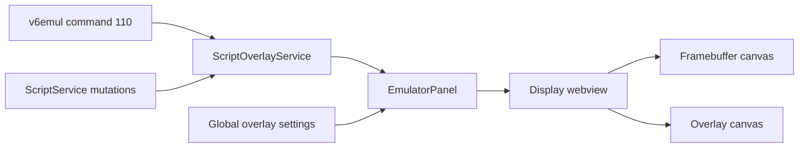

# Script Overlays Client Implementation Plan

**Status:** Proposed; server protocol implemented
**Date:** 2026-08-14
**Owner:** v6vscode maintainers
**Server contract:** v6emul `design/v6emul-script-overlay-protocol-design.md` and `docs/ipc-protocol.md`
**Related work:** `scripts-panel-plan.md`, `v6emul-scripts-protocol-design.md`, `v6emul-menu-and-panels-plan.md`

## 1. Goal

Render v6emul script overlays in the Display panel and expose two global user preferences in the existing Settings panel:

- **Hide All Overlays**, default `false`.
- **Font Size**, default `12` framebuffer pixels with an integer range of `6..48`.

The server owns retained overlay data. The client consumes command `110` deltas into a session cache and rasterizes cached text and rectangles on a transparent canvas above the emulator framebuffer.

Overlay preferences are global VS Code user settings. They are shared across projects, survive VS Code restarts, and are never written to `*.project.json`.

## 2. Server Contract

Require the independently advertised overlay interface:

- `IpcCommand.DEBUG_SCRIPT_OVERLAY_GET = 110`.
- `scriptOverlaySchema: 1`.
- `scriptOverlayRetained: true`.
- `scriptOverlayConsumesUpdates: true`.
- `scriptOverlayVectorScreenCoords: true`.
- `scriptOverlayColorFormat: 'RRGGBBAA'`.
- Positive `maxItemsPerScript`, `maxItemsTotal`, `maxTextBytes`, and `maxCoordinateMagnitude` limits.

Command `110` accepts an empty object and returns:

```ts
interface OverlayCommon {
  scriptId: number;
  itemId: number;
  vectorScreenCoords: boolean;
  x: number;
  y: number;
  color: number;
}

interface TextOverlay extends OverlayCommon {
  type: 'text';
  text: string;
}

interface RectOverlay extends OverlayCommon {
  type: 'rect';
  width: number;
  height: number;
  filled: boolean;
}

type ScriptOverlayItem = TextOverlay | RectOverlay;

interface ScriptOverlayResponse {
  overlays: ScriptOverlayItem[];
}
```

The response contains only changed items and consumes their internal update flags. An empty response is not an empty authoritative collection. Drawing order is ascending `scriptId`, then `itemId`.

Overlay support remains optional and independently capability-gated. A server without schema 1 overlays must continue supporting the existing Display and Scripts panel without errors or command `110` requests.

## 3. Client Architecture



### ScriptOverlayService

Owns consuming IPC reads, session generation, retained overlay cache, immutable sorted snapshots, and cleanup reconciliation.

### ScriptService

Publishes successful script operations that remove server overlays. It does not own rendering or the overlay cache.

### EmulatorSettingsController

Remains the Settings panel authority. Speed and Display Mode stay project-scoped; overlay visibility and font size are global user settings.

### EmulatorPanel and webview

Own visible-only polling coordination and rendering. The webview uses a separate pointer-transparent overlay canvas above the framebuffer canvas.

## 4. Implementation Phases

### Phase 1: Protocol and cache

#### 4.1 Add protocol models and capability validation

- Add `DEBUG_SCRIPT_OVERLAY_GET = 110` to `src/emulator/protocol/ipc-commands.ts`.
- Extend `ServerCapabilities` with the exact schema-1 overlay fields and limits.
- Add overlay limit, item, and response types to `src/emulator/protocol/debug-models.ts`.
- Add `validateScriptOverlayServer()` to `src/emulator/protocol/ipc-server-info.ts`.
- Keep `validateScriptServer()` unchanged so base script support does not depend on overlays.

#### 4.2 Add strict overlay decoding

Create `src/debug/scripts/script-overlay-codec.ts` and validate:

- Exact `{ overlays }` response shape.
- Exact common and discriminated variant fields.
- IDs in `0..2147483647`.
- Finite coordinates within `maxCoordinateMagnitude`.
- Non-negative rectangle dimensions within coordinate limits.
- Unsigned 32-bit colors.
- UTF-8 text without NUL bytes and within `maxTextBytes`.
- Response length within `maxItemsTotal`.
- Strict ascending unique `(scriptId, itemId)` order.

#### 4.3 Implement ScriptOverlayService

Create `src/debug/scripts/script-overlay-service.ts`.

- Store entries by `(scriptId,itemId)` and merge deltas by replacement, including type replacement.
- Publish a fully sorted immutable snapshot.
- Serialize command `110` reads because each response consumes update flags.
- Reject stale responses using lifecycle session generations.
- Clear cache on disconnect or process replacement.
- On reconnect, clear first and rebuild from the server's replay of retained overlays.
- Retain transparent items in cache but omit them from rendering.
- Never clear the cache because command `110` returned `[]`.
- Keep the service alive independently of the Scripts and Display panels so consumed state survives panel close/reopen.

#### 4.4 Reconcile overlay removals

Command `110` has no removal tombstones. Extend `ScriptService` with narrow successful-operation notifications and update `ScriptOverlayService` after acknowledgement:

- Edit or Activity change from active to inactive: remove that script's overlays.
- Disable: remove that script's overlays.
- Disable All: remove overlays for affected scripts.
- Delete: remove that script's overlays.
- Delete All: clear all overlays.

Do not invalidate overlays after Compile, active name/path edits, runtime failures, budget failures, reset, restart, ROM load, stop/start, or debug detach; the server preserves them.

Run Once may create overlays for an inactive script. Do not infer cleanup merely from an inactive snapshot; cleanup follows an explicit successful deactivation or deletion operation.

### Phase 2: Global Settings

#### 4.5 Contribute global settings

Add to `package.json`:

```json
{
  "v6.scriptOverlays.hidden": {
    "type": "boolean",
    "default": false,
    "description": "Hide all script overlays in the emulator Display."
  },
  "v6.scriptOverlays.fontSize": {
    "type": "integer",
    "default": 12,
    "minimum": 6,
    "maximum": 48,
    "description": "Script overlay text size in framebuffer pixels."
  }
}
```

Add corresponding constants to `src/config/contribution-ids.ts`.

#### 4.6 Extend EmulatorSettingsController

Add `scriptOverlaysHidden` and `scriptOverlayFontSize` to `EmulatorSettingsState`.

- Read values through `vscode.workspace.getConfiguration('v6')`.
- Validate boolean type and integer range `6..48` in the host.
- Persist with `vscode.ConfigurationTarget.Global`.
- Subscribe to `vscode.workspace.onDidChangeConfiguration` so native Settings edits update open panels and the Display immediately.
- Dispose the configuration listener with the controller.
- Keep project loading/saving limited to Speed and Display Mode.

Do not modify `V6ProjectRun`, `ProjectRepository`, `project-validator.ts`, or `v6.project.schema.json` for overlay settings.

#### 4.7 Extend the Settings panel

Add:

- A checkbox labelled **Hide All Overlays**.
- A numeric **Font Size** stepper with `min=6`, `max=48`, and `step=1`.

Overlay controls remain enabled when no project is active. Only project-scoped Speed and Display controls use the existing no-project disabled state.

Changing either global setting updates the Display immediately. Hide All clears only the overlay canvas; it does not modify server state or the retained client cache.

### Phase 3: Geometry and rendering

#### 4.8 Add pure overlay geometry

Create `src/emulator/panel/script-overlay-renderer.ts` without VS Code or DOM dependencies.

Geometry constants:

| Mode | Crop rectangle |
|---|---|
| Full | `(0, 0, 768, 312)` |
| Border | `(112, 24, 544, 288)` |
| Borderless | `(128, 40, 512, 256)` |

The active Vector-06C screen is `512x256` at full-frame origin `(128,40)`.

For each item:

1. Resolve negative coordinates from the right or bottom of its selected coordinate space.
2. For `vectorScreenCoords: true`, transform from active-screen coordinates into full-frame coordinates and clip to the active screen.
3. For `vectorScreenCoords: false`, clip to the full `768x312` framebuffer.
4. Subtract the current display-mode crop origin.
5. Clip partially visible primitives to the current cropped frame.
6. Decode `0xRRGGBBAA` using unsigned operations and preserve alpha.

Text uses top-left positioning, left alignment, top baseline, and a monospace font. Font Size is measured in framebuffer pixels. Rectangle outlines use one framebuffer pixel. Preserve server drawing order.

#### 4.9 Add the overlay canvas

Update Display panel assets to stack two canvases in one stable wrapper:

- Base canvas: framebuffer pixels.
- Overlay canvas: script text and rectangles.

Requirements:

- Both canvases have identical intrinsic dimensions and responsive CSS dimensions.
- Overlay canvas uses `pointer-events: none`.
- Frame messages redraw only the base canvas.
- Overlay/cache/font/visibility messages redraw only the overlay canvas.
- Reset clears both canvases and cached webview render state.
- Transparent items are skipped.
- Keyboard forwarding remains attached to the Display surface.

Update `EmulatorViewModel` message types to carry complete cached overlay snapshots and preferences separately from frame pixels.

#### 4.10 Integrate polling with EmulatorPanel

- Inject `ScriptOverlayService` into `EmulatorPanel` from `extension.ts`.
- Subscribe to overlay cache and global settings changes.
- Poll command `110` only while the Display is visible and the lifecycle is connected.
- Poll in running and paused states using a bounded interval independent of frame rate.
- Stop polling while hidden, disposed, or disconnected.
- Continue polling while overlays are globally hidden so the retained cache remains current and unhiding redraws immediately.
- Add a one-shot frame request when the Display becomes ready or visible while connected but paused, so Run Once overlays have a valid base frame.
- Use the existing shared IPC client and request-priority queue.

## 5. Tests

### Protocol and service

- Complete, malformed, and missing overlay capabilities.
- Overlay capability absence does not disable base Scripts or Display.
- Empty deltas, replacements, type changes, ordering, duplicate rejection, limits, malformed unions, and transparent items.
- Serialized consuming reads and stale-generation rejection.
- Disconnect/reconnect clearing and rehydration.
- Operation-driven cleanup for edit/disable/bulk/delete.
- Inactive Run Once overlay preservation.

### Settings

- Global defaults and `ConfigurationTarget.Global` persistence.
- Boolean and font-size validation.
- Bounds at `6` and `48`; reject fractions and out-of-range values.
- Native configuration-change propagation.
- No writes to project JSON.
- Overlay controls remain enabled without an active project.

### Geometry and rendering

- Full, border, and borderless crop modes.
- Positive and negative coordinates in both coordinate spaces.
- Active-screen and full-frame clipping.
- Partially visible rectangles.
- `RRGGBBAA` color and alpha decoding.
- Stable drawing order and font propagation.
- Separate canvases, pointer behavior, reset, paused redraw, and hidden/unhidden behavior.

### Integration and regression

- Manifest configuration properties.
- Display works against servers without overlay support.
- Closing and reopening Display preserves consumed cache.
- Panel visibility controls polling.
- Existing frame rendering, keyboard input, Scripts panel, Speed, and Display Mode behavior remain unchanged.

## 6. Documentation

Update:

- `docs/emulator.md` with command `110`, retained cache, rendering, and lifecycle behavior.
- `docs/settings.md` with both global settings.
- `docs/architecture.md` with `ScriptOverlayService` ownership and Display rendering flow.
- `design/features/scripts-panel-plan.md` only where current architecture references need to acknowledge overlay support, preserving newer edits.

## 7. Verification

Run:

```powershell
npm run compile
npm run lint
npm run test:unit
npm run test:regression
npm run test:integration
```

Also run VS Code diagnostics and `git diff --check`.

In an Extension Development Host against the implemented schema-1 v6emul, verify:

1. Text and outlined/filled rectangles in all display modes.
2. Positive and negative coordinates in active-screen and full-frame spaces.
3. RGBA alpha, replacement, and deterministic ordering.
4. Scheduled scripts while running and Run Once while paused.
5. Compile/runtime errors and disable/delete cleanup.
6. Reset, restart, ROM-load, stop/start, and reconnect preservation.
7. Display close/reopen and unsupported-server fallback.
8. Hide All clears immediately, continues ingesting deltas, and restores the latest cache when unchecked.
9. Font sizes `6`, `12`, and `48` update immediately.
10. Both overlay preferences survive project/workspace changes and VS Code restart as global user settings.

## 8. Decisions

- Both overlay preferences are global user settings, not project or workspace state.
- Font Size is an integer in framebuffer pixels, default `12`, range `6..48`, rendered with a monospace font.
- Hide All Overlays is client-only and does not mutate or delete server overlays.
- Overlay support is optional and independently capability-gated.
- Overlays render only in the Display panel; no per-item editor or list is included.
- No new server commands are required for visibility, font size, or deletion.
- The consuming delta protocol requires one client cache and operation-driven removal reconciliation.
- An empty command `110` response never clears the cache.


## 9. Implementation Checklist

### Protocol and cache

- [x] Add command `110`, overlay protocol models, and capability fields.
- [x] Validate overlay capabilities independently from base Scripts support.
- [x] Implement strict overlay response decoding and server-limit enforcement.
- [x] Implement the serialized, generation-aware retained overlay cache.
- [x] Clear and rehydrate the cache across disconnect and reconnect.
- [x] Reconcile removals after successful edit, disable, and delete operations.
- [x] Preserve inactive Run Once overlays until an explicit removal operation.

### Global settings

- [x] Contribute `v6.scriptOverlays.hidden` as a global boolean setting.
- [x] Contribute `v6.scriptOverlays.fontSize` with default `12` and range `6..48`.
- [x] Read, validate, persist, and observe both settings in `EmulatorSettingsController`.
- [x] Add Hide All Overlays and Font Size controls to the Settings panel.
- [x] Keep overlay controls available without an active project.
- [x] Confirm overlay preferences never modify project JSON.

### Display rendering

- [x] Implement pure coordinate, crop, clipping, and RGBA conversion helpers.
- [x] Add a pointer-transparent overlay canvas above the framebuffer canvas.
- [x] Render text with a monospace font and rectangles in stable server order.
- [x] Redraw overlays independently for cache, visibility, and font changes.
- [x] Integrate visible-only overlay polling in running and paused states.
- [x] Continue ingesting deltas while overlays are globally hidden.
- [x] Preserve keyboard input and existing framebuffer rendering behavior.

### Quality and documentation

- [x] Add protocol, codec, cache, settings, geometry, and rendering unit tests.
- [x] Add unsupported-server, lifecycle, panel reopen, and polling regression tests.
- [x] Update emulator, settings, and architecture documentation.
- [x] Run compile, lint, unit, regression, and integration validation.
- [ ] Complete the Extension Development Host acceptance checks.

The remaining manual acceptance check requires an Extension Development Host connected to the schema-1 v6emul server and representative Lua overlays. Automated validation cannot inspect the rendered overlay pixels or exercise the server's retained overlay replay.
