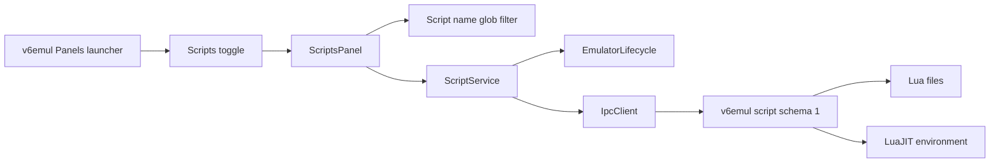

# V6 Scripts Panel Implementation Plan

**Status:** Proposed; extension implementation blocked by missing server schema
**Date:** 2026-08-08
**Owners:** v6vscode and v6emul maintainers
**Related work:** `v6emul-menu-and-panels-plan.md`, `performance-panel-plan.md`, `memory-edits-panel-plan.md`, `watchpoints-panel-plan.md`
**Server contract:** `v6emul-scripts-protocol-design.md`
**Server references:** `parallelno/v6emul` commands 84 through 88 and Lua script implementation

> **Assumption to confirm before implementation:** The feature request says users should show or hide the Trace Log panel. This plan assumes that sentence means the new **Scripts** panel should use the same launcher and toggle workflow already used by Trace Log and the other standalone panels. Confirm this placement decision at the implementation kickoff.

## 1. Problem

### Current behavior

v6vscode has no Scripts panel, script service, script protocol models, capability validation, or script commands in its panel launcher. The client enum already names five legacy v6emul requests:

| ID | Command | Current server behavior |
|---:|---|---|
| 84 | `DEBUG_SCRIPT_ADD` | Accepts a client-supplied Lua record and creates or replaces it. |
| 85 | `DEBUG_SCRIPT_DEL_ALL` | Clears the complete script collection. |
| 86 | `DEBUG_SCRIPT_DEL` | Deletes one client-supplied ID. |
| 87 | `DEBUG_SCRIPT_GET_ALL` | Returns the current unordered collection. |
| 88 | `DEBUG_SCRIPT_GET_UPDATES` | Returns a 32-bit mutation counter. |

The legacy server record is `{ id, active, code, comment }`. Add compiles the supplied source string immediately. Compilation and runtime failures are written only to the server log and force `active = false`; the error is not retained in the record or returned to the client. The API does not model a user-facing name or file path, does not allocate IDs reliably for remote clients, does not expose an explicit edit, compile, disable, disable-all, or run-once operation, and does not advertise a script schema or limits through `GET_SERVER_INFO`.

The existing v6vscode panel infrastructure already provides the required presentation patterns:

- `EmulatorPanelLauncherView`, contribution IDs, `extension.ts`, and `package.json` own panel visibility.
- `PerformancePanel` and `MemoryEditsPanel` own editable tables, Activity checkboxes, context menus, bulk actions, modal confirmation, refresh, and local query persistence.
- `PerformanceService` and `WatchpointService` own immutable server snapshots, session generations, serialized mutations, and post-mutation reconciliation.
- `SymbolsPanel` owns bounded search history and client-side filtering patterns.

### Desired behavior

Add a standalone **Scripts** editor panel to the existing `v6emul` Panels launcher. It displays a locally filtered server-owned script collection with columns in this order:

1. Compilation status icon.
2. Activity checkbox.
3. Name.
4. Full path.

Users can add scripts, edit Name and Path inline, toggle Activity, compile, run once, disable, disable all, delete, and delete all. Enter submits Name/Path edits and Escape restores the last acknowledged snapshot. Every field has a complete contextual tooltip, and a field-aware Copy action writes through the extension host.

The server remains authoritative for script identity, path, compile state, errors, activity, execution, and collection lifetime. The webview renders trusted snapshots and emits typed user intent; it never reads files, executes Lua, allocates IDs, or sends IPC directly.

### Root cause

The missing UI is not the only gap. The legacy code-string protocol cannot represent the requested path-based model or return the compile outcome needed by the status column. Implementing the panel directly over commands 84 through 88 would require the extension to invent names and paths, allocate IDs, infer compile success from activity, and hide server log errors. That would produce state the server cannot reconcile and would make Compile and Run Once impossible to implement correctly.

## 2. Strategy

### Approach: versioned server-owned script records with an established standalone panel

Define a structured script schema in v6emul first, then add a `ScriptService` and `ScriptsPanel` by following the implemented Performance panel architecture. Reuse existing command IDs 84 through 88 only where their conceptual operation remains compatible, and add explicit commands after the current public range for identity-preserving edit, compile, run once, disable, and disable all.

The extension implementation begins only when `GET_SERVER_INFO` advertises the complete schema and command set. Older servers show an unsupported state and receive no legacy script requests.

### Why this works

- The same launcher/context-key callback keeps direct tab close, command toggle, and launcher checked state synchronized.
- A path-based server snapshot directly supports every visible field and tooltip.
- Stable server IDs let filtering, polling, selection, editing, and mutations reconcile without using Name or Path as identity.
- Explicit compile results distinguish valid disabled scripts from compile failures.
- Serialized service mutations and a full refresh after every mutation match the repository's proven Performance and Watchpoints behavior.
- Server-side Compile and Run Once execute in the existing Lua environment on the emulation thread; the webview never becomes an execution boundary.
- Capability negotiation prevents a new client from silently misinterpreting legacy `{ code, comment }` records.

### Summary of changes

- Add Scripts contribution IDs, launcher entry, toggle/add/refresh commands, title actions, and extension registration.
- Add script capability fields, typed models, strict codecs, validation, and command IDs.
- Add a session-scoped `ScriptService` with immutable snapshots and serialized CRUD/compile/run operations.
- Add a standalone `ScriptsPanel` plus external CSS/JavaScript assets and typed webview messages.
- Add a pure local script-name glob filter and focused tests.
- Add protocol, service, panel, webview, integration, regression, live-server, and documentation coverage.
- Implement and verify the missing v6emul script schema before enabling mutations.

## 3. User Experience Contract

### 3.1 Surface and visibility

Add Scripts after Trace Log in the existing launcher:

```text
v6emul
  Panels
    Settings
    Display
    Hex Viewer
    Memory Edits
    Performance
    Trace Log
    Scripts
    Symbols
    Ports
    Watchpoints
```

Use:

- Toggle command: `v6emul.toggleScripts`.
- Add command: `v6.addScript`.
- Refresh command: `v6.refreshScripts`.
- Open-state context key: `v6emul.scriptsOpen`.
- Webview panel ID: `v6.scripts`.
- Tab title: `Scripts`.
- `ViewColumn.Beside` and `retainContextWhenHidden: true`.

Maintain one panel instance. `open()` reveals it, the toggle closes it, and direct tab disposal clears both launcher state and the context key. Closing or hiding the panel stops polling and dismisses menus but never changes server script activity or deletes scripts.

The Add and Refresh commands appear in the editor title when `activeWebviewPanelId == v6.scripts`. Add also remains available in the table context menu and Command Palette.

Session states are:

- **No session:** empty table, `No active emulator session`, mutations disabled.
- **Synchronizing:** retain the last snapshot for the current connection and disable mutations.
- **Ready/paused:** show the latest acknowledged collection and enable supported actions.
- **Running:** continue update-counter polling and allow actions only when advertised by the server.
- **Unsupported:** identify the missing script schema or command support.
- **Empty:** show `No scripts`; the empty surface remains a keyboard/context-menu target for Add.
- **Error/stale:** retain the last valid snapshot, report the error, and leave Refresh available.
- **Disconnected:** clear rows, selection, menus, and drafts so IDs cannot cross session generations.

### 3.2 Filter

Filter only the Name field. The pure query module uses these rules:

- Empty or whitespace-only input shows every script.
- `*` matches zero or more characters.
- A query containing no `*` is a case-insensitive substring query, equivalent to `*<query>*`.
- A query containing `*` is a case-insensitive full-name glob. For example, `Test S*` matches `Test Scene` and `Test Script 01`, while `*Scene` matches names ending in `Scene`.
- Every other character is literal. Regular-expression syntax has no special meaning.
- Collapse adjacent `*` characters during normalization.
- Bound query text to 256 UTF-16 code units before persistence or matching.
- Filtering is local to the latest acknowledged snapshot and sends no emulator request.

Implement matching without converting untrusted text into an executable regular expression. Use a small deterministic glob matcher or an existing repository helper if one is introduced before implementation. Do not copy Trace Log's server-side address/instruction grammar because this panel has a bounded in-memory name list and different semantics.

Persist the normalized query in `ExtensionContext.workspaceState` under `v6.scripts.query` and restore it when the webview becomes ready. Update results on every input and show `<visible> of <total>` beside the filter. Query history is not required by this feature; do not add it unless all editable-list panels adopt the same shared control.

### 3.3 Table and tooltips

Use one unframed tool surface with a compact toolbar/status line and a horizontally scrollable table. Keep a sticky header and stable column widths. Do not convert rows into cards at narrow widths.

| Column | Display | Tooltip | Editing |
|---|---|---|---|
| Compilation | Success or error icon with non-color accessible text | `Compiled Successfully` or `Error: <server error>` | Read-only; Compile is an action. |
| Activity | Checkbox | `Enabled` or `Disabled` | One click submits a state change. |
| Name | Plain text, visually truncated when needed | Full script name | Double-click text input. |
| Path | Full normalized path, visually truncated when needed | Full path | Double-click text input. |

Use `aria-label` for status icons and Activity. Assign all names, paths, and server errors through `textContent`, `title`, or form values; never interpolate them into HTML. Compilation success and failure must remain distinguishable in high-contrast themes and without color.

Preserve server order, which schema 1 defines as ascending `scriptId`. Preserve selection, focus, and the active draft by `scriptId` across same-generation snapshot replacement. Do not rebuild an active editor during background polling.

### 3.4 Add and inline editing

Add inserts one local draft row at the top and focuses Name. Suggested defaults are an empty Name, an empty Path, and Activity enabled. The draft sends no IPC request until Enter submits it. Optionally provide a path browse icon beside the draft Path field using `vscode.window.showOpenDialog`; the text input remains the authoritative full-path editor.

Only Name and Path use double-click edit mode. Double-clicking one of those cells edits the complete writable row so both values remain available for validation. Compilation is read-only. Activity toggles immediately on one normal click and must not open edit mode.

Keyboard contract:

- `Enter` validates and submits the complete draft or edited script.
- `Escape` cancels and restores the last acknowledged row; for Add it removes the draft.
- `Tab` and `Shift+Tab` move between Name and Path without committing.
- `Space` toggles Activity while the checkbox has focus.
- Invalid input keeps edit mode open, applies VS Code validation styling, associates the error through `aria-describedby`, and sends no IPC request.

Validate basic shape in the webview and repeat all validation in the extension host. Name and Path must be strings, valid UTF-8, and within server-advertised byte limits. Path must be absolute. Only the server authoritatively checks whether it identifies a regular readable file; a missing, unreadable, or non-regular file is retained as compilation error state rather than rejected as malformed input. Do not require `.lua` unless the server contract explicitly adopts that restriction.

After Add or an edited Path, the server reads and compiles the file. A successful mutation publishes the refreshed authoritative snapshot and exits edit mode. A compile failure keeps the record, sets its compilation error, disables it, and returns a normal record result so the UI can render the error tooltip. A failed validation or transport request keeps the draft/editor open.

Changing Name alone does not recompile. Changing Path recompiles because the source identity changed. Compile explicitly re-reads the current Path so users can pick up external file changes without editing the row.

### 3.5 Context menus and actions

VS Code cannot contribute native actions for arbitrary webview cells. Reuse the accessible custom DOM menu pattern from Performance, Memory Edits, Watchpoints, and Symbols: `role="menu"`, `role="menuitem"`, managed keyboard focus, ArrowUp/ArrowDown, Home/End, Enter/Space, Escape, Context Menu key, and `Shift+F10`.

Right-clicking a field shows this order:

1. **Copy**
2. **Add**
3. **Compile**
4. **Run Once**
5. **Disable**
6. **Disable All**
7. **Delete**
8. **Delete All**

Right-clicking blank table space or the empty state shows the same menu, with row-specific Copy, Compile, Run Once, Disable, and Delete visible but disabled. Add, Disable All, and Delete All target the collection.

Action behavior:

- **Copy** copies the targeted field's displayed semantic value through `vscode.env.clipboard.writeText`: compile tooltip text, `Enabled`/`Disabled`, Name, or full Path.
- **Add** starts the same draft flow as `v6.addScript`.
- **Compile** re-reads and compiles the selected script Path without changing Name or requested Activity. Success clears the previous compile error. Failure stores the new error and disables the script.
- **Run Once** executes the latest successfully compiled selected script exactly once without changing its Activity. It is disabled for a compile error or unsupported execution state.
- **Disable** sets the selected active script to inactive. It is disabled when the row is already inactive.
- **Disable All** atomically sets all active scripts inactive and requires confirmation.
- **Delete** removes the selected script without touching the file.
- **Delete All** removes every server record without touching any file and requires confirmation.

Use the existing host-owned modal mechanism:

```ts
vscode.window.showWarningMessage(message, { modal: true }, actionLabel)
```

Confirmation text includes the affected count:

- `Disable all <N> active scripts?` with button `Disable All`.
- `Delete all <N> scripts? Script files will not be deleted.` with button `Delete All`.

Close menus on action, Escape, outside click, scroll, edit start, snapshot replacement, session change, panel hide, or disposal. Return focus to the originating cell when it still exists, otherwise to the table body.

## 4. Proposed Server Contract

### 4.1 Capability negotiation

Add schema-1 fields to `GET_SERVER_INFO.capabilities`:

```ts
interface ScriptLimits {
  maxNameBytes: number;
  maxPathBytes: number;
  maxRecords: number;
  maxErrorBytes: number;
}

interface ServerCapabilities {
  scriptSchema?: number;
  scriptServerAllocatedIds?: boolean;
  scriptPathSources?: boolean;
  scriptExplicitCompile?: boolean;
  scriptRunOnce?: boolean;
  scriptBulkDisable?: boolean;
  scriptMutationsWhileRunning?: boolean;
  scriptLimits?: ScriptLimits;
}
```

v6vscode requires `scriptSchema: 1`, every listed boolean capability needed by the panel, positive limits, and the complete command set before enabling mutations. Command presence alone is insufficient because legacy commands 84 through 88 use a different record shape.

### 4.2 Models

Use `boolean`, not the non-TypeScript `bool` type from the initial sketch.

```ts
interface ScriptInput {
  name: string;
  path: string;
  active: boolean;
}

type ScriptCompilation =
  | { status: 'compiled'; error: null }
  | { status: 'error'; error: string };

interface ScriptSnapshot extends ScriptInput {
  scriptId: number;
  compilation: ScriptCompilation;
}

interface ScriptIdRequest {
  scriptId: number;
}

interface ScriptMutationResponse {
  scriptId: number;
}

type EmptyRequest = Record<string, never>;

interface ScriptAddRequest extends ScriptInput {}
type ScriptAddResponse = ScriptMutationResponse;

interface ScriptEditRequest extends ScriptInput {
  scriptId: number;
}
type ScriptEditResponse = ScriptMutationResponse;

type ScriptCompileRequest = ScriptIdRequest;
type ScriptCompileResponse = ScriptMutationResponse;

type ScriptDeleteRequest = ScriptIdRequest;
type ScriptDeleteResponse = undefined;
type ScriptDeleteAllRequest = EmptyRequest;
type ScriptDeleteAllResponse = undefined;

type ScriptDisableRequest = ScriptIdRequest;
type ScriptDisableResponse = ScriptMutationResponse;

type ScriptGetAllRequest = EmptyRequest;
type ScriptGetAllResponse = ScriptSnapshot[];

type ScriptGetUpdatesRequest = EmptyRequest;
interface ScriptGetUpdatesResponse {
  updates: number;
}

type ScriptDisableAllRequest = EmptyRequest;
interface ScriptDisableAllResponse {
  disabled: number;
}

type ScriptRunOnceRequest = ScriptIdRequest;
interface ScriptRunOnceResponse {
  scriptId: number;
  succeeded: boolean;
  error?: string;
}
```

`name`, `path`, and `active` are writable. `scriptId` and `compilation` are server-owned. The server normalizes Path once and returns that authoritative full path. Compile and file-read errors are record state, not request-envelope errors: Add retains the new record and Edit/Compile retains the existing record, stores the bounded error, and sets Activity false. Reserve failed IPC envelopes for malformed payloads, unsupported operations, transport failures, and internal failures that prevent a coherent record result.

All operations use the repository's existing `IpcResponse<T>` envelope. A structured failure uses `ok: false`, `code: "invalid_request" | "unknown_command" | "dispatch_error" | "internal_error"`, a user-facing `error`, and `details` containing `command`, optional `field`, optional `scriptId`, and optional machine-readable `reason`. Successful Delete and Delete All responses use `ok: true` with no `data` field.

### 4.3 Commands

Retain the existing IDs for compatible collection concepts and allocate new IDs after the current public command range:

| Command | ID | Request | Successful data |
|---|---:|---|---|
| `DEBUG_SCRIPT_ADD` | 84 | `ScriptInput` | `ScriptMutationResponse` with a new ID |
| `DEBUG_SCRIPT_DEL_ALL` | 85 | Empty object | Empty success |
| `DEBUG_SCRIPT_DEL` | 86 | `ScriptIdRequest` | Empty success |
| `DEBUG_SCRIPT_GET_ALL` | 87 | Empty object | `ScriptSnapshot[]`, ascending by `scriptId` |
| `DEBUG_SCRIPT_GET_UPDATES` | 88 | Empty object | `{ updates: uint32 }` |
| `DEBUG_SCRIPT_EDIT` | 105 | `{ scriptId, ...ScriptInput }` | `ScriptMutationResponse` with the same ID |
| `DEBUG_SCRIPT_COMPILE` | 106 | `ScriptIdRequest` | `ScriptMutationResponse` |
| `DEBUG_SCRIPT_RUN_ONCE` | 107 | `ScriptIdRequest` | `ScriptRunOnceResponse` |
| `DEBUG_SCRIPT_DISABLE` | 108 | `ScriptIdRequest` | `ScriptMutationResponse` |
| `DEBUG_SCRIPT_DISABLE_ALL` | 109 | Empty object | `{ disabled: number }` |

These IDs are proposals and must be confirmed in v6emul before either repository ships them. Update supported-command bounds, command tests, docs, and both enums together.

Command semantics:

- **Add** is create-only. The server allocates a non-negative monotonic ID, stores the normalized full Path, reads and compiles it, and returns the ID. Duplicate Name or Path values are allowed unless product requirements explicitly reject them. The client then refreshes Get All.
- **Edit** is a complete replacement of writable fields for an existing ID. Name-only and Activity-only edits preserve the compiled function and compile result. A Path change releases the old compiled reference and compiles the new file. The ID never changes.
- **Compile** releases the previous compiled reference only after the replacement compiles successfully, or explicitly stores error/disabled state without retaining a runnable stale function. The chosen policy must be atomic and tested; this plan recommends no stale execution after a failed explicit Compile.
- **Run Once** runs the current compiled function once without changing Activity. A successful run stores no execution metadata and does not increment the update counter. A runtime error must not escape the emulation thread, must disable the script to prevent repeated failures, must store an observable error in the next snapshot, and therefore increments the update counter when Activity/status/error changes. If runtime errors share the Compilation tooltip, return/store `Error: <message>` consistently; a future schema may separate compile and runtime status.
- **Disable** is idempotent and changes only Activity. It exists because it is a first-class requested server operation and avoids sending the complete record for a one-bit mutation.
- **Disable All** is atomic on the emulation thread and returns the number changed. It must not leave a partially disabled collection.
- **Delete** and **Delete All** release Lua registry references and remove only server records, never source files.
- **Get All** always returns an array, including `[]`, in ascending ID order.
- **Get Updates** is a non-consuming unsigned 32-bit wrapping counter. Effective add, edit, compile-result change, activity change, runtime-error state change, and delete increment it. Rejected requests and no-op disable/delete/clear do not.

### 4.4 Validation and lifecycle

- Reject missing, extra, mistyped, invalid UTF-8, and over-limit fields with `code: "invalid_request"`, `details.command`, and `details.field`.
- IDs are safe non-negative signed 32-bit integers. Unknown IDs for Edit, Compile, Run Once, and Disable return `invalid_request` with `details.field = "scriptId"`. Delete may be a documented no-op, matching other collections.
- Reject relative paths. Normalize separators/canonical form according to the server platform and return the normalized path.
- Enforce `maxRecords` and ID exhaustion before allocation. Use `details.field = "collection"` plus `details.reason = "capacity" | "id_exhausted"`.
- Bound compile/runtime error text by `maxErrorBytes` without producing invalid UTF-8.
- Run file I/O, Lua compilation, registry mutation, and execution in a serialized server-owned operation. Do not expose a partially updated record.
- Define whether mutation and Run Once are accepted while execution is running and advertise it. v6vscode sends actions while running only when supported.
- Records, IDs, compiled references, status, and the update counter survive reset, restart, ROM load, and TCP reconnect while the same debugger/Lua environment exists. Destroying the debugger clears the collection. Reset clears script-created UI output only if that is the existing Lua lifecycle contract.
- Script checks remain debug-attach functionality. When no debug callback is active, the server may retain and compile records, but Activity execution behavior must be documented.

## 5. Architecture



### Ownership boundaries

**ScriptService** owns capability checks, limits, runtime decoding, immutable snapshots, session generations, update-counter polling, serialized mutations, post-mutation reconciliation, and stale-response rejection. It is the only extension component that sends script IPC.

**ScriptsPanel** owns `WebviewPanel` lifecycle, visibility-based polling, workspace query persistence, message validation, clipboard writes, modal confirmation, and conversion from service snapshots to host messages.

**Script query module** owns normalization and deterministic matching. It has no VS Code, DOM, service, or protocol dependency.

**Webview assets** own rendering, local filter application, edit/draft state, selection, focus, tooltips, and accessible menus. Treat every message as untrusted and validate it again in the extension host.

**v6emul** owns files, normalized paths, Lua compilation/runtime, IDs, Activity, errors, update counter, ordering, and collection lifetime.

### Proposed extension layout

```text
src/
  debug/
    scripts/
      script-codec.ts
      script-service.ts
    views/
      scripts-panel.ts
      scripts-messages.ts
      scripts-query.ts
      assets/
        scripts.css
        scripts.js
test/
  unit/
    debug/
      script-codec.test.ts
      script-service.test.ts
      scripts-panel.test.ts
      scripts-query.test.ts
```

Do not extract a generic panel base class during this feature. Reuse the established shape directly; introduce shared abstractions only when they remove proven duplication across at least three implemented panels without hiding panel-specific lifecycle behavior.

## 6. Implementation Steps

### Step 6.1 - Confirm and implement the v6emul schema [ ]

- Add the schema-1 design to v6emul and confirm command IDs 105 through 109.
- Implement the path-based model, stable server IDs, retained compile status/error, explicit actions, deterministic snapshots, update-counter rules, structured validation, limits, lifecycle, and tests.
- Add protocol documentation and `GET_SERVER_INFO` capabilities.
- Build v6emul and run its focused unit/IPC suites.

> **Design Notes:** Keep legacy compatibility only behind a distinguishable schema/version. Do not make one command return `{ code, comment }` to old clients and `{ name, path, compilation }` to new clients without explicit negotiation.
>
> **Implementation Notes:**

### Step 6.2 - Add client protocol models and validation [ ]

- Add command IDs 105 through 109 to `ipc-commands.ts` after server confirmation.
- Add `ScriptInput`, `ScriptSnapshot`, result types, limits, and capability fields.
- Add strict codecs that reject malformed compilation unions, duplicate IDs, unsorted snapshots, oversized strings, unknown fields, and invalid IDs.
- Add `SUPPORTED_SCRIPT_SCHEMA` and `validateScriptServer()` beside the existing validators.
- Add capability/codec unit tests for every command and boundary.

> **Implementation Notes:**

### Step 6.3 - Implement the pure Scripts filter [ ]

- Add normalization and case-insensitive glob matching with implicit surrounding wildcards when no `*` appears.
- Reuse an existing shared glob matcher only if its full-name, case, and literal-character semantics match exactly.
- Test empty input, plain substrings, leading/middle/trailing stars, adjacent stars, spaces, regex punctuation as literals, Unicode case behavior, query bounds, and the `Test S*` example.

> **Implementation Notes:**

### Step 6.4 - Implement ScriptService [ ]

- Follow `PerformanceService` for immutable snapshots, connection generation, queueing, full reconciliation, and errors.
- Follow `WatchpointService` for update-counter polling while the visible collection is otherwise static.
- Expose `snapshot`, `available`, `sessionGeneration`, `refresh`, `refreshIfChanged`, `add`, `edit`, `setActivity`, `compile`, `runOnce`, `disable`, `disableAll`, `delete`, and `deleteAll`.
- Validate IDs against the current snapshot before mutation and refresh after every state-changing operation, including failures when possible.
- Clear state on disconnect and ignore stale generation responses.

> **Implementation Notes:**

### Step 6.5 - Add contributions and panel registration [ ]

- Add `CMD_TOGGLE_SCRIPTS`, `CMD_ADD_SCRIPT`, `CMD_REFRESH_SCRIPTS`, and `CONTEXT_SCRIPTS_OPEN`.
- Add Scripts to `EmulatorPanelLauncherView.PANELS` after Trace Log.
- Contribute toggle/add/refresh commands and Add/Refresh editor-title actions in `package.json`.
- Construct and dispose one `ScriptService` and `ScriptsPanel` in `extension.ts`.
- Initialize the context key to false and synchronize launcher/context state from the panel callback.
- Extend launcher and standalone-panel regression tests.

> **Implementation Notes:**

### Step 6.6 - Implement ScriptsPanel host behavior [ ]

- Follow `PerformancePanel` for lifecycle, states, operation reporting, modal confirmation, workspace query restoration, and polling shutdown.
- Add typed host/webview messages carrying session generation and server IDs.
- Validate every action and field target, resolve IDs against the current snapshot, and perform clipboard writes in the extension host.
- Poll `refreshIfChanged()` once per second only while visible and compatible.
- Dismiss menus and preserve/cancel drafts according to session generation and operation results.

> **Implementation Notes:**

### Step 6.7 - Implement the webview table and interactions [ ]

- Add external nonce-protected JavaScript/CSS with narrow `localResourceRoots` and VS Code theme tokens.
- Render the four columns, status icons, complete tooltips, filter count, empty/error states, and stable table sizing.
- Implement Add, Name/Path editing, Activity toggles, Enter/Escape/Tab/Space, in-flight disabled states, and no optimistic acknowledged-state replacement.
- Implement field-aware Copy and the complete accessible context menu with focus restoration.
- Preserve active drafts and editors across same-generation polling snapshots.

> **Implementation Notes:**

### Step 6.8 - Add automated extension coverage [ ]

- Add protocol capability and malformed-payload tests.
- Add service tests for serialization, update-counter polling, stale response rejection, post-mutation reconciliation, compile/runtime errors, partial transport failures, and disconnect.
- Add static and DOM interaction tests for columns, tooltips, filtering, editing, menu ordering, disabled states, confirmations, keyboard behavior, and plain-text rendering.
- Add integration coverage for launcher toggle, direct tab close, title commands, hidden polling shutdown, reconnect, and unsupported-server state.
- Add regression coverage ensuring all existing panel launcher entries and scripts remain intact.

> **Implementation Notes:**

### Step 6.9 - Build and run focused tests [ ]

Run:

```powershell
npm run compile
npm run test:unit
npm run test:regression
```

Run the narrow script protocol, service, query, panel, and launcher suites first after each implementation slice. Do not treat existing unrelated failures as Scripts regressions; record them separately.

> **Implementation Notes:**

### Step 6.10 - Run live-server and Extension Host acceptance [ ]

- Add a real-emulator feature test using the configured `V6EMUL` executable.
- Verify capability negotiation, empty collection, Add/Edit/Compile/Run Once/Disable/Delete, both bulk actions, update-counter no-op rules, compile and runtime errors, ordering, reconnect, reset/restart, and collection lifetime.
- In an Extension Development Host, verify every mouse, keyboard, tooltip, context-menu, confirmation, hide/reopen, disconnect/reconnect, running/paused, long Name, and long Path workflow.
- Ensure the feature test records an explicit result artifact following the repository's real-emulator test conventions; `test/features/README.md` currently defines prerequisites but no Scripts scenario, so add one rather than applying the compiler-specific assembly-result instructions from the generic feature prompt.

> **Implementation Notes:**

### Step 6.11 - Update documentation [ ]

- Update `README.md` panel inventory and command table.
- Update `docs/commands.md` with toggle, Add, and Refresh.
- Update `docs/emulator.md` with Lua script schema, lifecycle, compile status, and actions.
- Update `docs/debugging.md` with user workflows and compatibility requirements.
- Update `docs/architecture.md` with `ScriptService` ownership and path-based server execution.
- Add or link the authoritative server protocol design in v6emul.

> **Implementation Notes:**

## 7. Expected Results

### Example: filter and inspect a large collection

With scripts named `Test Scene`, `Test Script 01`, and `Release Scene`, entering `Test S*` shows the first two rows, preserves ascending server-ID order, and reports `2 of 3`. Clearing the field immediately restores all rows without IPC.

### Example: edit and compile safely

Double-clicking Path opens the full value. Escape restores the acknowledged path without contacting v6emul. Enter submits a valid absolute path; the server reads and compiles it, and the row shows either the success icon or an error icon whose tooltip includes the retained server error.

### Example: control execution without losing records

Clicking Activity disables one script while retaining its path and compiled state. Run Once executes a compiled disabled script exactly once without enabling it. Disable All and Delete All require count-specific modal confirmation, and Delete All never removes Lua files.

### Example: predictable compatibility

Connecting to a server that advertises only legacy commands 84 through 88 shows an unsupported state. The extension does not send a path-shaped payload to a code-shaped legacy handler and does not claim compilation success it cannot observe.

## 8. Risks and Mitigations

| Risk | Mitigation |
|---|---|
| Legacy and schema-1 payloads share command IDs 84 through 88. | Require `scriptSchema: 1` and exact capability checks before sending any script command. |
| A path edit or compile races with file changes. | Let the server open/read/compile atomically for one operation and publish the resulting snapshot. |
| Runtime Lua errors repeat every emulator tick. | Server disables the script on runtime error and exposes the error through the snapshot/update counter. |
| Disable All partially succeeds. | Provide one atomic server bulk command rather than client-side per-row edits. |
| Polling disrupts an inline editor. | Preserve webview drafts by ID and avoid row rebuild while editing; stop polling while hidden. |
| Long paths destabilize the layout. | Use stable grid tracks, visual ellipsis, horizontal scrolling, and complete tooltips. |
| A stale response affects a new emulator session. | Carry and validate service generation on every host/webview operation and response. |
| Path access differs in remote/container VS Code environments. | Document that v6emul resolves paths on the machine where it runs; return the normalized server path and report inaccessible paths explicitly. |
| Script APIs can mutate emulator state or request Break. | Keep execution on the emulation thread, serialize operations, define Run Once state semantics, and add live safety tests. |
| Compile errors are mistaken for transport failures. | Model compilation as snapshot state; reserve failed IPC envelopes for invalid requests and operational failures. |

## 9. Relationship to Other Improvements

- The Scripts panel extends the standalone visibility mechanism established by `v6emul-menu-and-panels-plan.md` without changing panel ownership.
- Its table, mutation, and confirmation behavior should stay visually and structurally aligned with Performance and Memory Edits.
- Its update-counter synchronization follows Watchpoints, while its local name filtering follows Performance with the requested glob extension.
- Runtime script `Break()` may later enrich stop records and DAP stopped descriptions, but the panel must not wait for that enhancement unless Run Once requires explicit break attribution.
- A future shared editable-list webview toolkit may extract menu/focus/editor utilities after Scripts provides a third sufficiently similar implementation. Do not make that refactor a prerequisite.

## 10. Future Enhancements

- Open Path in the VS Code editor and reveal compile-error line/column when the server returns structured locations.
- Add file-system watching and an opt-in auto-compile mode.
- Separate compile and last-runtime status in a later schema.
- Show last run time, duration, or execution count if the server can provide them without per-tick polling.
- Add multi-selection and selected-row bulk operations.
- Add script API discovery/completion documentation for the exposed Lua functions.
- Add server-pushed collection events if update polling becomes measurable overhead.

## 11. References

- `src/emulator/panel/emulator-panel-launcher-view.ts`
- `src/config/contribution-ids.ts`
- `src/extension.ts`
- `src/debug/views/performance-panel.ts`
- `src/debug/performance/performance-service.ts`
- `src/debug/views/memory-edits-panel.ts`
- `src/debug/views/assets/memory-edits.js`
- `src/debug/views/watchpoints-provider.ts`
- `src/debug/watchpoints/watchpoint-service.ts`
- `src/debug/views/symbols-panel.ts`
- `src/emulator/protocol/ipc-commands.ts`
- `src/emulator/protocol/ipc-server-info.ts`
- `test/unit/emulator/standalone-panels.test.ts`
- `test/unit/emulator/emulator-panel-launcher-view.test.ts`
- `design/features/v6emul-menu-and-panels-plan.md`
- `design/features/performance-panel-plan.md`
- `design/features/memory-edits-panel-plan.md`
- `design/features/watchpoints-panel-plan.md`
- `parallelno/v6emul`: `libs/v6core/include/core/script.h`, `libs/v6core/src/script.cpp`, `libs/v6core/src/scripts.cpp`, `libs/v6core/src/debugger.cpp`, and `docs/ipc-protocol.md`

## 12. Server Missing Functionality

### 12.1 Path-based records and server-assigned identity

#### Description

The panel requires stable records containing server-owned `scriptId`, user-editable Name, full Path, and Activity. Add must allocate identity; Edit must preserve it.

#### Current Server Solution

The legacy model is `{ id, active, code, comment }`. Add expects a client ID, and the default static ID allocator is not a safe remote collection contract. Name and Path do not exist. Add also doubles as replacement, so creation and editing are ambiguous.

#### Proposed Server Functionality and Recommendations

Implement `ScriptInput`/`ScriptSnapshot`, create-only Add, ID-preserving Edit, monotonic non-reused IDs, deterministic Get All ordering, limits, structured validation, and explicit lifetime rules. Retain old code-based behavior only behind a legacy schema.

### 12.2 Observable compilation status and explicit Compile

#### Description

The status icon and tooltip require a retained success/error outcome, and Compile must re-read the current file on demand.

#### Current Server Solution

Add calls `luaL_loadstring()` on the submitted code. Failure is logged, the Lua error is popped, and Activity is forced false. Get All returns no status or error, and there is no Compile request. The client therefore cannot distinguish compile failure from a user-disabled record.

#### Proposed Server Functionality and Recommendations

Store a bounded compile result in every snapshot and add `DEBUG_SCRIPT_COMPILE`. Read source from the normalized Path, compile atomically, release Lua references safely, disable on failure, clear the error on success, and increment the update counter when observable status changes.

### 12.3 Run Once and runtime error reporting

#### Description

Run Once must execute one compiled script independently of its persistent Activity and return an observable outcome.

#### Current Server Solution

Scripts run only through `Scripts::Check()` when active. `RunScript()` is private to the current execution path; runtime failures are logged and disable the script. There is no IPC action or returned runtime result.

#### Proposed Server Functionality and Recommendations

Add `DEBUG_SCRIPT_RUN_ONCE`, serialize it on the emulation thread, define paused/running support, preserve Activity, capture bounded runtime errors, disable repeated automatic execution after failure, and expose the outcome in the response and next snapshot. Define how the Lua `Break()` function affects Run Once and stop attribution.

### 12.4 Explicit Disable and atomic Disable All

#### Description

The panel needs one-script Disable and confirmed Disable All without a partial collection state.

#### Current Server Solution

The legacy Add path can replace `active`, but there is no documented identity-preserving Disable and no bulk disable. Repeated replacement requests could partially succeed and may recompile unnecessarily.

#### Proposed Server Functionality and Recommendations

Add idempotent `DEBUG_SCRIPT_DISABLE` and atomic `DEBUG_SCRIPT_DISABLE_ALL`. Change only Activity, preserve compiled references and status, return the affected ID/count, and increment the update counter only for effective changes.

### 12.5 Capability discovery, validation, and synchronization guarantees

#### Description

The extension must identify the record schema, validate limits, poll changes cheaply, reject malformed data, and avoid applying stale IDs after reconnect.

#### Current Server Solution

Command names 84 through 88 are advertised, but no script schema, limits, path support, mutation-while-running policy, or compile/run capability is exposed. Get All iterates an unordered map, and update-counter no-op/wrap semantics are undocumented. Some no-op deletes/clears increment the counter.

#### Proposed Server Functionality and Recommendations

Advertise schema 1 and all limits/capabilities in `GET_SERVER_INFO`; return `[]` in ascending ID order; define a non-consuming wrapping `uint32` counter; reject malformed/extra fields with command and field details; specify mutation and record lifetime across running, reset, restart, reconnect, and process replacement; and add black-box IPC contract tests reusable by v6vscode.

## 13. Implementation Checklist

### Server contract

- [ ] Confirm command IDs and publish the schema-1 v6emul protocol design.
- [ ] Implement path-based snapshots and stable server-assigned IDs.
- [ ] Implement Edit, Compile, Run Once, Disable, and atomic Disable All.
- [ ] Retain bounded compile/runtime errors and deterministic Get All ordering.
- [ ] Advertise script schema, capabilities, limits, and running-state behavior.
- [ ] Define update-counter, validation, and lifecycle semantics.
- [ ] Add server unit, IPC, malformed-request, lifecycle, and Lua error tests.

### Extension protocol and service

- [ ] Add script command IDs, capability models, limits, and runtime codecs.
- [ ] Add `validateScriptServer()` and focused server-info tests.
- [ ] Implement and test the pure bounded Name glob filter.
- [ ] Implement `ScriptService` with snapshots, generations, polling, serialization, and reconciliation.
- [ ] Cover Add/Edit/Compile/Run Once/Disable/bulk/delete success and failure paths.

### Panel integration

- [ ] Add toggle/add/refresh contributions and open-state context key.
- [ ] Add Scripts to the launcher after Trace Log.
- [ ] Register and dispose the service/panel in `extension.ts`.
- [ ] Implement single-instance lifecycle, direct-tab-close synchronization, and visibility-based polling.
- [ ] Implement all session, unsupported, empty, loading, stale, and error states.

### Webview behavior

- [ ] Implement Filter, result count, query persistence, and the four-column table.
- [ ] Implement status icons, checkboxes, truncation, full tooltips, and accessible labels.
- [ ] Implement Add draft, Name/Path double-click editing, Activity click, Enter/Escape/Tab/Space, and validation.
- [ ] Implement field-aware Copy and the complete accessible context menu.
- [ ] Implement confirmed Disable All and Delete All with count-specific messages.
- [ ] Preserve selection, focus, and drafts across same-generation refreshes.

### Verification and completion

- [ ] Add unit, integration, regression, and real-emulator feature tests.
- [ ] Run `npm run compile`, `npm run test:unit`, and `npm run test:regression`.
- [ ] Complete Extension Development Host acceptance for paused, running, hidden, reopened, disconnected, and unsupported states.
- [ ] Verify long Name/Path values, compile/runtime errors, external file recompilation, and keyboard-only use.
- [ ] Update README, command, emulator, debugging, architecture, and server protocol documentation.
- [ ] Record implementation notes and mark completed plan steps/checklist items.