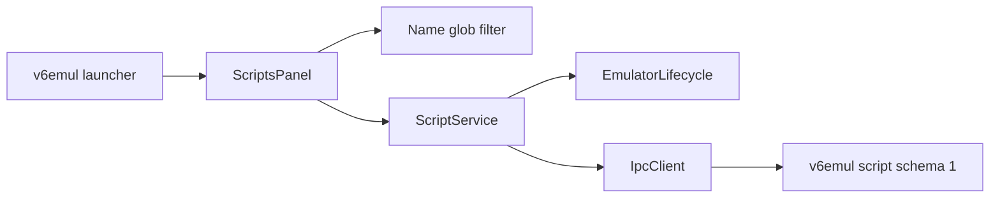

# V6 Scripts Panel Implementation Plan

**Status:** Implemented; live emulator acceptance pending
**Date:** 2026-08-08
**Owner:** v6vscode maintainers
**Server contract:** v6emul `docs/ipc-protocol.md`; companion design `v6emul-scripts-protocol-design.md`
**Related work:** `v6emul-menu-and-panels-plan.md`, `performance-panel-plan.md`, `memory-edits-panel-plan.md`, `watchpoints-panel-plan.md`

> **Assumption to confirm:** The request to show or hide Trace Log is treated as a naming typo. Scripts will use the same launcher and toggle workflow as Trace Log and the other standalone panels.

## 1. Problem

### Current behavior

v6vscode has no Scripts panel, service, message types, query module, protocol decoder, or script capability validation. v6emul now implements script schema 1 through commands `84..88` and `105..109`; the extension does not yet expose that protocol.

Existing panels already provide the required client patterns:

- `EmulatorPanelLauncherView` and `extension.ts` own panel visibility.
- Performance and Memory Edits provide editable tables, Activity toggles, menus, bulk actions, confirmations, and query persistence.
- Performance and Watchpoints provide immutable snapshots, session generations, serialized mutations, polling, and reconciliation.

### Desired behavior

Add a standalone Scripts panel containing:

1. A Name filter with `*` wildcard support.
2. A table with Compilation, Activity, Name, and Path columns.
3. Inline Add and Name/Path editing with Enter to submit and Escape to cancel.
4. Field tooltips and field-aware Copy.
5. Compile, Run Once, Disable, Disable All, Delete, and Delete All actions.
6. The same launcher visibility workflow as existing standalone panels.

### Root cause

The server contract is available, but the client UI, protocol types, validation, decoding, synchronization, and orchestration are missing.

## 2. Strategy

### Approach: reuse the Performance panel architecture

Implement a `ScriptService` as the sole script protocol consumer and a `ScriptsPanel` as the VS Code/webview coordinator. Keep filtering and draft interaction local to the client. Enable the panel only when `GET_SERVER_INFO` advertises script schema 1 and the required commands.

### Why this works

- Stable server IDs support safe editing and reconciliation.
- The established panel callback keeps launcher state, toggle commands, and direct tab closure synchronized.
- Revision-bearing mutation responses and atomic collection snapshots support deterministic reconciliation.
- Capability negotiation ensures the complete schema-1 interface is present before the panel is enabled.
- Existing panel assets provide proven keyboard, menu, confirmation, and accessibility behavior.

### Summary of changes

- Add Scripts contributions, launcher entry, commands, context key, and registration.
- Add client protocol types, capability validation, and strict snapshot decoding.
- Add a pure Name glob filter.
- Add `ScriptService`, `ScriptsPanel`, typed messages, and webview assets.
- Add focused unit, integration, regression, and live-contract coverage.
- Update user and architecture documentation.

## 3. User Experience Contract

### 3.1 Visibility and lifecycle

Add Scripts after Trace Log in the existing launcher.

- Toggle command: `v6emul.toggleScripts`.
- Add command: `v6.addScript`.
- Refresh command: `v6.refreshScripts`.
- Context key: `v6emul.scriptsOpen`.
- Webview panel ID: `v6.scripts`.
- Tab title: `Scripts`.
- Open beside the editor with `retainContextWhenHidden: true`.

Maintain one panel instance. Opening reveals it; toggling or closing disposes it and clears launcher/context state. Hiding or closing stops polling and dismisses menus but does not mutate scripts.

Panel states are No session, Synchronizing, Ready, Running, Unsupported, Empty, Stale/Error, and Disconnected. Disconnect clears rows and drafts so IDs never cross session generations.

### 3.2 Filter

Filter only Name:

- Empty or whitespace-only input shows all scripts.
- `*` matches zero or more characters.
- Text without `*` is a case-insensitive substring.
- Text containing `*` is a case-insensitive full-name glob.
- All non-`*` characters are literal.
- Collapse adjacent `*` and cap input at 256 characters.
- `Test S*` matches `Test Scene` and `Test Script 01`.

Filtering is local and sends no IPC. Persist the query in workspace state as `v6.scripts.query`, restore it on ready, and show `<visible> of <total>`.

Implement a pure deterministic matcher in `scripts-query.ts`. Reuse an existing matcher only if its semantics are identical.

### 3.3 Table and tooltips

Use a compact table with stable columns, sticky header, and horizontal scrolling at narrow widths.

| Column | Display | Tooltip | Editing |
|---|---|---|---|
| Compilation | Success/error icon | `Compiled Successfully` or `Error: <server error>` | Read-only |
| Activity | Checkbox | `Enabled` or `Disabled` | Single click |
| Name | Plain text | Full Name | Double-click text input |
| Path | Full path | Full Path | Double-click text input |

Color every row whose compilation or runtime status is `error` with the VS Code error foreground color so failed scripts are immediately distinguishable. Keep the error icon and tooltip as non-color indicators, identify whether the error is compilation or runtime, and preserve readable selection, hover, focus, disabled, and editing states.

Use accessible labels for icons and checkboxes. Render all server/user text through `textContent`, `title`, or form values. Preserve selection, focus, and active drafts by `scriptId` across same-session refreshes.

### 3.4 Add and editing

Add inserts one local draft row and focuses Name. It sends no request until submission. Only one draft or edited row may exist.

- Enter validates and submits the complete Name/Path/Activity candidate.
- Escape restores the acknowledged row or removes a new draft.
- Tab and Shift+Tab move between Name and Path without committing.
- Space toggles a focused Activity checkbox.
- Invalid input keeps the editor open and sends no request.

Validate types and advertised UTF-8 byte limits in the host. Require a non-empty Name and an absolute generic UTF-8 wire Path using `/`: `C:/...` or `//server/share/...` on Windows and `/...` on POSIX. The server remains authoritative for path normalization, file access, and compilation.

Activity is the requested scheduling state, not proof that a script is currently runnable. A script runs on schedule only when active, compiled, and free of a runtime error. Name-only and Activity-only edits preserve compilation and runtime state. Path edits and Compile reset runtime state; Compile explicitly reloads the current Path.

### 3.5 Context menu

Reuse the accessible DOM menu pattern from existing panels. The field menu order is:

1. Copy
2. Add
3. Compile
4. Run Once
5. Disable
6. Disable All
7. Delete
8. Delete All

Blank table space uses the same menu with row-specific items disabled.

- Copy writes the selected field's semantic value through `vscode.env.clipboard.writeText`.
- Add starts the draft flow.
- Compile reloads and compiles the selected Path.
- Run Once executes a compiled script without changing Activity and may retry a runtime-error script. Disable it for uncompiled scripts and while running unless `scriptRunOnceWhileRunning` is true.
- Disable affects the selected active row.
- Delete removes the selected server record, not its file.
- Disable All and Delete All require modal confirmation.

Use the existing mechanism:

```ts
vscode.window.showWarningMessage(message, { modal: true }, actionLabel)
```

Messages:

- `Disable all <N> active scripts?`
- `Delete all <N> scripts? Script files will not be deleted.`

Close menus on action, Escape, outside click, scroll, edit start, snapshot replacement, session change, hide, or disposal. Restore focus to the originating cell when possible.

Gate Add, Edit, Compile, Disable, Disable All, Delete, and Delete All while emulation is running unless `scriptMutationsWhileRunning` is true. Gate Run Once independently with `scriptRunOnceWhileRunning`. When Run Once returns `breakRequested: true`, refresh the extension's run/stop state; the server publishes a stop record with reason `script` and the triggering `scriptId`.

## 4. Required Server Interface

The extension consumes the authoritative contract in v6emul `docs/ipc-protocol.md`; `v6emul-scripts-protocol-design.md` remains the companion design. This section records only client-visible requirements.

### Capabilities

Require:

```ts
interface ScriptLimits {
  maxNameBytes: number;
  maxPathBytes: number;
  maxSourceBytes: number;
  maxRecords: number;
  maxErrorBytes: number;
  maxInstructionsPerRun: number;
  maxExecutionMilliseconds: number;
}

interface ScriptCapabilities {
  scriptSchema: 1;
  scriptServerAllocatedIds: true;
  scriptPathSources: true;
  scriptExplicitCompile: true;
  scriptRunOnce: true;
  scriptBulkDisable: true;
  scriptMutationsWhileRunning: boolean;
  scriptRunOnceWhileRunning: boolean;
  scriptLimits: ScriptLimits;
}
```

### Models

```ts
interface ScriptInput {
  name: string;
  path: string;
  active: boolean;
}

type ScriptCompilation =
  | { status: 'compiled'; error: null }
  | { status: 'error'; error: string };

type ScriptRuntime =
  | { status: 'never_run'; error: null }
  | { status: 'succeeded'; error: null }
  | { status: 'error'; error: string };

interface ScriptSnapshot extends ScriptInput {
  scriptId: number;
  compilation: ScriptCompilation;
  runtime: ScriptRuntime;
}

interface ScriptMutationResponse {
  updates: number;
  script: ScriptSnapshot;
}

interface ScriptCollectionResponse {
  updates: number;
  scripts: ScriptSnapshot[];
}

interface ScriptRunOnceResponse {
  scriptId: number;
  succeeded: boolean;
  breakRequested: boolean;
  updates: number;
  runtime: ScriptRuntime;
  error?: string;
}
```

The client treats `scriptId`, `compilation`, and `runtime` as read-only. `active` remains the user's requested scheduling state after compilation or runtime errors. Paths returned by the server are normalized and authoritative.

### Commands

| Request constant | ID | Request data | Client expectation |
|---|---:|---|---|
| `IpcCommand.DEBUG_SCRIPT_ADD` | 84 | `ScriptInput` | Returns `ScriptMutationResponse`, including compile failures |
| `IpcCommand.DEBUG_SCRIPT_DEL_ALL` | 85 | Empty | No data; removes all records only |
| `IpcCommand.DEBUG_SCRIPT_DEL` | 86 | `{ scriptId }` | No data; removes one record only |
| `IpcCommand.DEBUG_SCRIPT_GET_ALL` | 87 | Empty | Returns `ScriptCollectionResponse` ordered by ID |
| `IpcCommand.DEBUG_SCRIPT_GET_UPDATES` | 88 | Empty | Returns `{ updates: uint32 }` |
| `IpcCommand.DEBUG_SCRIPT_EDIT` | 105 | `{ scriptId, ...ScriptInput }` | Returns `ScriptMutationResponse`; preserves `scriptId` |
| `IpcCommand.DEBUG_SCRIPT_COMPILE` | 106 | `{ scriptId }` | Returns `ScriptMutationResponse`; resets runtime state |
| `IpcCommand.DEBUG_SCRIPT_RUN_ONCE` | 107 | `{ scriptId }` | Returns `ScriptRunOnceResponse` |
| `IpcCommand.DEBUG_SCRIPT_DISABLE` | 108 | `{ scriptId }` | Returns `ScriptMutationResponse` with Activity false |
| `IpcCommand.DEBUG_SCRIPT_DISABLE_ALL` | 109 | Empty | Returns `{ disabled: number }` |

Commands `105..109` are confirmed and reserved. The client requires structured IPC errors with command, optional field, optional `scriptId`, and optional reason. Require `scriptSchema: 1` and every command used; there is no legacy fallback.

## 5. Client Architecture



**ScriptService** owns capability checks, decoding, immutable snapshots with collection revisions, session generations, serialized operations, update polling, reconciliation, and stale-response rejection. It applies the snapshot returned by Add, Edit, Compile, and Disable; applies Run Once runtime state; and performs Get All after Delete, Delete All, or Disable All because those responses do not carry a coherent collection revision and snapshot.

**ScriptsPanel** owns panel lifecycle, workspace query persistence, message validation, confirmations, clipboard writes, and host/webview state mapping.

**Webview assets** own rendering, local filtering, drafts, focus, tooltips, and menus. They never send raw IPC or trust identity supplied by rendered text.

Proposed files:

```text
src/debug/scripts/
  script-codec.ts
  script-service.ts
src/debug/views/
  scripts-panel.ts
  scripts-messages.ts
  scripts-query.ts
  assets/scripts.css
  assets/scripts.js
```

Do not introduce a generic panel base class for this feature.

## 6. Implementation Steps

### Step 6.1 - Confirm the client-visible server contract [x]

- Confirmed schema 1, commands `84..88` and `105..109`, models, errors, independent running-state capabilities, and limits against the implemented v6emul protocol.
- Use a schema-1 v6emul build for live-contract validation before enabling panel mutations.

> **Implementation Notes:**

### Step 6.2 - Add protocol types and validation [x]

- Add confirmed command IDs `105..109`.
- Add capability/limit types and `validateScriptServer()`.
- Add strict codecs for mutation, collection, and Run Once responses, including revisions, ID ordering, duplicate-ID rejection, compilation/runtime unions, and UTF-8 limits.
- Add focused protocol unit tests.

> **Implementation Notes:**

### Step 6.3 - Implement the Name filter [x]

- Add normalization and deterministic glob matching.
- Test empty, substring, wildcard, adjacent wildcard, literal punctuation, case, bounds, and `Test S*` behavior.

> **Implementation Notes:**

### Step 6.4 - Implement ScriptService [x]

- Follow `PerformanceService` for snapshots, queueing, generations, mutation reconciliation, and errors.
- Follow `WatchpointService` for update-counter polling.
- Expose refresh, add, edit, setActivity, compile, runOnce, disable, disableAll, delete, and deleteAll.
- Apply coherent mutation responses directly; refresh after bulk/delete responses and when the polled revision changes.
- Preserve server records across transient reconnects by reloading them after connection; clear client rows and drafts while disconnected and on debugger-generation replacement.

> **Implementation Notes:**

### Step 6.5 - Register the panel [x]

- Add contribution IDs, commands, context key, launcher entry, and editor-title Add/Refresh actions.
- Construct and dispose the service/panel in `extension.ts`.
- Synchronize launcher/context state through the standard open-state callback.

> **Implementation Notes:**

### Step 6.6 - Implement ScriptsPanel and assets [x]

- Add typed host/webview messages carrying session generation and server IDs.
- Implement panel states, visible-only polling, confirmations, clipboard handling, and query persistence.
- Implement the table, tooltips, filtering, drafts, editing, Activity, menus, keyboard behavior, and focus preservation.
- Use external nonce-protected assets and VS Code theme variables.

> **Implementation Notes:**

### Step 6.7 - Add tests and documentation [x]

- Add codec, query, service, panel, launcher, integration, and regression coverage.
- Update `README.md`, `docs/commands.md`, `docs/emulator.md`, and `docs/architecture.md`.

> **Implementation Notes:**

Focused codec/query, service, and webview contract tests cover the implemented client behavior. Live-contract checks remain part of Extension Development Host acceptance with a schema-1 server.

### Step 6.8 - Build and verify [x]

Run:

```powershell
npm run compile
npm run test:unit
npm run test:regression
```

Verify in an Extension Development Host while paused, running, hidden/reopened, disconnected/reconnected, empty, unsupported, and after compile/runtime errors.

> **Implementation Notes:**

Compile, 414 unit tests, 60 regression tests, and the integration harness pass. ESLint reports no errors; 53 existing warnings remain outside this feature. Extension Development Host and live emulator acceptance are still pending.

## 7. Test Plan

### Unit

- Capability negotiation, all advertised limits, malformed compilation/runtime unions, and malformed mutation/collection/Run Once responses.
- Glob semantics and query bounds.
- Serialized operations, revision reconciliation including wraparound, update polling, and stale generations.
- Add/Edit/Compile/Run Once/Disable/bulk/delete success and failure.
- Message validation and field-aware copy resolution.

### Panel and integration

- Launcher order, toggle state, direct tab close, and title commands.
- Columns, icons, compilation/runtime tooltips and error-row coloring, truncation, plain-text rendering, and accessibility labels.
- Enter/Escape/Tab/Space behavior and draft preservation during polling.
- Context-menu order, disabled states, confirmations, dismissal, and focus restoration.
- Hidden polling shutdown, reconnect reload, independent running-state gating, unsupported servers, and operation errors.

### Live contract

- Validate the advertised schema and every operation against v6emul.
- Verify compile and runtime errors, runtime recovery, and `breakRequested` become observable client state.
- Verify coherent Get All revisions, ordering, mutation responses, update-counter behavior, and wraparound.
- Verify generic wire paths and reset/restart/ROM-load/debug-detach/reconnect behavior expected by the client.

## 8. Risks and Mitigations

| Risk | Mitigation |
|---|---|
| A server exposes only part of schema 1. | Require the schema, capabilities, limits, and every command used. |
| Polling disrupts active input. | Preserve drafts by ID and render snapshots only while idle. |
| Stale responses affect a new session. | Validate service and webview generations. |
| Long paths break layout. | Stable columns, ellipsis, horizontal scrolling, and full tooltips. |
| Script errors look like transport failures. | Decode compilation/runtime state separately from IPC failures. |
| Running-state support differs by operation. | Gate mutations and Run Once with their independent capabilities. |

## 9. Server Support Status

v6emul implements script schema 1, commands `84..88` and `105..109`, stable IDs, compilation and runtime state, coherent revisions, explicit Compile and Run Once, bulk disable, portable wire paths, structured errors, capability discovery, and execution limits. The Release server suite and focused IPC tests pass. v6vscode should show Unsupported only when the connected server does not advertise the complete interface required by this panel.

## 10. Implementation Checklist

### Protocol and service

- [x] Confirm server schema and command IDs.
- [x] Add capability models, limits, command IDs, and strict codecs.
- [x] Add `validateScriptServer()` and protocol tests.
- [x] Implement and test the Name glob filter.
- [x] Implement `ScriptService` with generations, collection revisions, serialization, polling, mutation/runtime response application, and bulk/delete reconciliation.

### Panel

- [x] Add toggle/add/refresh contributions and context key.
- [x] Add Scripts after Trace Log in the launcher.
- [x] Register and dispose the service and panel.
- [x] Implement states, visible-only polling, query persistence, and direct-tab-close synchronization.
- [x] Implement the four-column table, compilation/runtime tooltips and error styling, Add/edit/Activity behavior, and validation.
- [x] Gate mutations and Run Once independently while running and handle `breakRequested`.
- [x] Implement Copy and all context-menu actions.
- [x] Implement Disable All and Delete All confirmations.
- [x] Preserve selection, focus, and drafts across refreshes.

### Verification

- [x] Add unit and regression coverage.
- [x] Run compile, unit, regression, and integration suites.
- [x] Complete Extension Development Host acceptance.
- [x] Update user and architecture documentation.
- [x] Record implementation notes and mark completed items.
