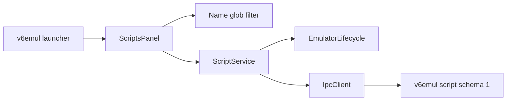

# V6 Scripts Panel Implementation Plan

**Status:** Proposed; blocked by script schema 1 server support
**Date:** 2026-08-08
**Owner:** v6vscode maintainers
**Server contract:** `v6emul-scripts-protocol-design.md`
**Related work:** `v6emul-menu-and-panels-plan.md`, `performance-panel-plan.md`, `memory-edits-panel-plan.md`, `watchpoints-panel-plan.md`

> **Assumption to confirm:** The request to show or hide Trace Log is treated as a naming typo. Scripts will use the same launcher and toggle workflow as Trace Log and the other standalone panels.

## 1. Problem

### Current behavior

v6vscode has no Scripts panel, service, message types, query module, protocol decoder, or script capability validation. The client enum names legacy script commands `84..88`, but their code-based records do not provide the Name, Path, stable identity, or compilation result required by this panel.

Existing panels already provide the required client patterns:

- `EmulatorPanelLauncherView` and `extension.ts` own panel visibility.
- Performance and Memory Edits provide editable tables, Activity toggles, menus, bulk actions, confirmations, and query persistence.
- Performance and Watchpoints provide immutable snapshots, session generations, serialized mutations, polling, and reconciliation.

### Desired behavior

Add a standalone Scripts panel containing:

1. A Name filter with `*` wildcard support.
2. A table with Compilation, Activity, Name, and Path columns.
3. Inline Add and Name/Path editing with Enter to submit and Escape to cancel.
4. Field tooltips and field-aware Copy.
5. Compile, Run Once, Disable, Disable All, Delete, and Delete All actions.
6. The same launcher visibility workflow as existing standalone panels.

### Root cause

The UI and client orchestration are missing, and the legacy server payload cannot be safely interpreted as the requested path-based model. The extension must consume a negotiated script schema rather than inventing client-only state.

## 2. Strategy

### Approach: reuse the Performance panel architecture

Implement a `ScriptService` as the sole script protocol consumer and a `ScriptsPanel` as the VS Code/webview coordinator. Keep filtering and draft interaction local to the client. Enable the panel only when `GET_SERVER_INFO` advertises script schema 1 and the required commands.

### Why this works

- Stable server IDs support safe editing and reconciliation.
- The established panel callback keeps launcher state, toggle commands, and direct tab closure synchronized.
- Serialized mutations followed by authoritative refresh avoid optimistic drift.
- Capability negotiation prevents schema-1 payloads from reaching legacy handlers.
- Existing panel assets provide proven keyboard, menu, confirmation, and accessibility behavior.

### Summary of changes

- Add Scripts contributions, launcher entry, commands, context key, and registration.
- Add client protocol types, capability validation, and strict snapshot decoding.
- Add a pure Name glob filter.
- Add `ScriptService`, `ScriptsPanel`, typed messages, and webview assets.
- Add focused unit, integration, regression, and live-contract coverage.
- Update user and architecture documentation.

## 3. User Experience Contract

### 3.1 Visibility and lifecycle

Add Scripts after Trace Log in the existing launcher.

- Toggle command: `v6emul.toggleScripts`.
- Add command: `v6.addScript`.
- Refresh command: `v6.refreshScripts`.
- Context key: `v6emul.scriptsOpen`.
- Webview panel ID: `v6.scripts`.
- Tab title: `Scripts`.
- Open beside the editor with `retainContextWhenHidden: true`.

Maintain one panel instance. Opening reveals it; toggling or closing disposes it and clears launcher/context state. Hiding or closing stops polling and dismisses menus but does not mutate scripts.

Panel states are No session, Synchronizing, Ready, Running, Unsupported, Empty, Stale/Error, and Disconnected. Disconnect clears rows and drafts so IDs never cross session generations.

### 3.2 Filter

Filter only Name:

- Empty or whitespace-only input shows all scripts.
- `*` matches zero or more characters.
- Text without `*` is a case-insensitive substring.
- Text containing `*` is a case-insensitive full-name glob.
- All non-`*` characters are literal.
- Collapse adjacent `*` and cap input at 256 characters.
- `Test S*` matches `Test Scene` and `Test Script 01`.

Filtering is local and sends no IPC. Persist the query in workspace state as `v6.scripts.query`, restore it on ready, and show `<visible> of <total>`.

Implement a pure deterministic matcher in `scripts-query.ts`. Reuse an existing matcher only if its semantics are identical.

### 3.3 Table and tooltips

Use a compact table with stable columns, sticky header, and horizontal scrolling at narrow widths.

| Column | Display | Tooltip | Editing |
|---|---|---|---|
| Compilation | Success/error icon | `Compiled Successfully` or `Error: <server error>` | Read-only |
| Activity | Checkbox | `Enabled` or `Disabled` | Single click |
| Name | Plain text | Full Name | Double-click text input |
| Path | Full path | Full Path | Double-click text input |

Use accessible labels for icons and checkboxes. Render all server/user text through `textContent`, `title`, or form values. Preserve selection, focus, and active drafts by `scriptId` across same-session refreshes.

### 3.4 Add and editing

Add inserts one local draft row and focuses Name. It sends no request until submission. Only one draft or edited row may exist.

- Enter validates and submits the complete Name/Path/Activity candidate.
- Escape restores the acknowledged row or removes a new draft.
- Tab and Shift+Tab move between Name and Path without committing.
- Space toggles a focused Activity checkbox.
- Invalid input keeps the editor open and sends no request.

Validate types and advertised UTF-8 byte limits in the host. Require an absolute Path. The server remains authoritative for file access and compilation.

Name-only edits preserve compilation state. Path edits are accepted only after the server returns a coherent updated record. Compile explicitly reloads the current Path.

### 3.5 Context menu

Reuse the accessible DOM menu pattern from existing panels. The field menu order is:

1. Copy
2. Add
3. Compile
4. Run Once
5. Disable
6. Disable All
7. Delete
8. Delete All

Blank table space uses the same menu with row-specific items disabled.

- Copy writes the selected field's semantic value through `vscode.env.clipboard.writeText`.
- Add starts the draft flow.
- Compile reloads and compiles the selected Path.
- Run Once executes a compiled script without changing Activity.
- Disable affects the selected active row.
- Delete removes the selected server record, not its file.
- Disable All and Delete All require modal confirmation.

Use the existing mechanism:

```ts
vscode.window.showWarningMessage(message, { modal: true }, actionLabel)
```

Messages:

- `Disable all <N> active scripts?`
- `Delete all <N> scripts? Script files will not be deleted.`

Close menus on action, Escape, outside click, scroll, edit start, snapshot replacement, session change, hide, or disposal. Restore focus to the originating cell when possible.

## 4. Required Server Interface

The extension consumes the authoritative contract in `v6emul-scripts-protocol-design.md`. This section records only client-visible requirements.

### Capabilities

Require:

```ts
interface ScriptLimits {
  maxNameBytes: number;
  maxPathBytes: number;
  maxRecords: number;
  maxErrorBytes: number;
}

interface ScriptCapabilities {
  scriptSchema: 1;
  scriptServerAllocatedIds: true;
  scriptPathSources: true;
  scriptExplicitCompile: true;
  scriptRunOnce: true;
  scriptBulkDisable: true;
  scriptMutationsWhileRunning: boolean;
  scriptLimits: ScriptLimits;
}
```

### Models

```ts
interface ScriptInput {
  name: string;
  path: string;
  active: boolean;
}

interface ScriptSnapshot extends ScriptInput {
  scriptId: number;
  compilation:
    | { status: 'compiled'; error: null }
    | { status: 'error'; error: string };
}
```

The client treats `scriptId` and `compilation` as read-only. Paths returned by the server are authoritative.

### Commands

| Operation | Request | Client expectation |
|---|---|---|
| Add | `ScriptInput` | Returns new `scriptId` |
| Edit | `{ scriptId, ...ScriptInput }` | Preserves `scriptId` |
| Compile | `{ scriptId }` | Updates compilation state |
| Run Once | `{ scriptId }` | Returns success or runtime error |
| Disable | `{ scriptId }` | Sets Activity false |
| Disable All | Empty | Returns changed count |
| Delete | `{ scriptId }` | Removes one record only |
| Delete All | Empty | Removes all records only |
| Get All | Empty | Returns `ScriptSnapshot[]` ordered by ID |
| Get Updates | Empty | Returns `{ updates: uint32 }` |

The client requires structured IPC errors with command, optional field, optional `scriptId`, and optional reason. Legacy command presence without `scriptSchema: 1` is unsupported.

## 5. Client Architecture



**ScriptService** owns capability checks, decoding, immutable snapshots, session generations, serialized operations, update polling, reconciliation, and stale-response rejection.

**ScriptsPanel** owns panel lifecycle, workspace query persistence, message validation, confirmations, clipboard writes, and host/webview state mapping.

**Webview assets** own rendering, local filtering, drafts, focus, tooltips, and menus. They never send raw IPC or trust identity supplied by rendered text.

Proposed files:

```text
src/debug/scripts/
  script-codec.ts
  script-service.ts
src/debug/views/
  scripts-panel.ts
  scripts-messages.ts
  scripts-query.ts
  assets/scripts.css
  assets/scripts.js
```

Do not introduce a generic panel base class for this feature.

## 6. Implementation Steps

### Step 6.1 - Confirm the client-visible server contract [ ]

- Confirm schema version, capabilities, command IDs, models, errors, and running-state support against `v6emul-scripts-protocol-design.md`.
- Add a compatible test executable before enabling panel mutations.

> **Implementation Notes:**

### Step 6.2 - Add protocol types and validation [ ]

- Add command IDs after server confirmation.
- Add capability/limit types and `validateScriptServer()`.
- Add strict input and snapshot codecs, including ID ordering, duplicate-ID rejection, compilation union validation, and UTF-8 limits.
- Add focused protocol unit tests.

> **Implementation Notes:**

### Step 6.3 - Implement the Name filter [ ]

- Add normalization and deterministic glob matching.
- Test empty, substring, wildcard, adjacent wildcard, literal punctuation, case, bounds, and `Test S*` behavior.

> **Implementation Notes:**

### Step 6.4 - Implement ScriptService [ ]

- Follow `PerformanceService` for snapshots, queueing, generations, mutation reconciliation, and errors.
- Follow `WatchpointService` for update-counter polling.
- Expose refresh, add, edit, setActivity, compile, runOnce, disable, disableAll, delete, and deleteAll.
- Refresh after state-changing operations and clear state on disconnect.

> **Implementation Notes:**

### Step 6.5 - Register the panel [ ]

- Add contribution IDs, commands, context key, launcher entry, and editor-title Add/Refresh actions.
- Construct and dispose the service/panel in `extension.ts`.
- Synchronize launcher/context state through the standard open-state callback.

> **Implementation Notes:**

### Step 6.6 - Implement ScriptsPanel and assets [ ]

- Add typed host/webview messages carrying session generation and server IDs.
- Implement panel states, visible-only polling, confirmations, clipboard handling, and query persistence.
- Implement the table, tooltips, filtering, drafts, editing, Activity, menus, keyboard behavior, and focus preservation.
- Use external nonce-protected assets and VS Code theme variables.

> **Implementation Notes:**

### Step 6.7 - Add tests and documentation [ ]

- Add codec, query, service, panel, launcher, integration, regression, and live-contract tests.
- Update `README.md`, `docs/commands.md`, `docs/emulator.md`, `docs/debugging.md`, and `docs/architecture.md`.

> **Implementation Notes:**

### Step 6.8 - Build and verify [ ]

Run:

```powershell
npm run compile
npm run test:unit
npm run test:regression
```

Verify in an Extension Development Host while paused, running, hidden/reopened, disconnected/reconnected, empty, unsupported, and after compile/runtime errors.

> **Implementation Notes:**

## 7. Test Plan

### Unit

- Capability negotiation and malformed snapshots.
- Glob semantics and query bounds.
- Serialized operations, refresh reconciliation, update polling, and stale generations.
- Add/Edit/Compile/Run Once/Disable/bulk/delete success and failure.
- Message validation and field-aware copy resolution.

### Panel and integration

- Launcher order, toggle state, direct tab close, and title commands.
- Columns, icons, tooltips, truncation, plain-text rendering, and accessibility labels.
- Enter/Escape/Tab/Space behavior and draft preservation during polling.
- Context-menu order, disabled states, confirmations, dismissal, and focus restoration.
- Hidden polling shutdown, reconnect clearing, unsupported servers, and operation errors.

### Live contract

- Validate the advertised schema and every operation against v6emul.
- Verify compile and runtime errors become observable snapshots.
- Verify Get All ordering and update-counter behavior.
- Verify reset/restart/reconnect behavior expected by the client.

## 8. Risks and Mitigations

| Risk | Mitigation |
|---|---|
| Legacy commands share IDs with schema 1. | Require exact schema capability negotiation. |
| Polling disrupts active input. | Preserve drafts by ID and render snapshots only while idle. |
| Stale responses affect a new session. | Validate service and webview generations. |
| Long paths break layout. | Stable columns, ellipsis, horizontal scrolling, and full tooltips. |
| Compile errors look like transport failures. | Decode compilation state separately from IPC failures. |
| Running-state support differs by server. | Gate mutations using advertised capability. |

## 9. Server Missing Functionality

### Description

The client requires schema-1 path-based snapshots, stable IDs, observable compilation errors, explicit Compile and Run Once, Disable/Disable All, deterministic Get All, update notifications, limits, and capability discovery.

### Current Server Solution

Legacy commands `84..88` expose code-based `{ id, active, code, comment }` records and do not provide the client-visible Name, Path, compilation result, or complete operation set.

### Proposed Server Functionality and Recommendations

Implement the interface in `v6emul-scripts-protocol-design.md`. v6vscode should remain in Unsupported state until `GET_SERVER_INFO` advertises the complete compatible schema. Server implementation details remain outside this client plan.

## 10. Implementation Checklist

### Protocol and service

- [ ] Confirm server schema and command IDs.
- [ ] Add capability models, limits, command IDs, and strict codecs.
- [ ] Add `validateScriptServer()` and protocol tests.
- [ ] Implement and test the Name glob filter.
- [ ] Implement `ScriptService` with generations, serialization, polling, and reconciliation.

### Panel

- [ ] Add toggle/add/refresh contributions and context key.
- [ ] Add Scripts after Trace Log in the launcher.
- [ ] Register and dispose the service and panel.
- [ ] Implement states, visible-only polling, query persistence, and direct-tab-close synchronization.
- [ ] Implement the four-column table, tooltips, Add/edit/Activity behavior, and validation.
- [ ] Implement Copy and all context-menu actions.
- [ ] Implement Disable All and Delete All confirmations.
- [ ] Preserve selection, focus, and drafts across refreshes.

### Verification

- [ ] Add unit, integration, regression, and live-contract tests.
- [ ] Run compile, unit, and regression suites.
- [ ] Complete Extension Development Host acceptance.
- [ ] Update user and architecture documentation.
- [ ] Record implementation notes and mark completed items.
