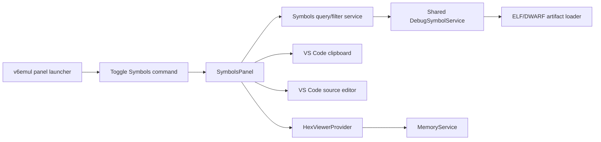

# V6 Symbols Panel Plan

**Status:** Implemented; Extension Development Host verification pending
**Date:** 2026-08-01
**Owners:** v6vscode maintainers
**Related work:** `v6emul-menu-and-panels-plan.md`, `hex-viewer-panel-plan.md`, `debug-adapter-and-debug-views-plan.md`

## 1. Objective

Add a standalone **Symbols** editor panel for browsing and filtering the symbols in the active project's debug artifact. The panel supports incremental text and expression search, case-sensitive and whole-word name matching, source navigation, Hex Viewer navigation, clipboard actions, and the same open/close behavior as Display, Hex Viewer, Ports, and Watchpoints.

The extension host remains authoritative for debug metadata, expression evaluation, source locations, clipboard writes, and cross-panel navigation. The webview owns rendering, search history interaction, focus, and its accessible context menu. Webview messages contain stable symbol identities, not trusted source paths or values.

## 2. Surface and Contribution Decision

Implement Symbols as a standalone editor `WebviewPanel`, not a Run and Debug sidebar view. Add it to the existing `v6emul` launcher after **Hex Viewer**:

```text
v6emul
  Panels
    Settings
    Display
    Hex Viewer
    Symbols
    Ports
    Watchpoints
```

Use the established panel mechanism:

- Command: `v6emul.toggleSymbols`
- Open-state context key: `v6emul.symbolsOpen`
- Webview panel ID: `v6.symbols`
- Tab title: `Symbols`
- Create beside the active editor with `ViewColumn.Beside` and `retainContextWhenHidden: true`.
- Maintain at most one instance. Toggle closes an open panel and opens a closed panel; `open()` reveals an existing instance.
- Direct tab disposal clears the context key and launcher checked state.
- Hiding or closing Symbols does not dispose shared debug metadata, the emulator session, or Hex Viewer.

Add a Symbols launcher item using the VS Code `symbol-variable` theme icon. Keep the toggle command available in the Command Palette under the `v6emul` category.

## 3. User Experience Contract

### 3.1 Layout

The panel is an unframed, vertically arranged tool surface:

1. One search toolbar containing a flexible search field.
2. A **Match Case** toggle immediately to its right, rendered with the familiar `Aa` case-sensitive icon.
3. A **Match Whole Word** toggle immediately after Match Case, rendered with the VS Code `whole-word` icon.
4. A compact result count/status line.
5. A virtualized or incrementally rendered list of matching symbol labels filling the remaining height.

Use VS Code theme tokens and stable toolbar/button dimensions. Toggle buttons expose `aria-pressed`, an accessible name, a hover tooltip, and a visible keyboard focus indicator. Do not rely on icon shape or color alone to communicate the enabled state.

Each result is one focusable symbol-label button. Preserve deterministic order by ascending value and then by symbol name. Preserve duplicate names and duplicate values as separate records; use a host-generated stable result ID for interaction messages.

### 3.2 Data and Panel States

Symbols come from the active project's validated `run.debugArtifact`. The panel does not require an active emulator connection to browse symbols or open source.

Explicit states are:

- **No active project:** `No active V6 project` and an empty list.
- **No debug artifact configured:** `No debug artifact configured for the active project`.
- **Loading:** retain the previous list but disable actions until the new artifact is accepted.
- **Ready:** show the filtered result list and count.
- **No matches:** `No matching symbols`.
- **Artifact error:** clear stale results for that project, log the failure, and show a concise error state.

Reload when the active project changes and when a newly opened/revealed panel observes a changed artifact. Reuse the debug-metadata loader's validation and path resolution; do not parse ELF/DWARF in the webview. A delayed result from a previous project or panel generation must be discarded.

### 3.3 Search Grammar and History

The search field uses the Hex Viewer search conventions:

- Search runs automatically on every `input` event; Enter is not required.
- Apply the same short trailing delay used by Hex Viewer (`75 ms`) for host-side expression evaluation and filtering.
- Accept decimal, `0x`, `$`, and `h` hexadecimal literals; symbol names; `+`, `-`, `*`, unary signs, and parentheses through the existing symbol-expression utilities.
- `Enter` commits the current non-empty query to history without changing when results update.
- Deduplicate consecutive history entries and retain at most 50 entries in `ExtensionContext.workspaceState`.
- `ArrowUp` and `ArrowDown` traverse committed queries while the input has focus.
- Editing after history navigation preserves a draft. `Escape` restores the draft, or clears the query when no draft exists.
- Persist the query, history, Match Case state, and Match Whole Word state per workspace.

The Symbols panel should extract or reuse a small DOM-independent search-history helper rather than copy the Hex Viewer state machine a second time. Expression parsing and evaluation remain extension-host operations.

### 3.4 Filtering Semantics

An empty or whitespace-only query displays all symbols. For a non-empty query, evaluate the name and value branches independently, include a symbol when either branch matches, and de-duplicate by stable symbol ID.

**Value branch:**

1. Parse and evaluate the complete trimmed query as a symbol expression using the loaded symbol index.
2. If it resolves to an integer in `0x0000..0xFFFF`, include every symbol whose value equals that integer.
3. An invalid, unresolved, ambiguous, or out-of-range expression contributes no value matches. It does not suppress valid name matches.

**Name branch:**

- Match Case off and Whole Word off: case-folded substring match.
- Match Case on and Whole Word off: case-sensitive substring match.
- Match Case off and Whole Word on: case-insensitive exact symbol-name match.
- Match Case on and Whole Word on: case-sensitive exact symbol-name match.

For this symbol list, “whole word” means the complete symbol name, not a regular-expression word boundary. This avoids surprising splits around valid assembler symbol characters such as `_`, `.`, `@`, and `$`.

Match Case and Match Whole Word affect only the name branch. Expression symbol lookup retains the existing exact, case-sensitive, ambiguity-reporting semantics used by Hex Viewer.

Do not display an error merely because free text is not a valid expression; substring search remains valid. Show an expression validation error only when the text is expression-shaped, has no name matches, and cannot be evaluated. Toggle changes re-run the current query immediately and do not add history entries.

### 3.5 Symbol Value

Treat the symbol's ELF value as its 16-bit Main RAM address. The canonical display and clipboard format is uppercase, zero-padded hexadecimal:

```text
0xNNNN
```

Display the value beside each symbol name. Do not add a symbol-row tooltip because it would duplicate the visible value.

### 3.6 Click and Double-Click Behavior

Implement the requested label interactions exactly:

- **Left click:** open the label context menu.
- **Double-click:** open the source location associated with the symbol.
- **Ctrl+double-click:** open/reveal Hex Viewer and search for the symbol.

On macOS, also accept `Meta+double-click` for the Hex Viewer action while retaining Ctrl on Windows/Linux.

Because browsers emit click events before `dblclick`, defer the single-click menu with one replaceable 250 ms timer and cancel it when a second click arrives. A modifier double-click must trigger only Hex Viewer navigation; an unmodified double-click must trigger only source navigation. Keyboard activation with `Enter` opens source, while the Context Menu key or `Shift+F10` opens the menu.

If no exact source row exists, double-click keeps the panel open and shows `Source location unavailable for <name>`. It must not navigate to an unrelated enclosing symbol or silently select an arbitrary duplicate.

### 3.7 Context Menu

VS Code cannot contribute native menu items for arbitrary webview DOM labels. Use a custom accessible menu anchored to the clicked label, with `role="menu"`, `role="menuitem"`, managed focus, arrow-key navigation, Home/End, Enter/Space, and Escape.

The menu order is:

1. **Copy Name**
2. **Copy Value**
3. **Find in Source**
4. **Find in Hex Viewer**

Behavior:

- Copy Name writes the exact symbol name through `vscode.env.clipboard.writeText`.
- Copy Value writes the canonical `0xNNNN` value through the extension host.
- Find in Source performs the same action as unmodified double-click.
- Find in Hex Viewer performs the same action as Ctrl+double-click.
- Find in Source remains visible but disabled when no exact source location exists.
- Find in Hex Viewer remains visible but disabled only when the symbol value is outside Main RAM. It may open Hex Viewer into its no-session state when no emulator is connected, while preserving the requested query/navigation for the next compatible session.

Close the menu after an action, on Escape, outside click, focus loss, list scrolling, query/toggle change, result replacement, panel hide, or disposal. Return focus to the originating label if it still exists.

### 3.8 Source Navigation

For source navigation, the webview sends only the stable symbol ID. The provider re-resolves the symbol and asks the shared symbol service for the exact DWARF row at its value. When available:

1. Open the source through `vscode.workspace.openTextDocument`.
2. Show it with `vscode.window.showTextDocument(..., { preview: true })`.
3. Place the selection at the one-based metadata line and column after clamping to the document.
4. Reveal it with `TextEditorRevealType.InCenterIfOutsideViewport`.

Do not trust a file path, line, column, name, or value sent by the webview. Version 1 does not attempt declaration lookup because the existing metadata index maps executable addresses to source rows, not symbols to declaration DIEs.

Resolve the metadata file through the shared debug-source path helper before opening it. Existing absolute files remain unchanged; relative paths and single-rooted DWARF paths such as `/src/main.asm` resolve from the active project's directory. Hex Viewer and DAP stack frames use the same helper so all source-navigation surfaces interpret metadata paths consistently.

Before opening a source editor, reuse a matching visible editor or inactive open text tab and reveal it in its existing editor group. Create a preview tab only when the source file is not already open anywhere.

### 3.9 Hex Viewer Navigation

Both Ctrl+double-click and **Find in Hex Viewer** use one provider method. Extend `HexViewerProvider` with a typed operation such as:

```ts
revealSymbol(symbol: { name: string; address: number; size: number }): void
```

The operation must:

1. Validate the value and derive the inclusive Main RAM range from `address` and `max(size, 1)`, clamped to `0xFFFF`.
2. Open or reveal the standalone Hex Viewer.
3. Put the symbol name in the Hex Viewer search field.
4. Select Main RAM, scroll to the symbol, and highlight its range.
5. Commit the applied symbol query to Hex Viewer history once, using its normal consecutive-duplicate and 50-entry rules.

Pass both the canonical query text and resolved range in the typed host-side handoff. Do not make Hex Viewer resolve the name again: duplicate symbol names may be ambiguous, while the Symbols row already identifies one exact symbol. If Hex Viewer is not ready, retain one pending navigation and apply it after its `ready` handshake. A newer request replaces the previous pending request.

## 4. Architecture



### 4.1 Shared Symbol Metadata

Construct one `DebugSymbolService` in `extension.ts` and inject it into Hex Viewer and Symbols instead of allowing each panel to own an unrelated index. The service remains the authority for the latest completely loaded artifact.

Extend its immutable query surface with:

- `allSymbols(): ReadonlyArray<SymbolInfo>` returning deterministic value/name order.
- Stable symbol identity for duplicate-safe webview operations. The identity may be an opaque service-generated ID derived from index position; do not use name alone.
- `sourceForSymbol(id)` or an equivalent host-side lookup that resolves the current symbol value to an exact source row.
- Explicit loading state/artifact generation so stale asynchronous loads and stale webview IDs can be rejected.

Keep `DebugIndex` and debug-artifact parsing independent of VS Code and DOM APIs. Preserve atomic loading: consumers see the previous complete index or the new complete index, never a partially rebuilt collection.

### 4.2 Query Ownership

Add a pure TypeScript Symbols query module that accepts a query, toggle state, and immutable symbol snapshot and returns:

```ts
interface SymbolFilterResult {
    matches: readonly SymbolListItem[];
    expressionError?: string;
}
```

This module owns trimming, case behavior, exact/substring behavior, value-equality union, de-duplication, and ordering. It delegates expression grammar/evaluation to the existing symbol-expression utilities. Keeping filtering outside the provider makes every semantic combination unit-testable without VS Code or a DOM.

### 4.3 Provider and Webview Boundary

`SymbolsPanel` owns panel lifecycle, artifact synchronization, workspace persistence, query scheduling, message validation, clipboard writes, source opening, Hex Viewer handoff, and stale-generation checks.

Webview assets own toolbar interaction, list rendering/virtualization, history keys, focus restoration, and context-menu presentation. Render symbol names and messages with `textContent`; never use symbol text as HTML. Cap query length and validate message discriminants, booleans, and stable IDs in the extension host.

Suggested source layout:

```text
src/debug/
  metadata/
    debug-symbol-service.ts
  views/
    symbols-panel.ts
    symbols-query.ts
    symbols-messages.ts
    assets/
      symbols.css
      symbols.js
test/unit/debug/
  symbols-query.test.ts
  symbols-panel.test.ts
```

## 5. Expected Code Changes

### Contributions and registration

- `package.json`: add `v6emul.toggleSymbols` in the existing command order.
- `src/config/contribution-ids.ts`: add Symbols command and context-key constants.
- `src/emulator/panel/emulator-panel-launcher-view.ts`: add Symbols after Hex Viewer with the selected theme icon.
- `src/extension.ts`: construct the shared symbol service and Symbols panel, initialize its context key, register its toggle command, and synchronize launcher state.

### Metadata and query model

- `src/debug/metadata/debug-index.ts`: expose the complete immutable ordered symbol collection without reparsing or broad range scans.
- `src/debug/metadata/debug-symbol-service.ts`: add shared loading/generation, all-symbol, stable-identity, and exact source-location queries.
- Add a pure Symbols filter module and tests for all matching combinations.
- Keep existing Hex Viewer exact-name/expression behavior unchanged while switching it to the injected shared service.

### Symbols panel

- Add typed host/webview message unions.
- Add panel lifecycle, artifact states, persisted search settings, query scheduling, clipboard/source/Hex actions, and strict message validation.
- Add CSP-protected CSS/JS assets for toolbar, result list, and context menu.
- Use the official VS Code case-sensitive and whole-word icon forms; package any required codicon stylesheet/font locally rather than loading remote assets.

### Hex Viewer handoff

- Extend pending navigation to carry resolved Main RAM range plus query text and history intent.
- Ensure the handoff opens/reveals Hex Viewer before posting.
- Update the Hex Viewer webview to set the search input, bank, highlight, viewport, persistence, and history atomically from the host message.

### Documentation

- Update `docs/debugging.md`, `docs/commands.md`, `docs/architecture.md`, and the root `README.md` panel list.
- Update `design/features/v6emul-menu-and-panels-plan.md` with a placement note or implemented follow-up entry so its five-panel inventory does not become misleading.

## 6. Implementation Sequence

### Phase 1: Shared metadata and pure filtering

Expose ordered/stable symbol records from `DebugIndex` and `DebugSymbolService`, inject the service into Hex Viewer, and add exhaustive pure filter tests. This proves duplicate handling and expression/name union semantics before UI work.

### Phase 2: Panel lifecycle and launcher

Add contribution IDs, launcher entry, toggle registration, context state, and a minimal Symbols panel with loading/empty/error states. Verify direct tab closure and command toggling before adding interactions.

### Phase 3: Search and list

Add the search toolbar, persisted history/toggles, delayed automatic filtering, result counts, deterministic list rendering, and keyboard focus. Extract the history helper from Hex Viewer only if both panels can use it without changing Hex Viewer behavior.

### Phase 4: Actions and cross-panel navigation

Add the left-click menu, click/double-click arbitration, clipboard actions, source navigation, and the typed Hex Viewer symbol handoff. Validate duplicate names and pending navigation while Hex Viewer is closed.

### Phase 5: Documentation and full verification

Update user/architecture documentation, inspect the Extension Development Host at narrow and wide panel widths, and run compile, lint, unit, and regression suites.

## 7. Test Plan

### Unit and regression tests

- Empty query returns all symbols in value/name order.
- Each of the four Match Case/Whole Word combinations has substring/exact positive and negative coverage, including `_`, `.`, `@`, and `$` names.
- Decimal and every supported hexadecimal/expression form include all symbols at the resolved value.
- Name and value branches are unioned and de-duplicated by stable ID.
- Invalid expressions still permit text matches and never throw from the filter boundary.
- Duplicate names and duplicate values remain separate and route actions to the selected stable ID.
- Search history draft traversal, consecutive de-duplication, 50-entry cap, Escape, and workspace restoration match Hex Viewer behavior.
- Toggle/open/direct-dispose operations synchronize `v6emul.symbolsOpen` and launcher state.
- Artifact/project generation changes discard stale loads and stale webview actions.
- Copy Name and Copy Value write exact expected text through the host clipboard.
- Find in Source opens only the exact resolved row and handles unavailable rows without fallback.
- Plain double-click, Ctrl/Meta+double-click, and deferred single-click produce exactly one intended action.
- Find in Hex Viewer opens a closed viewer, selects Main RAM, sets the name query, highlights the resolved extent, and records history once.
- Pending Hex Viewer symbol navigation survives the `ready` handshake and newer navigation replaces older navigation.
- Existing Hex Viewer query, source-navigation, and panel tests remain passing with the shared symbol service.
- Manifest regression tests expect the Symbols toggle command and launcher item in the requested order.

### Extension-host/manual checks

1. Open the `v6emul` launcher and verify Symbols appears after Hex Viewer with correct open/closed state.
2. Toggle Symbols from the launcher and Command Palette, then close its tab directly and verify state remains synchronized.
3. Open a project with debug metadata but no emulator session and verify symbols remain browsable and source navigation works.
4. Type text without Enter and verify filtering updates; exercise case-sensitive and whole-word toggles.
5. Enter numeric and compound symbol expressions and verify all symbols with the resolved value appear.
6. Commit several searches, traverse history, edit a draft, close/reopen the panel, and verify restoration.
7. Verify each row displays its canonical value without a redundant symbol tooltip.
8. Left-click a label and exercise all four context-menu actions with mouse and keyboard.
9. Double-click a label to open source; Ctrl+double-click it to open Hex Viewer with the symbol selected.
10. Repeat navigation with duplicate symbol names and while Hex Viewer is initially closed.
11. Change active projects and verify stale symbols and actions cannot leak across projects.
12. Check narrow and wide editor columns, high-contrast theme, and keyboard-only operation.

Run:

```powershell
npm run compile
npm run lint
npm run test:unit
npm run test:regression
```

## 8. Implementation Checklist

- [x] Add `v6emul.toggleSymbols` and `v6emul.symbolsOpen` constants and manifest contribution.
- [x] Add Symbols after Hex Viewer in the `v6emul` panel launcher.
- [x] Register one Symbols panel owner and synchronize toggle/direct-close open state.
- [x] Create/reveal Symbols beside the active editor and retain webview state while hidden.
- [x] Share one `DebugSymbolService` between Symbols and Hex Viewer.
- [x] Expose all symbols in deterministic value/name order with duplicate-safe stable IDs.
- [x] Add artifact generation/loading state and reject stale loads/actions.
- [x] Add the pure Symbols query/filter module.
- [x] Implement independent name-substring and expression-value matching, union, and de-duplication.
- [x] Implement Match Case and Match Whole Word toggles with accessible VS Code icons.
- [x] Implement automatic delayed search on every input change.
- [x] Reproduce Hex Viewer-compatible history, draft, Escape, persistence, and 50-entry behavior.
- [x] Persist query, history, and both toggle states in workspace state.
- [x] Render deterministic result counts, empty/error states, and a scalable result list.
- [x] Add keyboard-focusable labels with visible canonical values and no redundant row tooltip.
- [x] Implement deferred left-click context-menu opening without leaking into double-click actions.
- [x] Implement Copy Name and canonical Copy Value through the extension host clipboard.
- [x] Implement exact-row Find in Source with unavailable-state handling.
- [x] Unify project-relative debug source path resolution across Symbols, Hex Viewer, and DAP stack frames.
- [x] Reuse an existing source editor/tab before creating a preview tab.
- [x] Implement double-click source navigation.
- [x] Implement Ctrl/Meta+double-click Hex Viewer navigation.
- [x] Extend Hex Viewer with an open/reveal symbol handoff carrying query, resolved range, and history intent.
- [x] Preserve pending Hex Viewer navigation until ready and replace it with newer requests.
- [x] Validate every webview message and re-resolve stable symbol IDs in the extension host.
- [x] Add unit tests for filtering, history, metadata identity, panel lifecycle, and navigation actions.
- [x] Update manifest/launcher regression tests for the new panel order.
- [x] Update debugging, commands, architecture, README, and panel-inventory documentation.
- [x] Run compile, changed-file lint, focused unit tests, and regression tests.
- [ ] Complete the Extension Development Host manual checks.