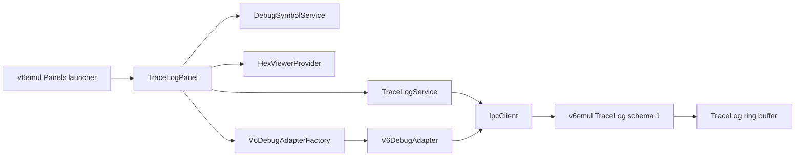

# V6 Trace Log Panel Plan

**Status:** Proposed; blocked on a structured v6emul trace-query protocol
**Date:** 2026-08-05
**Owners:** v6vscode and v6emul maintainers
**Related work:** `v6emul-menu-and-panels-plan.md`, `debug-adapter-and-debug-views-plan.md`, `hex-viewer-panel-plan.md`, `symbols-panel-plan.md`, `conditional-breakpoints-plan.md`

## 1. Problem

### 1.1 Current behavior

v6emul already records executed instructions in a 300,000-entry circular `TraceLog`. Each record contains the executed global instruction address, opcode, and immediate bytes. The in-process Devector UI can disassemble that buffer because it calls `TraceLog::GetDisasm()` directly.

The TCP protocol exposes only:

- `DEBUG_TRACE_LOG_ENABLE` (89), which starts writing a trace file on the server filesystem.
- `DEBUG_TRACE_LOG_DISABLE` (90), which stops writing that file.

Neither command returns trace rows. `GET_SERVER_INFO` does not advertise a trace-log schema, filter/window commands, or limits. v6vscode has no trace model, service, panel, query parser, or action bridge.

Existing standalone tools such as Display, Hex Viewer, Memory Edits, Performance, Symbols, Ports, and Watchpoints are editor `WebviewPanel` instances. Their open state is controlled through the `v6emul` **Panels** launcher, a toggle command, an open-state context key, and direct-tab-close synchronization.

The debug adapter owns breakpoint identity, source/instruction ownership, server synchronization, temporary Step Over breakpoints, and execution state. A Trace Log panel must not mutate breakpoints or send `RUN` independently of that owner.

### 1.2 Desired behavior

Add a standalone **Trace Log** panel to the existing `v6emul` Panels launcher. The panel contains:

1. A filter using the grammar `<address pattern> <instruction pattern>`.
2. A virtualized table with **Offset**, **Address**, and **Assembly Instruction** columns.
3. Clipboard, source-navigation, Hex Viewer, breakpoint, and Run To Line actions.
4. Exact-symbol decoration for instruction addresses and immediate operands.
5. Bounded refresh only while emulation is paused.

The panel must remain responsive against the complete 300,000-entry trace, must not copy the entire ring buffer on every paused refresh, and must clear stale results when execution resumes or the emulator reconnects.

### 1.3 Root cause

The existing trace buffer is an in-process C++ UI facility, not a versioned server contract. The extension cannot retrieve structured trace rows or identify immediate-operand spans from the two file-logging commands. Breakpoint and execution actions also lack a public adapter-facing operation reusable by a custom panel.

## 2. Strategy

### 2.1 Approach: structured server query plus extension-side presentation

Add schema-1 v6emul operations that create an immutable filtered result and retrieve indexed windows from it. Parse and validate the user query in v6vscode, create a server filter from normalized address/instruction glob patterns, then request only the visible result rows plus overscan. The server returns the total match count so the webview can provide a virtual scrollbar without transferring 300,000 rows.

Keep responsibilities separated:

- v6emul owns execution-order history, immutable filtered results, disassembly facts, bounded window limits, and query matching.
- `TraceLogService` owns capability validation, filter creation, indexed window retrieval, window caching, generation handling, and cancellation.
- `TraceLogPanel` owns panel lifecycle, symbol decoration, source/Hex navigation, message validation, and debugger-action routing.
- Pure query/format modules own grammar, wildcard compilation, and display rules.
- The webview owns virtualization, selection, focus, tooltips, and the accessible context menu.
- `V6DebugAdapterFactory` and the active `V6DebugAdapter` own breakpoint replacement, synchronization, temporary run-to-address breakpoints, and resume.

### 2.2 Why this works

- One server-side filter scan followed by indexed visible-window requests keeps IPC and DOM work bounded while supporting arbitrary scrolling.
- Paused-only refreshes avoid mixing an advancing ring-buffer head into one result.
- Structured operands allow one immediate value to be decorated or activated without parsing rendered assembly text.
- Numeric canonical fields keep filtering stable when ELF symbols are loaded, missing, or ambiguous.
- Reusing adapter breakpoint reconciliation avoids invisible breakpoint drift and races with DAP requests.
- The panel follows the established visibility mechanism exactly and introduces no second view container.

### 2.3 Summary of changes

- Extend v6emul with trace schema 1, `DEBUG_TRACE_LOG_FILTER`, `DEBUG_TRACE_LOG_WINDOW`, capability metadata, and immutable paused filtered results.
- Add typed trace models, codecs, query parsing, and `TraceLogService` to v6vscode.
- Add the Trace Log launcher item, toggle/refresh commands, context key, panel owner, and webview assets.
- Load ELF/DWARF symbols through `DebugSymbolService` and decorate only unique exact matches.
- Add active-adapter methods for persistent breakpoint replacement and Run To Line.
- Add unit, integration, regression, real-emulator, accessibility, and performance coverage.
- Update debugging, commands, emulator compatibility, and architecture documentation.

## 3. User Experience Contract

### 3.1 Surface and visibility

Add Trace Log after Performance in the existing launcher:

```text
v6emul
  Panels
    Settings
    Display
    Hex Viewer
    Memory Edits
    Performance
    Trace Log
    Symbols
    Ports
    Watchpoints
```

Use:

- Toggle command: `v6emul.toggleTraceLog`.
- Refresh command: `v6.refreshTraceLog`.
- Open-state context key: `v6emul.traceLogOpen`.
- Webview panel ID: `v6.traceLog`.
- Tab title: `Trace Log`.
- `ViewColumn.Beside` and `retainContextWhenHidden: true`.

Maintain one panel instance. `open()` reveals it, toggle disposes it, and direct tab disposal clears both the launcher check and context key. Hiding or closing the panel cancels pending filter/window requests and clears its cache, but it does not clear the server trace. A disconnected/new emulator session clears all client rows and increments the session generation.

### 3.2 Filter grammar

Use this grammar:

```ebnf
query               = address-pattern, [ whitespace, instruction-pattern ] ;
address-pattern     = "*" | address-glob ;
instruction-pattern = glob-text ;
```

Rules:

- Empty input shows all available trace rows.
- The address field is required when a non-empty query is used. Use `*` to skip address filtering.
- Address matching is case-insensitive against canonical `0xNNNN` CPU-address text. `*` matches zero or more characters; every other character is literal.
- The remaining normalized text is one case-insensitive glob over the complete canonical assembly instruction, including mnemonic and operands.
- Repeated whitespace in the query and canonical instruction is normalized to one space before matching.
- A missing instruction pattern means any instruction. A lone `*` also means any instruction.
- Symbols are display decoration only. Filters match canonical numeric assembly so results do not change when metadata changes.
- Invalid input retains the last valid result set, marks the input invalid, and sends no IPC query.
- Parse on each input event and issue a valid query after a replaceable 100 ms trailing delay.

Examples:

| Query | Meaning |
|---|---|
| `0x1000 LDA 0x100` | Match `LDA 0x100` rows at `0x1000`. |
| `0x1000 LDA*` | Match `LDA` rows at `0x1000`. |
| `* JMP*` | Match `JMP` with any operands at any address. |
| `* J*` | Match mnemonics beginning with `J`, including `JMP`, `JP`, `JZ`, and `JNZ`. |
| `0x10* *` | Match any instruction whose canonical address begins with `0x10`. |

Persist the last valid query in workspace state, bounded to 64 characters. Do not persist trace rows.

### 3.3 Query history

Reuse the established Hex Viewer and Symbols panel query-history behavior; do not create a Trace Log-specific history mechanism.

- Restore `query` and `history` from `ExtensionContext.workspaceState` when the webview is ready.
- On Enter, commit a valid non-empty query, deduplicate only the immediately previous entry, retain the most recent 50 entries, reset the history index, and persist.
- While focus is in the filter, Up stores the current draft on first use and selects the older committed query; Down selects the newer query or restores the draft after the newest entry.
- Applying a recalled query uses the same input/query path as typing it, including validation and the 100 ms trailing request delay.
- Persist only valid queries and their canonical history. Invalid drafts do not replace the last valid persisted state.

Follow the existing message shape used by Hex Viewer and Symbols: the webview sends `persist` with `{ query, history }`, and the host returns `restored` with the persisted values. Keep the Trace Log workspace-state value bounded to 64 characters per query and 50 entries.

### 3.4 Table and values

Use one unframed tool surface with a full-width filter, compact status/result count, and a virtualized table filling the remaining panel height.

| Column | Canonical value | Display behavior |
|---|---|---|
| Offset | `-1`, `-2`, ... | Always numeric; `-1` is the newest retained instruction. Offset is display data, not a filter. |
| Address | `0xNNNN` | Replace with a unique exact symbol; tooltip retains `0xNNNN`. |
| Assembly Instruction | Complete canonical instruction and operands | Replace an address-like immediate with a unique exact symbol; tooltip retains the numeric value. |

Rows are newest first. Use fixed row height, sticky headers, stable column widths, one spacer sized from `totalMatches * rowHeight`, and windowed rendering with overscan. Never create one DOM row per match.

After a valid filter change while paused, call `DEBUG_TRACE_LOG_FILTER`, store its `filterId` and `totalMatches`, clear cached windows, and reset scroll position to zero. On initial render, scroll, resize, refresh, or visibility restoration, calculate the first required filtered-result index and `visibleLines = ceil(tableViewportHeight / rowHeight) + overscan`. Request `{ filterId, start, lines }`, clamping `start` to the result and `lines` to `maxLines`.

Debounce scroll requests by approximately 50 ms. Cache the current, preceding, and following windows; prefetch only an adjacent window when the viewport approaches its cached boundary. Discard distant windows and ignore responses whose client filter generation, `filterId`, `start`, or requested range no longer matches current state. `start` and `lines` are app-controlled and have no user-visible inputs.

Preserve focus while its filtered-result index remains rendered; otherwise return focus to the table. Clear filter state, windows, rows, and selection when emulation resumes.

Each cell is keyboard focusable and independently copyable. Copy uses the displayed text. The numeric address remains available through its tooltip and **Find in Hex Viewer**.

### 3.5 Symbol decoration

Load the active project's debug artifact through the shared `DebugSymbolService`.

- For a row CPU address, use a symbol only when exactly one symbol starts at that exact 16-bit address.
- For an address-like immediate operand, use a label symbol only when exactly one symbol starts at that exact value.
- For an non-address-like immediate operand, use a symbol (label or a constant) only when it matches the bit width and there is only one symbol with that exact value.
- If zero or multiple symbols match, show canonical numeric text.
- Never use `symbolAtAddress()` for decoration because an enclosing function is not an exact address alias.
- Preserve the raw number in a tooltip when a symbol is displayed.
- Do not decorate byte immediates or non-address operands as addresses unless server operand metadata explicitly marks them address-like.
- Filtering always uses the undecorated canonical instruction supplied by the server.

Add a `symbolsAtExactAddress(address)` API to `DebugSymbolService`/`DebugIndex`; do not repeatedly scan `allSymbols()` for every visible cell.

### 3.6 Navigation

- Double-click the Address cell or non-immediate area of Assembly Instruction to open the exact DWARF source row for the executed instruction.
- Ctrl+double-click an address-like immediate token to open the exact source row for that immediate target.
- Plain double-click on an immediate token still opens the row instruction source; Ctrl is required to follow the operand.
- Use `revealDebugSource()` and resolve project-relative paths exactly as Symbols and Performance do.
- If no exact source row exists, retain panel state and report `No DWARF source line for 0xNNNN` in the status area.
- Never accept a file path or source line from the webview. The webview sends only the current result-row index and target kind; the host validates the index against the current cached result and re-resolves the authoritative address.

### 3.7 Context menu

Right-click, Context Menu, or Shift+F10 opens an accessible custom menu in this order:

1. **Copy**
2. **Add Breakpoint**
3. **Find in Source**
4. **Find in Hex Viewer**
5. **Run To Line**

The action target is the exact hovered element:

| Hover target | Copy | Breakpoint/Source/Hex target | Run To Line target |
|---|---|---|---|
| Offset | Offset text | Row instruction address | Row instruction address |
| Address | Displayed symbol or `0xNNNN` | Row instruction address | Row instruction address |
| Mnemonic/register/text operand | Displayed instruction cell | Row instruction address | Row instruction address |
| Address-like immediate | Displayed symbol or numeric token | Immediate value | Immediate value |

**Find in Hex Viewer** uses the row's global instruction address for a row target so code executed from mapped RAM-disk memory opens the correct bank. An immediate target is a 16-bit CPU address and opens Main RAM unless a future server schema supplies its resolved global memory address.

Disable source actions without an exact source mapping. Disable Hex navigation for an invalid/unmapped global address. Disable Add Breakpoint and Run To Line unless an active V6 debug adapter is paused and can own the operation. Close the menu on action, Escape, outside click, scroll, result replacement, session change, panel hide, or disposal; restore focus when the target still exists.

### 3.8 Add Breakpoint

Route the action through the active `V6DebugAdapter`, never directly from `TraceLogPanel` to `IpcClient`.

1. Validate a paused active V6 debug session and a 16-bit target.
2. Read/reconcile the authoritative backend breakpoint collection.
3. If a breakpoint already exists at the target, delete it first as requested and remove/update its adapter-side server identity.
4. Add one persistent unconditional breakpoint with comment `__trace_log`.
5. Read `DEBUG_BREAKPOINT_GET_ALL` and publish DAP breakpoint change events so the adapter and native Breakpoints view agree with the backend.
6. Report add/delete/synchronization failures without claiming success.

The operation must serialize with DAP `setBreakpoints`, `setInstructionBreakpoints`, Step Over, reset, reload, disconnect, and Run To Line. Add focused collision tests for source-owned, instruction-owned, server-only, disabled, and conditional breakpoints. The implementation must not leave the adapter maps claiming a configuration different from the backend.

### 3.9 Run To Line

Extract the temporary-breakpoint flow currently used by `onNext()` into one adapter-owned helper and expose `runToAddress(address)` through `V6DebugAdapterFactory`.

1. Require a paused active debug session.
2. Capture and reconcile any breakpoint already at the target.
3. If necessary, temporarily remove the target breakpoint and preserve its complete configuration and ownership.
4. Add an unconditional auto-delete breakpoint with comment `__trace_run_to_line`.
5. Confirm it through `DEBUG_BREAKPOINT_GET_ALL` before continuing.
6. Capture the stop-record baseline, transition adapter/lifecycle state, send `RUN`, emit the normal DAP continued event, and start normal stop polling.
7. On target hit, unrelated stop, pause, reset, reload, disconnect, or error, reconcile the backend and restore any preserved user breakpoint when the session still exists.

Do not send `RUN` until the temporary breakpoint is visible in the synchronized backend snapshot. Do not emit a second continued/stopped sequence outside the adapter's normal state machine.

## 4. Architecture and Protocol

### 4.1 Components



`TraceLogService` must be independent of VS Code and DOM APIs. `TraceLogPanel` treats webview messages as untrusted and re-resolves every row-index/target pair against the current immutable result cache. The active adapter remains the only owner of breakpoint and run-state mutations.

### 4.2 Server interface

The v6emul client-facing contract is defined in `v6emul-trace-log-query-design.md`. `DEBUG_TRACE_LOG_FILTER` accepts normalized address and instruction patterns and returns an opaque `filterId` plus `totalMatches`. `DEBUG_TRACE_LOG_WINDOW` accepts `{ filterId, start, lines }` and returns that indexed window.

The extension treats `filterId` as opaque. It uses `totalMatches` only for virtual-scroll geometry and bounds. Resume, reset, reconnect, emulator replacement, or a new filter invalidates all prior windows.

### 4.3 Extension request flow

```text
filter input, history recall, refresh, or panel reveal while paused
        |
        v
parse valid user filter and send DEBUG_TRACE_LOG_FILTER
        |
        v
store filterId + totalMatches; reset virtual scroll and window cache
        |
        v
on scroll/resize calculate start + visible lines + overscan
        |
        v
send DEBUG_TRACE_LOG_WINDOW and render only the returned window
```

The extension must reject stale responses after a filter, viewport, lifecycle, or generation change. It clears the active filter and all cached windows when execution resumes.

## 5. Implementation Steps

### Step 5.1 - Confirm protocol ID and schema contract [ ]

- Review v6emul's current command tail before assigning the query ID.
- Add the schema-1 filter/window requests, responses, operand, error, limits, and filter-lifetime contract to v6emul design documentation.
- Fix canonical I8080 spacing/case and address-like operand classification with golden examples for all 256 opcodes.

> **Implementation Notes:**

### Step 5.2 - Verify server support before extension implementation [ ]

- Verify the server advertises trace schema 1, both filter/query commands, and limits.
- Verify filter creation returns `filterId`/`totalMatches` and every window response honors `start`/`lines`.

> **Implementation Notes:**

### Step 5.3 - Add extension protocol models and codecs [ ]

- Add both command enums and server capability fields.
- Add strict request/response codecs and `validateTraceLogServer()`.
- Reject invalid filter IDs, totals, starts, malformed operands, unsafe numbers, invalid addresses, oversized responses, and inconsistent offsets.
- Add mocked protocol and capability tests before panel work.

> **Implementation Notes:**

### Step 5.4 - Implement and test the pure filter parser [ ]

- Add `trace-log-query.ts` with the grammar from section 3.2.
- Return a typed normalized query or one field-specific diagnostic.
- Test empty, exact/wildcard addresses, instruction globs, whitespace, case, malformed queries, and the requested examples.
- Share glob conformance vectors with v6emul so client validation and server matching cannot drift.

> **Implementation Notes:**

### Step 5.5 - Implement TraceLogService [ ]

- Add filter creation, indexed window retrieval, paused-only refresh, cancellation/generation checks, and a bounded adjacent-window cache.
- Send app-calculated `start`/`lines` in every window request and clamp them to `totalMatches`/server limits.
- Coalesce equivalent window requests; never coalesce distinct filters or ranges.
- Clear filter/window state when execution resumes, disconnects, resets, or starts a new session.
- Add service tests for stale filter/window responses, reconnect, hidden state, scroll, resize, refresh, eviction, and filter replacement.

> **Implementation Notes:**

### Step 5.6 - Add panel visibility and contribution wiring [ ]

- Add command/context IDs in `src/config/contribution-ids.ts`.
- Add Trace Log to `EmulatorPanelLauncherView.PANELS`.
- Add toggle/refresh command contributions and the editor-title refresh action in `package.json`.
- Construct/dispose the service and panel in `src/extension.ts`.
- Initialize the context key to false and synchronize direct tab close through `onOpenStateChanged`.
- Extend standalone-panel regression coverage.

> **Implementation Notes:**

### Step 5.7 - Implement TraceLogPanel and symbol decoration [ ]

- Add panel lifecycle, shared query/history restoration, typed message routing, status states, and result-cache lookup by row index.
- Load/clear shared debug symbols with active project lifecycle.
- Add indexed exact-address symbol lookup and deterministic ambiguity handling.
- Implement source and Hex Viewer navigation without trusting webview locations.
- Add panel/controller and symbol-decoration tests.

> **Implementation Notes:**

### Step 5.8 - Implement the virtualized webview [ ]

- Add CSP-protected `trace-log.js` and `trace-log.css` assets.
- Implement delayed filtering, shared Enter/Up/Down query history, virtual-scroll geometry, visible-window measurement, loading/empty/error states, stable focus, and session reset.
- Render all server/symbol text through `textContent`.
- Implement cell selection, per-cell copy, operand spans, tooltips, mouse/keyboard navigation, and the exact context-menu order.
- Verify light, dark, high-contrast, reduced-motion, 200% zoom, and narrow panel behavior.

> **Implementation Notes:**

### Step 5.9 - Add adapter-owned breakpoint actions [ ]

- Expose active-adapter availability and paused state through the factory.
- Add serialized `replaceBreakpointAtAddress()` with delete-first semantics and post-operation `GET_ALL` reconciliation.
- Extract the Step Over temporary-breakpoint helper and add `runToAddress()` with collision preservation/restoration.
- Disable actions outside an active paused V6 debug session.
- Add breakpoint-map, event-order, collision, failure, cancellation, and synchronization tests.

> **Implementation Notes:**

### Step 5.10 - Add navigation and interaction tests [ ]

- Test row versus immediate double-click and Ctrl+double-click behavior.
- Test target-sensitive Copy, Add Breakpoint, Find in Source, Find in Hex Viewer, and Run To Line.
- Test menu keyboard access, disabled states, focus restoration, stale-response rejection, and scroll/resize-driven windows.
- Test Main RAM and RAM-disk global instruction navigation.

> **Implementation Notes:**

### Step 5.11 - Build and run focused extension tests [ ]

- Run `npm run compile`.
- Run focused Mocha suites for query, codec, service, panel, symbols, adapter, and standalone panels.
- Run `git diff --check`.

> **Implementation Notes:**

### Step 5.12 - Run full regression and real-emulator verification [ ]

- Run `npm run test:unit` and `npm run test:regression`.
- Extend `test/features/debug-adapter` or add `test/features/trace-log` following `test/features/README.md`.
- Verify real execution order, reset, filtering, arbitrary virtual scrolling, window limits, breakpoint replacement, source/Hex navigation, and Run To Line.
- Ensure `result.txt` is written only after every real-emulator assertion passes and contains stable scenario IDs, versions, and artifact hashes.

> **Implementation Notes:**

### Step 5.13 - Performance and manual acceptance [ ]

- Verify first visible results under 100 ms for a warm paused 300,000-row trace on the development machine.
- Verify filter results under 200 ms p95 and response payloads within the advertised maximum.
- Run execution with Display and Trace Log visible and confirm the panel sends no filter/window requests until the emulator pauses.
- Scroll across the complete 300,000-row unfiltered result and filtered results while confirming bounded DOM, cache, and response sizes.
- Verify the complete workflow in an Extension Development Host.

> **Implementation Notes:**

### Step 5.14 - Update documentation and close the plan [ ]

- Update `docs/commands.md`, `docs/debugging.md`, `docs/emulator.md`, and `docs/architecture.md`.
- Document grammar, symbol rules, context actions, debug-session restrictions, server schema, HLT suppression, capacity, and filter invalidation.
- Mark completed checklist items and record implementation deviations.

> **Implementation Notes:**

## 6. Expected Results

### 6.1 Recent execution inspection

`-10 * *` immediately shows the ten latest recorded instructions in execution order, with `-1` at the top.

### 6.2 Targeted control-flow search

`* J* *` searches the complete retained trace for jump-family instructions without transferring the complete ring buffer or changing results when debug symbols load.

### 6.3 Source and memory correlation

A uniquely named instruction address and immediate target display as symbols, retain numeric tooltips, open exact source rows, and reveal the correct instruction memory bank in Hex Viewer.

### 6.4 Debug execution control

Add Breakpoint and Run To Line update the backend and adapter atomically. The Breakpoints view receives synchronized events, temporary breakpoints do not orphan, and normal continued/stopped events remain authoritative.

## 7. Test Plan

### 7.1 Unit tests

- Query grammar and wildcard conformance.
- Trace capability and payload codecs.
- Filter identity/lifetime, total counts, indexed windows, generation, cache eviction, resize, and request coalescing.
- Exact/ambiguous/missing symbol decoration.
- Context-target resolution and stale-response rejection.
- Breakpoint replacement and run-to-address state transitions.

### 7.2 Integration and regression tests

- Contribution IDs, launcher ordering, toggle state, direct close, and refresh routing.
- Host/webview message contracts and CSP.
- Virtual-scroll geometry, visible-window measurement, shared query history, keyboard menu behavior, and copy targets.
- Source and Hex Viewer handoffs.
- Existing panel visibility, Step Over, breakpoint reconciliation, and stop-record behavior remain unchanged.

### 7.3 Real-emulator tests

- All 256 opcodes serialize with stable canonical instructions and operand metadata.
- Offsets remain correct across execution, reset, repeated HLT suppression, and ring wrap.
- Filters return complete counts and indexed queries return correct ordered windows throughout the result.
- Add Breakpoint and Run To Line synchronize before execution resumes.
- No trace filter/window request is sent while execution is running.

## 8. Risks and Mitigations

| Risk | Mitigation |
|---|---|
| Copying/filtering 300,000 rows stalls the emulator | Scan once per filter and transfer only indexed visible windows plus small overscan. |
| Delayed scroll response belongs to an old filter | Require opaque `filterId` and reject responses using client filter/range generations. |
| A stale paused result is shown after execution resumes | Clear rows immediately when lifecycle state changes to running. |
| Client and server wildcard behavior diverge | Share golden conformance vectors and keep the grammar deliberately limited to `*`. |
| Rendered text must be reparsed for immediate actions | Return structured operands and address-like metadata. |
| Symbol aliases produce misleading links | Decorate only one exact-address match; otherwise retain the number. |
| A panel action corrupts DAP breakpoint ownership | Serialize actions through the active adapter and reconcile with `GET_ALL` before/after mutations. |
| Run To Line destroys a user breakpoint at its target | Preserve complete configuration/ownership and restore it after every completion or cancellation path. |
| Hidden or running panels generate unnecessary traffic | Cancel pending work when hidden and issue filter/window requests only while visible and paused. |
| RAM-disk execution opens the wrong Hex Viewer bank | Carry both CPU and global instruction addresses in every row. |

## 9. Relationship to Other Improvements

The panel consumes the existing ELF/DWARF metadata and shared panel launcher introduced by earlier debug-view work. Its adapter action bridge should also become the common implementation for future Disassembly, Call Stack, and execution-history actions. The structured trace protocol can later support reverse navigation and profiler correlation, but it must remain distinct from file logging and recorder state.

## 10. Future Enhancements

- Reverse step/continue anchored to recorder state.
- Export filtered rows to a client-selected file.
- Additional exact fields such as opcode bytes, cycle count, register deltas, and memory accesses.
- Saved named filters.
- Mixed source/assembly grouping.
- Follow-tail toggle and pause-on-match.
- Backend query indexes if linear scans miss latency targets.

## 11. References

- `src/emulator/panel/emulator-panel-launcher-view.ts`
- `src/debug/views/hex-viewer-provider.ts`
- `src/debug/views/performance-panel.ts`
- `src/debug/metadata/debug-symbol-service.ts`
- `src/debug/adapter/v6-debug-adapter.ts`
- `src/debug/adapter/v6-debug-adapter-factory.ts`
- `src/emulator/protocol/ipc-commands.ts`
- `test/unit/emulator/standalone-panels.test.ts`
- `test/features/README.md`
- `C:\Work\Programming\v6emul\libs\v6core\include\core\trace_log.h`
- `C:\Work\Programming\v6emul\libs\v6core\src\trace_log.cpp`
- `C:\Work\Programming\v6emul\libs\v6core\src\debugger.cpp`
- `C:\Work\Programming\devector\src\main_imgui\main\ui\trace_log_window.cpp`
- `v6emul-trace-log-query-design.md`

## 12. Implementation Checklist

### Server contract

- [ ] Assign the next free IPC command ID.
- [ ] Specify and advertise trace-log schema 1.
- [ ] Add structured opcode/operand serialization.
- [ ] Add bounded server-side address/instruction filtering and immutable filter IDs.
- [ ] Return complete `totalMatches` for virtual-scroll geometry.
- [ ] Add app-controlled `start`/`lines` window retrieval.
- [ ] Add capacity/line/pattern limits.

### Extension protocol and service

- [ ] Add both commands, capabilities, limits, filter/window requests, responses, and operand models.
- [ ] Add strict runtime codecs and server validation.
- [ ] Add pure query parsing and shared glob vectors.
- [ ] Add TraceLogService filter lifecycle, indexed windows, adjacent cache, generation, and cancellation.
- [ ] Add protocol, parser, and service unit tests.

### Panel integration

- [ ] Add toggle/refresh commands and open-state context key.
- [ ] Add Trace Log to the existing Panels launcher.
- [ ] Register/dispose the service and panel in `extension.ts`.
- [ ] Implement single-instance lifecycle and direct-tab-close synchronization.
- [ ] Implement no-session, unsupported, loading, ready, running, stale, empty, and error states.

### Webview behavior

- [ ] Implement the filter and exact requested examples.
- [ ] Reuse the Hex Viewer/Symbols query-history contract.
- [ ] Implement the three-column virtual table and full-result scrollbar.
- [ ] Implement per-cell copy and numeric tooltips.
- [ ] Implement unique-symbol decoration for row and immediate addresses.
- [ ] Implement row and Ctrl+immediate source navigation.
- [ ] Implement the exact context-menu order and target matrix.
- [ ] Implement Find in Hex Viewer with global instruction addresses.
- [ ] Implement keyboard access, focus preservation, and stale-result rejection.
- [ ] Request and honor indexed visible windows on scroll, resize, refresh, and reveal.

### Debug actions

- [ ] Expose active-adapter paused/action state.
- [ ] Implement delete-first persistent breakpoint replacement.
- [ ] Synchronize breakpoint maps and DAP events after replacement.
- [ ] Extract the reusable temporary-breakpoint execution helper.
- [ ] Implement collision-safe Run To Line.
- [ ] Reconcile before RUN and after every stop/cancel/error path.
- [ ] Add adapter collision, synchronization, and event-order tests.

### Verification and documentation

- [ ] Run focused compile/unit checks after each implementation slice.
- [ ] Run `npm run test:unit`.
- [ ] Run `npm run test:regression`.
- [ ] Run real-emulator trace feature verification.
- [ ] Create `result.txt` only after complete real-emulator success.
- [ ] Verify latency, memory, cache bounds, and paused-only request behavior.
- [ ] Verify the Extension Development Host workflow and accessibility states.
- [ ] Update commands, debugging, emulator, and architecture documentation.
- [ ] Compare implementation with every acceptance criterion and record deviations.

## 13. Server Missing Functionality

### 13.1 Structured trace retrieval

#### Description

The extension requires versioned filter and window-query commands that expose retained executed instructions as structured records containing offset, 16-bit CPU address, global instruction address, opcode bytes, canonical instruction text, and typed operand boundaries while emulation is paused.

#### Current Server Solution

v6emul stores the required raw execution facts in `TraceLog::m_log`, and its in-process UI calls `TraceLog::GetDisasm()`. The TCP server exposes no command that returns those records. `DEBUG_TRACE_LOG_ENABLE` and `DEBUG_TRACE_LOG_DISABLE` only control a server-side text file and cannot populate an interactive client panel.

#### Proposed Server Functionality and Recommendations

Implement trace-log schema 1 with structured `DEBUG_TRACE_LOG_FILTER` and `DEBUG_TRACE_LOG_WINDOW` commands. Keep file logging commands unchanged. Serialize raw canonical I8080 instructions without server symbol substitution and include typed operands so clients can safely decorate and activate immediate values.

### 13.2 Bounded filtering and indexed windows

#### Description

The panel must filter by address and complete-instruction globs across up to 300,000 retained records, obtain the complete match count, and retrieve arbitrary visible windows plus overscan.

#### Current Server Solution

`TraceLog::GetDisasm(lines, filter)` performs an in-process scan using an instruction-type threshold. It has no text/address glob query, immutable filter identity, total match count, indexed window request, payload bound, or TCP representation. Returning the complete ring on each filter change would be too expensive.

#### Proposed Server Functionality and Recommendations

Add a normalized filter request returning opaque `filterId` and `totalMatches`, then accept bounded `{ filterId, start, lines }` window requests. Match canonical numeric data so filtering is independent of client symbols. Publish limits through `GET_SERVER_INFO`.

### 13.3 Paused-state availability

#### Description

The panel requests rows only while emulation is paused. It must receive a bounded result for the current paused state, and reset or resume must invalidate prior client rows explicitly.

#### Current Server Solution

The current server has no remote trace-query command or declared paused-state availability contract.

#### Proposed Server Functionality and Recommendations

Keep each filtered result immutable while paused and invalidate it on replacement, reset, resume, reconnect, or emulator replacement. Define repeated-HLT suppression and wraparound behavior in the client contract.

### 13.4 Capability negotiation

#### Description

v6vscode must determine whether the active emulator supports the exact trace schema and safe limits before enabling the panel's data path.

#### Current Server Solution

The command list can reveal IDs 89 and 90, but those IDs indicate file logging only. There is no trace schema version, query flag, coherence guarantee, capacity, line limit, or pattern-size limit.

#### Proposed Server Functionality and Recommendations

Advertise `traceLogSchema`, `traceLogFilter`, `traceLogWindowQuery`, and `traceLogLimits` in `GET_SERVER_INFO`, plus both command IDs. Older servers must produce an explicit unsupported-panel state rather than a guessed fallback.