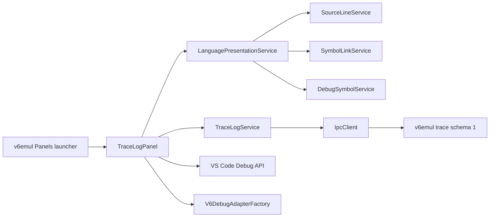

# V6 Trace Log Panel Plan

**Status:** Proposed; server protocol implemented
**Date:** 2026-08-07
**Owner:** v6vscode maintainers
**Server contract:** `v6emul-trace-log-query-design.md`
**Related work:** `v6emul-menu-and-panels-plan.md`, `debug-adapter-and-debug-views-plan.md`, `hex-viewer-panel-plan.md`, `symbols-panel-plan.md`

## 1. Goal

Add a standalone **Trace Log** panel to the existing `v6emul` Panels launcher. The panel must:

1. Filter retained execution history by address and server disassembly text.
2. Scroll through up to 300,000 matches without loading or rendering the complete result.
3. Show the mapped source line when an instruction address has source information.
4. Otherwise show the undecorated I8080 instruction returned by v6emul.
5. Reuse language highlighting, symbol hyperlinks, source navigation, and debugger breakpoint behavior through shared services.
6. Request trace data only while the emulator is paused.

Listing text remains exactly the mapped source line or the server instruction. Row interactions target the instruction address.

## 2. Design Principles

Follow the ownership rules in `design/design.md`:

- v6emul owns retained execution history, filtering, result ordering, disassembly text, and bounded windows.
- The language domain owns assembly/source tokenization and symbol-link resolution.
- The debug metadata domain owns address-to-source resolution.
- The debug adapter and VS Code debug API own breakpoints and execution control.
- `TraceLogService` owns protocol validation, filter lifetime, indexed windows, caching, generations, and cancellation.
- `TraceLogPanel` coordinates services, validates webview messages, and prepares trusted row view models.
- The webview owns virtual scrolling, row rendering, selection, focus, and menus.

Do not copy parser, hyperlink, source-resolution, or breakpoint synchronization logic into the panel.

## 3. Server Contract

Require trace schema 1 and both advertised commands:

- `DEBUG_TRACE_LOG_FILTER`
- `DEBUG_TRACE_LOG_WINDOW`

The extension models the implemented contract exactly:

```ts
interface TraceLogFilterRequest {
  addressPattern?: string;
  instructionPattern?: string;
}

interface TraceLogFilterResponse {
  filterId: number;
  totalMatches: number;
}

interface TraceLogWindowRequest {
  filterId: number;
  start: number;
  lines: number;
}

interface TraceLogWindowResponse {
  start: number;
  entries: TraceLogEntry[];
}

interface TraceLogEntry {
  address: number;
  bytes: number[];
  instruction: string;
}
```

`filterId` is opaque to the client. `totalMatches`, response `start`, and `entries.length` fully describe the virtual result and returned window.

Reject invalid capabilities, IDs, counts, starts, line limits, addresses, byte arrays, instruction strings, and oversized responses at the protocol boundary.

## 4. User Experience

### 4.1 Surface and lifecycle

Add Trace Log after Performance in the existing launcher.

- Toggle command: `v6emul.toggleTraceLog`
- Refresh command: `v6.refreshTraceLog`
- Open-state context key: `v6emul.traceLogOpen`
- Webview panel ID: `v6.traceLog`
- Tab title: `Trace Log`
- Open beside the active editor and retain webview context while hidden.

Maintain one panel instance. Opening reveals it; toggling or closing disposes it and synchronizes launcher state. Hiding cancels pending requests and releases client window caches. Disconnect, resume, reset, step, or session replacement clears the active filter and all rows.

The panel states are: no session, unsupported server, running, loading, ready, empty, and error.

### 4.2 Filter

Use the grammar:

```ebnf
query               = address-pattern, [ whitespace, instruction-pattern ] ;
address-pattern     = "*" | address-glob ;
instruction-pattern = glob-text ;
```

- Empty input omits both patterns and matches all retained instructions.
- A non-empty query requires an address pattern. `*` skips address filtering.
- Both patterns use the server's case-insensitive `*` glob semantics.
- The instruction pattern matches the complete undecorated instruction, including operands.
- Invalid input retains the current result, marks the input invalid, and sends no request.
- Send valid filters after a replaceable 100 ms trailing delay.
- Limit each pattern to the server-advertised `maxPatternBytes` after UTF-8 encoding.

Examples:

| Query | Meaning |
|---|---|
| `0x1000 LDA 0x100` | Match that complete instruction at `0x1000`. |
| `0x1000 LDA*` | Match `LDA` instructions at `0x1000`. |
| `* JMP*` | Match `JMP` instructions at any address. |
| `0x10* *` | Match every instruction at matching addresses. |

Reuse the Hex Viewer/Symbols query-history behavior: Enter commits, Up/Down recalls, only the immediately previous duplicate is suppressed, and at most 50 valid entries are stored in workspace state.

### 4.3 Virtual listing

Use a two-column virtual table:

| Column | Value |
|---|---|
| Address | Server `address`, formatted as `0xNNNN`. |
| Listing | Mapped source line, otherwise server `instruction`. |

Rows remain in the server's newest-first order.

Use fixed row height, sticky headers, stable columns, a spacer sized from `totalMatches`, and a bounded set of rendered rows. On filter success, store `filterId` and `totalMatches`, clear cached windows, and scroll to result index zero.

For initial display, scroll, resize, refresh, and reveal:

1. Calculate the first required result index.
2. Calculate visible rows plus overscan.
3. Clamp `start` to `totalMatches` and `lines` to the advertised `maxLines`.
4. Request `{ filterId, start, lines }`.
5. Render the returned entries at response `start`.

Debounce scroll requests by approximately 50 ms. Cache only the current, preceding, and following windows. Prefetch an adjacent window near a cache boundary and evict distant windows. Ignore a response when its session generation, filter generation, `filterId`, or requested range is stale.

### 4.4 Source-backed rows

For every visible entry, resolve `address` through `DebugSymbolService.sourceAtExactAddress()`.

When an exact source location exists:

1. Resolve the project-relative source path through the existing debug-source path utility.
2. Read the corresponding source document through a shared source-line service.
3. Display that complete source line as the Listing value.
4. Tokenize it through the shared language-highlighting service.
5. Resolve symbol hyperlinks through the shared symbol-link service.

When source metadata, the source file, or the requested line is unavailable, display and highlight the server `instruction`. Do not merge source and disassembly text in one row.

Cache source documents by URI and document version or file modification state. Resolve and prepare only rows in retained trace windows; do not process all matches eagerly.

### 4.5 Highlighting and hyperlinks

Language highlighting must remain owned by `src/language`. Extract reusable tokenization that accepts one assembly/source line and returns text spans with stable semantic classes. The source editor provider and Trace Log presentation must consume the same lexical definitions.

For source-backed rows, reuse shared symbol token discovery and target resolution. A link action sent by the webview contains only the result index and token range. The extension host revalidates the row and range, resolves the symbol again, and performs navigation with `revealDebugSource()`.

For disassembly-backed rows:

- Highlight mnemonic, registers, numeric literals, and punctuation.
- Do not create symbol or constant hyperlinks.
- Do not parse immediates for source, Hex Viewer, breakpoint, or Run To Line targets.

Render all source and server text through `textContent`; never accept HTML from either source.

### 4.6 Row navigation and breakpoints

Double-clicking a source-backed row opens its exact source location with `revealDebugSource()`. A disassembly-backed row has no source-navigation action.

Breakpoint actions target the instruction represented by the row:

- For a source-backed row, create or remove a `SourceBreakpoint` through `vscode.debug.addBreakpoints()` / `removeBreakpoints()`. This reuses the main editor's DAP source-breakpoint path and keeps the Breakpoints view authoritative.
- For a disassembly-backed row, create or remove an `InstructionBreakpoint` for `address` through the VS Code debug API.
- Never send breakpoint IPC commands directly from `TraceLogPanel`.

The panel determines checked state from `vscode.debug.breakpoints`, using source URI/line for source rows and instruction reference for disassembly rows. Disable breakpoint actions without an active V6 debug session.

Run To Line, if included, remains an adapter-owned operation targeting the row `address`; it must reuse the adapter's temporary-breakpoint execution path and normal continued/stopped events.

### 4.7 Context menu and copying

Provide an accessible context menu with only actions supported by the selected row:

1. **Copy Address**
2. **Copy Listing**
3. **Toggle Breakpoint**
4. **Find in Source** when source-backed
5. **Run To Line** when a paused adapter supports it

Copy uses displayed text. The webview sends a result index and action; the host resolves the authoritative cached entry and source location. Close the menu on action, Escape, outside click, scroll, result replacement, hide, or disposal.

## 5. Architecture



`TraceLogService` has no VS Code or DOM dependency. Language parsing and symbol resolution have no panel dependency. `TraceLogPanel` is an orchestration boundary, and the webview is an untrusted renderer.

## 6. Implementation Plan

### Step 1 - Protocol models and validation

- Add both command IDs, capability fields, limits, request/response models, and strict codecs.
- Validate the exact `{ address, bytes, instruction }` entry shape.
- Add capability, malformed-payload, boundary, and server-error tests.

### Step 2 - Shared language presentation

- Complete the separate language-presentation refactoring plan.
- Extract source-line loading, line tokenization, symbol token discovery, and symbol target resolution behind reusable interfaces.
- Preserve current editor behavior with focused language-provider tests before panel integration.

### Step 3 - Filter parser and history

- Implement the pure Trace Log query parser and UTF-8 byte-limit checks.
- Add shared glob conformance vectors matching the server.
- Reuse the existing query-history interaction and persistence shape.

### Step 4 - TraceLogService

- Implement paused-only filter creation and indexed window requests.
- Add generation checks, request coalescing, adjacent-window caching, and eviction.
- Clear state on invalidation and test stale filter/window responses, scrolling, resize, hide, resume, and reconnect.

### Step 5 - Panel integration

- Add contribution IDs, launcher entry, toggle/refresh commands, title action, and lifecycle wiring.
- Build trusted row view models from trace entries plus optional source locations.
- Route source links, row navigation, breakpoint actions, and Run To Line through shared owners.

### Step 6 - Virtualized webview

- Implement filter/history controls, virtual-scroll geometry, bounded rows, loading/empty/error states, selection, focus, copy, and the row context menu.
- Render host-produced text spans using VS Code theme variables.
- Verify narrow widths, 200% zoom, high contrast, reduced motion, and keyboard-only use.

### Step 7 - Verification and documentation

- Run focused protocol, language, service, panel, adapter, and standalone-panel tests.
- Run `npm run compile`, `npm run test:unit`, and `npm run test:regression`.
- Add real-emulator tests for filtering, complete virtual scrolling, source/disassembly fallback, invalidation, and paused-only requests.
- Update commands, debugging, emulator, language-support, and architecture documentation.

## 7. Acceptance Criteria

- The panel enables only when trace schema 1 and both commands are advertised.
- Filtering creates one server result; scrolling retrieves bounded indexed windows from it.
- The scrollbar represents all `totalMatches`, while DOM and cache sizes remain bounded.
- Rows show source text only for exact mapped addresses and otherwise show the server instruction.
- Every row conforms exactly to the server's `{ address, bytes, instruction }` entry contract.
- Source-backed rows use shared highlighting and symbol-link behavior.
- Disassembly-backed rows are highlighted but contain no symbol hyperlinks.
- Breakpoints use VS Code's source/instruction breakpoint APIs and appear consistently in the Breakpoints view and source gutter.
- Running, stepping, reset, reconnect, filter replacement, and panel hiding cannot expose stale rows.
- The panel remains responsive with 300,000 unfiltered matches.

## 8. Risks and Mitigations

| Risk | Mitigation |
|---|---|
| Large histories exhaust IPC or DOM resources | Filter once and request only visible indexed windows with bounded adjacent caching. |
| Delayed responses render under a newer filter | Validate session/filter generations, opaque `filterId`, and requested range. |
| Source files are repeatedly loaded while scrolling | Cache source documents and prepare only retained windows. |
| Panel highlighting diverges from editor highlighting | Keep lexical definitions and symbol resolution in shared language services. |
| Webview actions use forged paths or addresses | Send row indices/ranges only and re-resolve targets in the extension host. |
| Breakpoint state diverges from the source editor | Use VS Code breakpoint APIs and the existing DAP adapter path. |
| A trace address has no usable source | Render the server instruction without symbol or constant substitution. |

## 9. Implementation Checklist

### Protocol and service

- [ ] Add schema-1 capabilities, commands, models, and codecs.
- [ ] Add filter parsing and server-compatible glob tests.
- [ ] Implement filter lifetime and indexed window retrieval.
- [ ] Implement bounded adjacent-window caching and stale-response rejection.

### Shared language behavior

- [ ] Extract reusable source-line loading and tokenization.
- [ ] Extract reusable symbol-token target resolution.
- [ ] Preserve source-editor highlighting and navigation behavior.
- [ ] Add source-line/disassembly fallback tests.

### Panel and webview

- [ ] Add launcher, commands, context key, and single-instance lifecycle.
- [ ] Implement the two-column virtual listing.
- [ ] Implement source-backed and disassembly-backed row presentation.
- [ ] Implement copy, source navigation, breakpoint, and Run To Line actions.
- [ ] Implement keyboard, focus, theme, zoom, and accessibility behavior.

### Verification

- [ ] Run compile, focused tests, unit tests, and regression tests.
- [ ] Verify complete 300,000-row scrolling with bounded memory and DOM use.
- [ ] Verify exact-source lookup and server-disassembly fallback.
- [ ] Verify source and instruction breakpoints through the VS Code debug UI.
- [ ] Update user and architecture documentation.
