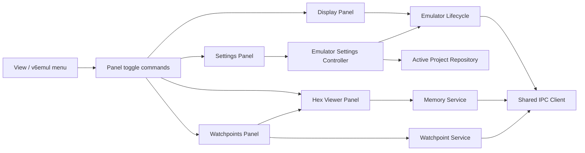

# v6emul Menu and Standalone Panels Plan

**Status:** Proposed
**Date:** 2026-08-01
**Owners:** v6vscode maintainers
**Related work:** `hex-viewer-panel-plan.md`, `watchpoints-panel-plan.md`, `debug-adapter-and-debug-views-plan.md`

## 1. Objective

Add one discoverable `v6emul` menu that opens and closes the emulator tools, move the large Hex Viewer and Watchpoints tools out of the Run and Debug sidebar, and simplify the emulator Display panel to the screen only.

The resulting surfaces are:

| Menu item | Surface | Title |
|---|---|---|
| Settings | Editor `WebviewPanel` | Settings |
| Display | Existing editor `WebviewPanel` | Display |
| Hex Viewer | Editor `WebviewPanel` | Hex Viewer |
| Watchpoints | Editor `WebviewPanel` | Watchpoints |

Each menu item is a toggle. Selecting a closed panel creates it; selecting its open menu item closes it. Closing a panel through its tab close button must update the menu's checked state.

## 2. VS Code Menu Decision

VS Code extensions cannot contribute an arbitrary new top-level application menu beside **File**, **Edit**, **View**, and the other built-in menus. Implement the supported equivalent as a `v6emul` submenu under the built-in **View** menu:

```text
View
  v6emul
    Settings
    Display
    Hex Viewer
    Watchpoints
```

Contribute the submenu and its four commands in `package.json`. Use context keys to show checked state for open panels:

- `v6emul.settingsOpen`
- `v6emul.displayOpen`
- `v6emul.hexViewerOpen`
- `v6emul.watchpointsOpen`

The commands remain available in the Command Palette under the `v6emul` category. Command handlers own toggle behavior; menu contributions only invoke commands and render their state.

Proposed command IDs:

- `v6emul.toggleSettings`
- `v6emul.toggleDisplay`
- `v6emul.toggleHexViewer`
- `v6emul.toggleWatchpoints`

Do not keep duplicate Hex Viewer or Watchpoints contributions in `views.debug`. Hardware Statistics remains in the Run and Debug sidebar because it is compact and is outside this change.

## 3. User Experience Contract

### 3.1 Common Panel Behavior

- Maintain at most one instance of each panel.
- Opening an already-created but hidden panel reveals it instead of creating another instance.
- Toggling an open panel disposes it and clears its open context key.
- Closing a tab directly has the same state cleanup as closing it from the menu.
- Reopening a panel restores the state already owned by the extension host or workspace state.
- Hex Viewer and Watchpoints remain usable in both Run Project and debug sessions.
- A panel displays its existing no-session or unsupported-backend state when no compatible emulator is connected.
- Panel disposal stops panel-local timers, subscriptions, and pending UI work without disposing shared emulator, memory, or watchpoint services.

Panel visibility must not be treated as emulator ownership. Closing Display from the menu closes only the UI; it must not terminate a debug session or invalidate the other standalone tools. Preserve an explicit stop path for Run Project sessions through the existing lifecycle/command behavior, and cover any required lifecycle adjustment with regression tests before removing `stopFromDisplay` calls.

### 3.2 Settings Panel

The Settings panel contains only two settings:

1. **Speed**: `1%`, `20%`, `50%`, `100%`, `200%`, `Max`.
2. **Display**: `Borderless`, `Border`, `Full`.

Behavior must match the controls currently in the Display top bar:

- Load initial values from the active project's `run.speed` and `run.viewMode` fields.
- Map project value `bordered` to runtime/UI value `border` and map it back when saving.
- On Speed change, validate against `SPEED_VALUES`, send `SET_CPU_SPEED` when connected, update shared state, and persist the active project.
- On Display change, validate the `DisplayMode`, call `EmulatorLifecycle.setFrameMode` when connected, update shared state, and persist the active project.
- Reflect project reloads and changes made through extension-host code without requiring the panel to reopen.
- Disable controls, or show the existing values as unavailable, when no active project exists. A disconnected emulator may still accept and persist project defaults for its next launch.
- Report persistence or IPC failures in the panel without leaving the displayed value ahead of the last accepted shared state.

Extract these mutations from `EmulatorPanel.handleWebviewMessage` into one extension-host settings controller/service. The Settings panel is a presentation adapter over that service. The Display panel consumes display-mode state only for frame sizing/status and no longer owns settings controls.

### 3.3 Display Panel

- Rename the editor tab from `v6emul: Vector-06C` to `Display`.
- Remove the complete top bar, including Run/Pause, Reset, Speed, and Display controls.
- Make the frame viewport fill the entire panel above the existing error bar.
- Preserve frame rendering, keyboard forwarding, focus handling, FPS status, panel reveal, and session-state behavior.
- Remove obsolete `run`, `pause`, `reset`, `setSpeed`, and `setViewMode` webview messages and DOM handlers from the Display webview.
- Keep execution control in VS Code's standard debug toolbar: Pause/Continue, Step Over, Restart, and related DAP actions.

The source currently generates its HTML inside `EmulatorPanel`; `assets/panel.html` duplicates that structure. Choose one template source during implementation and remove or update the unused duplicate so tests and future edits cannot disagree.

### 3.4 Hex Viewer Panel

Convert `HexViewerProvider` from `WebviewViewProvider` to a standalone panel owner while preserving its existing host/webview protocol, query parsing, memory virtualization, editing, workspace-state persistence, source navigation, and refresh command.

- Create the panel beside the active editor using `ViewColumn.Beside` and `retainContextWhenHidden: true`.
- Replace `resolveWebviewView` with explicit `open`, `close`/`toggle`, `isOpen`, and `dispose` operations.
- Replace `view.visible` checks with panel visibility and active-state checks.
- Stop the live refresh timer while hidden or disposed; restart and synchronize when visible again.
- Keep `revealRange` capable of storing one pending navigation before the panel is created.
- Update Watchpoints' **Find in Hex Viewer** flow to open/reveal the panel through the panel owner rather than execute the generated `v6.hexViewer.focus` view command.
- Keep `v6.refreshHexViewer` as a panel title action or Command Palette command when the panel is open.

### 3.5 Watchpoints Panel

Convert `WatchpointsProvider` from `WebviewViewProvider` to a standalone panel owner while preserving the existing table, edits, bulk actions, memory previews, polling, and backend reconciliation.

- Create the panel beside the active editor using `ViewColumn.Beside` and `retainContextWhenHidden: true`.
- Replace `resolveWebviewView` with explicit `open`, `close`/`toggle`, `isOpen`, and `dispose` operations.
- Stop polling while hidden or disposed; synchronize and restart polling when visible again.
- Change `add()` to open/reveal the Watchpoints panel directly instead of executing `v6.watchpoints.focus`.
- Keep Add and Refresh available as panel title actions or Command Palette commands when the panel is open.
- Preserve the shared `WatchpointService`; panel disposal must not clear backend watchpoints.

## 4. Architecture



Use a small reusable panel-state helper only if it removes repeated context-key/disposal bookkeeping across at least three panels. Do not force unlike panel behavior behind a broad generic abstraction.

The extension host remains authoritative for open state and settings values. Webviews send typed intent messages and never write project files or invoke emulator IPC directly.

## 5. Expected Code Changes

### Contributions and registration

- `package.json`: contribute submenu, toggle commands, checked-state menu entries, activation events if required, and remove Hex Viewer/Watchpoints from `views.debug`.
- `src/config/contribution-ids.ts`: centralize the four command IDs and four context-key IDs.
- `src/extension.ts`: construct panel owners, register toggle commands, remove `registerWebviewViewProvider` calls, and initialize context keys to false.

### Settings

- Add an emulator settings controller/service under `src/emulator/panel/` or `src/emulator/settings/`.
- Add a Settings `WebviewPanel` owner and focused HTML/CSS/JS assets.
- Move speed/display validation, IPC updates, active-project loading, and persistence out of the Display webview message handler.

### Display

- `src/emulator/panel/emulator-panel.ts`: title, toggle/open state, disposal semantics, and simplified message handling/HTML.
- `src/emulator/panel/emulator-viewmodel.ts`: remove execution/settings status fields that are no longer sent to the Display webview, retaining frame and error messages.
- `src/emulator/panel/assets/panel.js`: remove toolbar DOM access and control messages.
- `src/emulator/panel/assets/panel.css`: remove header rules and allow viewport to fill the panel.
- `src/emulator/panel/assets/panel.html`: remove or synchronize the duplicate template.

### Standalone debug tools

- `src/debug/views/hex-viewer-provider.ts`: migrate provider lifecycle to `WebviewPanel` lifecycle.
- `src/debug/views/watchpoints-provider.ts`: migrate provider lifecycle to `WebviewPanel` lifecycle.
- Preserve existing message types and webview assets unless panel sizing exposes a concrete layout defect.

### Documentation

- Update `docs/emulator.md`, `docs/debugging.md`, `docs/architecture.md`, `docs/commands.md`, and the root `README.md` where they describe the Run and Debug sidebar or Display toolbar.
- Amend the surface decisions in `design/features/hex-viewer-panel-plan.md` and `design/features/watchpoints-panel-plan.md` so they no longer prescribe `views.debug`.

## 6. Implementation Sequence

### Phase 1: Shared settings ownership

Introduce and test the settings controller first. Route current Display Speed and Display messages through it temporarily. This proves behavior parity before moving the controls.

### Phase 2: Settings panel and menu

Add the Settings panel, four toggle commands, submenu contributions, context-key synchronization, and command registration. Keep existing panel placements during this phase so menu mechanics can be tested independently.

### Phase 3: Simplify Display

Remove the complete Display toolbar and obsolete messages, rename the panel, and verify that DAP controls still provide execution control. Confirm panel closure does not accidentally stop a debug-owned session.

### Phase 4: Migrate Hex Viewer

Move Hex Viewer to an editor panel, then validate refresh visibility, workspace restoration, pending range navigation, byte editing, and source navigation before changing Watchpoints.

### Phase 5: Migrate Watchpoints

Move Watchpoints to an editor panel and update Add and Find in Hex Viewer handoffs. Remove both old debug view contributions only after their panel replacements pass focused tests.

### Phase 6: Documentation and full verification

Update user and architecture documentation, inspect the Extension Development Host manually, and run the full compile/test suite.

## 7. Test Plan

### Unit and regression tests

- Settings controller accepts every speed/display value, rejects invalid values, maps `border`/`bordered`, persists accepted values, and sends IPC only when appropriate.
- A failed save or IPC update reports failure and restores the last accepted state.
- Every panel toggle creates one panel, closes the open instance, and updates its context key on command close and direct tab disposal.
- Display HTML has no toolbar controls and its webview no longer emits execution/settings messages.
- Display close does not stop a debug-owned session or dispose shared services.
- Hex Viewer hidden/disposed state stops refresh timers; reveal restarts synchronization.
- Pending Hex Viewer range navigation survives creation and uses the requested memory bank/range.
- Watchpoints hidden/disposed state stops polling without deleting service state.
- Watchpoints Add opens the standalone panel; Find in Hex Viewer opens/reveals the standalone Hex Viewer and applies the range.
- Existing query, byte-edit, watchpoint-edit, memory, and protocol tests remain unchanged and passing.

### Extension-host/manual checks

1. Open **View > v6emul** and verify all four entries are present.
2. Toggle each entry twice and verify checked state and tab disposal remain synchronized.
3. Start a V6 debug session; verify Display shows only the frame and keyboard input still works.
4. Use VS Code's debug toolbar for Pause/Continue, Step Over, and Restart.
5. Change Speed and Display in Settings; verify the running emulator updates and the project file persists the values.
6. Close and reopen Settings and Display; verify accepted values and frame mode are retained.
7. Open Hex Viewer and Watchpoints together at useful editor width; verify neither appears in the Run and Debug sidebar.
8. Use Find in Hex Viewer from a watchpoint while Hex Viewer is closed; verify it opens to the correct bank and inclusive range.
9. Close Display and verify the debug session and standalone Hex Viewer/Watchpoints session remain active.
10. Stop the session and verify all open panels transition to their no-session state without stale polling or errors.

Run:

```powershell
npm run compile
npm run test:unit
npm run test:regression
```

## 8. Implementation Checklist

- [ ] Add `v6emul` submenu under the built-in View menu.
- [ ] Add Settings, Display, Hex Viewer, and Watchpoints toggle commands.
- [ ] Add and synchronize one open-state context key per panel.
- [ ] Keep toggle commands available in the Command Palette.
- [ ] Extract speed/display validation, IPC, state, and persistence into a shared settings controller.
- [ ] Add the Settings editor panel with Speed and Display controls.
- [ ] Match existing speed values and display-mode mappings exactly.
- [ ] Rename `v6emul: Vector-06C` to `Display`.
- [ ] Remove Pause and Reset from Display.
- [ ] Remove Speed and Display controls from Display.
- [ ] Remove the complete Display top bar and reclaim its space for the viewport.
- [ ] Remove obsolete Display webview messages and handlers.
- [ ] Resolve the duplicate generated/static Display HTML source.
- [ ] Ensure closing Display does not terminate a debug-owned emulator session.
- [ ] Convert Hex Viewer from `WebviewViewProvider` to standalone `WebviewPanel` ownership.
- [ ] Preserve Hex Viewer state, refresh, byte editing, source navigation, and pending range navigation.
- [ ] Convert Watchpoints from `WebviewViewProvider` to standalone `WebviewPanel` ownership.
- [ ] Preserve Watchpoints polling, edits, bulk actions, previews, and service state.
- [ ] Update Watchpoints Add and Find in Hex Viewer to use standalone panel APIs.
- [ ] Remove Hex Viewer and Watchpoints from `views.debug`.
- [ ] Preserve Hardware Statistics in the Run and Debug sidebar.
- [ ] Add focused settings, toggle-state, panel-lifecycle, and handoff tests.
- [ ] Update existing Display lifecycle and webview tests.
- [ ] Update emulator, debugging, architecture, commands, README, and superseded feature-plan documentation.
- [ ] Run compile, unit tests, and regression tests.
- [ ] Verify the complete workflow in an Extension Development Host.

## 9. Definition of Done

The change is complete when `View > v6emul` reliably toggles all four checked panel entries, Settings is the only UI that owns Speed and Display controls, Display contains only the emulator viewport and error state, Hex Viewer and Watchpoints no longer occupy the Run and Debug sidebar, cross-panel navigation still works, and all automated and manual checks above pass.