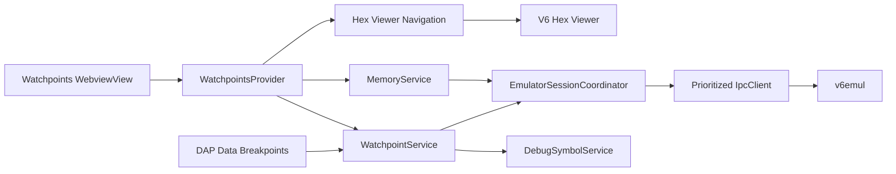

# V6 Watchpoints Panel Plan

**Status:** Ready for implementation with scoped deferrals
**Date:** 2026-08-01
**Owners:** v6vscode and v6emul maintainers
**Related work:** `debug-adapter-and-debug-views-plan.md`, Steps 3.3, 3.7, 3.13, 3.14, and 3.16; `hex-viewer-panel-plan.md`

## 1. Objective

Add a **V6 Watchpoints** panel to the built-in Run and Debug container. The panel presents one watchpoint per table row, supports reliable add/edit/enable/disable/delete operations, previews watched memory, and navigates the selected range into V6 Hex Viewer.

The backend watchpoint collection is authoritative. The panel and future DAP data-breakpoint support must share one extension-side service so they do not maintain contradictory copies. The webview is an untrusted presentation client and never invokes IPC directly.

## 2. VS Code Surface Decision

VS Code's native Breakpoints view can display DAP data breakpoints, but the extension API does not allow another extension to add custom columns, editable cells, row hover previews, or the requested table-specific context menus to that view. A `TreeDataProvider` also cannot provide a true multi-column editable table.

Contribute **V6 Watchpoints** as a `WebviewView` under `views.debug`, registered with `registerWebviewViewProvider`. Keep all models, validation, protocol operations, reconciliation, and Hex Viewer navigation outside the webview. If VS Code later exposes an extensible native watchpoint table, only the presentation adapter should need replacement.

The panel complements rather than replaces VS Code's native Breakpoints view:

- DAP data breakpoints created by VS Code and watchpoints created in this panel share one `WatchpointService` keyed by the backend watchpoint ID.
- A mutation through either surface is followed by a backend refresh and updates both surfaces.
- The existing protocol has no owner field. `DEBUG_WATCHPOINT_DEL_ALL` therefore deletes the complete backend collection, including watchpoints created by another connected client. The confirmation must say this explicitly.
- The panel is available only when `GET_SERVER_INFO` advertises `watchpointSchema: 1`, `watchpointServerAllocatedIds: true`, `watchpointEdit: true`, and the required watchpoint requests including `DEBUG_WATCHPOINT_EDIT`.

## 3. User Experience Contract

### 3.1 Placement and Table

The panel appears as **V6 Watchpoints** in the built-in Run and Debug sidebar. It is useful during both Run Project and V6 debug sessions when the connected emulator advertises structured watchpoint schema 1.

The table fills the view and contains these columns:

| Column | Content | Editing control |
|---|---|---|
| Activity | Enabled/disabled status icon and accessible text | Checkbox |
| Global Address | Six-digit global memory address in `0xNNNNNN` format | Numeric text input |
| Access | Read, Write, or Read/Write | Select control |
| Condition | Watchpoint comparison condition | Select control |
| Value | Comparison value in `0xNN` or `0xNNNN` format | Numeric text input |
| Type | `LEN` or `WORD` | Select control |
| Len | Positive decimal byte length | Number input |
| Comment | Optional user note | Text input |

Use a sticky header and stable column sizing. Activity, Access, Condition, Value, Type, and Len stay compact; Global Address has a fixed width for `0xNNNNNN`; Comment receives flexible width. At narrow widths, keep all fields available through horizontal scrolling rather than collapsing cells into an ambiguous card layout.

`DEBUG_WATCHPOINT_GET_ALL` is ordered by backend ID. Preserve that order and preserve selection and focus by ID across refreshes.

### 3.2 Display Formats

Activity displays an enabled or disabled icon, not color alone. The accessible label is `Enabled` or `Disabled`.

Global Address accepts:

- A numeric global address in decimal, `0x`, `$`, or `h` form.

The field presents the numeric wire `globalAddr` directly. Display and editor normalization always use uppercase six-digit hexadecimal in `0xNNNNNN` format, including Main RAM addresses. Accepted alternate numeric input is converted to that form on blur and after refresh.

Access displays `Read`, `Write`, or `Read/Write`.

Rules:

- Condition displays the explicit wire value `ANY`, `EQU`, `LESS`, `GREATER`, `LESS_EQU`, `GREATER_EQU`, or `NOT_EQU`.
- Value always displays uppercase hexadecimal: `0xNN` for `LEN` and `0xNNNN` for `WORD`. Accepted alternate numeric input is converted to that form on blur and after refresh, including when Condition is `ANY`.
- Type and Len are displayed in their own columns rather than being combined with Condition.
- `LEN` compares every matching read/write byte in `[globalAddr, globalAddr + len)` with the low 8 bits of `value`; any matching byte stops execution.
- `WORD` forces `len = 2`. The low-byte access at `globalAddr` and high-byte access at `globalAddr + 1` must both satisfy the same condition against the corresponding byte of the 16-bit `value` before execution stops. The backend latches the two matches until `CheckBreak` resets all watchpoint latches; it does not require both matches to come from one instruction.
- Length is a positive decimal byte count in `1..0xFFFF`; `globalAddr + len` must not exceed `Memory::MEMORY_GLOBAL_LEN`. For `LEN`, value is `0..0xFF`; for `WORD`, value is `0..0xFFFF`.
- Truncated visible text retains the complete accessible label and cell tooltip.

Comment is shown verbatim as plain text. Webview content is assigned through `textContent` or form values, never `innerHTML`.

### 3.3 Empty and Session States

The panel has explicit states:

- **No session:** table is empty; Add and bulk actions are disabled with `No active emulator session`.
- **Connecting/synchronizing:** preserve the last navigation state, disable mutations, and show progress.
- **Ready:** display the latest acknowledged backend snapshot.
- **Running:** mutations remain available when `watchpointMutationsWhileRunning` is true.
- **Unsupported backend:** explain which structured-schema capability or watchpoint request is unavailable.
- **Read failure:** retain the last acknowledged rows, mark the snapshot stale, log the failure, and expose Refresh.
- **Disconnected:** clear backend rows and pending edits; never carry a watchpoint identity into a new session.

An empty ready table states `No watchpoints`. It remains a valid context-menu target.

### 3.4 Context Menus

VS Code does not expose native menu contributions for arbitrary webview table cells. Implement an accessible custom DOM context menu using `role="menu"`, `role="menuitem"`, managed focus, arrow-key navigation, `Escape`, the Context Menu key, and `Shift+F10`.

Right-clicking empty table space or the empty state shows:

- **Add**
- **Disable All**
- **Delete All**

Right-clicking a watchpoint row shows:

- **Find in Hex Viewer**
- **Disable** or **Enable**, reflecting current activity
- **Delete**

Keep inapplicable actions visible and disabled:

- Add is disabled without a compatible active session or while a conflicting mutation is in flight.
- Disable All is disabled when there are no enabled watchpoints or mutation is unavailable.
- Delete All is disabled when there are no watchpoints or mutation is unavailable.
- Find in Hex Viewer is disabled when the range is unresolved, outside negotiated memory geometry, or Hex Viewer cannot represent that memory space.
- Disable is disabled for an already-disabled row; Enable is disabled for an already-enabled row.
- Delete is disabled while that row has an unacknowledged mutation.

**Delete All** invokes `DEBUG_WATCHPOINT_DEL_ALL`. It requires a VS Code modal confirmation containing the count and warning that the protocol has no ownership, so all backend watchpoints are deleted. **Disable All** sends `DEBUG_WATCHPOINT_EDIT` for each enabled row with its existing ID and all fields preserved except `active = false`, serially, then refreshes. It is idempotent and reports partial failures.

The menu closes on action, `Escape`, focus loss, scroll, edit start, snapshot replacement, session change, or panel disposal. Focus returns to the original row or the table body if the row was deleted.

### 3.5 Add and Inline Editing

Add inserts a draft row at the top of the table and focuses Global Address. Only one row may be edited at a time. A draft is local UI state until a complete valid model is submitted and acknowledged.

Double-clicking an editable table cell enters edit mode:

- Activity uses a checkbox.
- Global Address, Value, and Comment use single-line text inputs.
- Access uses a select control.
- Condition and Type use select controls; Len uses a number input. Each remains in its explicit table column.

Keyboard contract:

- `Enter` validates and applies the complete row, not merely the active field.
- `Escape` cancels the edit and restores the last acknowledged row; for a new draft it removes the draft.
- `Tab` and `Shift+Tab` move between editable fields without committing.
- `Space` toggles Activity when its checkbox has focus.
- A second double-click elsewhere first attempts to commit the current valid edit; if invalid, focus remains on the failing field.

Validation occurs immediately in the webview for basic usability and again authoritatively in the extension host. Invalid input keeps edit mode active, uses VS Code error styling, associates the message through `aria-describedby`, and sends no backend mutation. Validate:

- Global-address bounds and negotiated memory geometry.
- Access and enum values.
- Condition/value compatibility and numeric bounds.
- Type/length semantics and range overflow.
- The advertised `watchpointLimits.maxCommentBytes`.

Applying an edit follows the negotiated watchpoint protocol:

1. The webview sends the session generation, backend watchpoint ID for an existing row, and complete candidate model.
2. `WatchpointService` validates the candidate and encodes its configuration without inventing an ID.
3. For Add, send `DEBUG_WATCHPOINT_ADD` without an ID, then refresh with `DEBUG_WATCHPOINT_GET_ALL`; identify the new row by the ID-set difference and submitted configuration.
4. For Edit or per-row Enable/Disable, send `DEBUG_WATCHPOINT_EDIT` with the existing backend ID and the complete updated configuration. The ID must not change.
5. Serialize the mutation, disable conflicting actions, and reconcile with `DEBUG_WATCHPOINT_GET_ALL` after the response.
6. Exit edit mode only when the refreshed backend row matches the candidate. On validation or transport failure, restore the refreshed backend state and use `details.command` and `details.field` when available.

Do not optimistically show an unacknowledged model as active. Session generation, one serialized mutation queue, `DEBUG_WATCHPOINT_GET_UPDATES`, and post-mutation `DEBUG_WATCHPOINT_GET_ALL` verification are the available safeguards.

### 3.6 Hover Memory Preview

Hovering a row, or focusing it with the keyboard, shows a tooltip containing up to the first 16 bytes in the watchpoint's resolved range followed by their character representation:

```text
F3 AF 32 00 41    ..2.A
```

Formatting rules:

- Display bytes as uppercase two-digit hexadecimal separated by one space.
- Display one character per byte after four spaces.
- Use literal printable ASCII for `0x20..0x7E`; use `.` for other values.
- Show at most `min(length, 16)` bytes and characters.
- If the watchpoint range exceeds 16 bytes, append `...` after the character preview and expose `Showing first 16 of N bytes` in the accessible description.
- If some bytes are unreadable, display `--` and `.` in their positions.
- While loading, show `Reading memory...`; on failure show `Memory preview unavailable` without hiding the row's configuration tooltip.

The extension host obtains previews through the shared `MemoryService` at normal IPC priority. The webview sends only a stable row identity and session generation; it never supplies a global read address. The service derives and bounds the range from its acknowledged model.

Use a 150 ms hover delay and cancel the request when hover/focus leaves, the row changes, the view hides, or the session generation changes. Cache previews by `(session generation, backend watchpoint ID, globalAddr, len)` while paused. While running, reuse a cached preview for at most one second only when coherent live reads are advertised. Never poll every row and never read more than 16 bytes for a tooltip.

Use an accessible custom tooltip rather than relying only on the HTML `title` attribute. It must be hoverable, use `role="tooltip"`, be connected with `aria-describedby`, remain on screen, and contain text only.

### 3.7 Find in Hex Viewer

**Find in Hex Viewer** performs a typed host-side handoff:

1. Resolve the acknowledged watchpoint to `MemorySpace`, start offset, and inclusive end offset.
2. Validate the range against current session capabilities.
3. Call `HexViewerProvider.revealRange` with that typed range.
4. Reveal/focus the contributed view with VS Code's generated `v6.hexViewer.focus` command.
5. Select the matching memory bank, put the canonical range into Hex Viewer's search field, scroll to the first byte, and highlight the inclusive range.

Extend `HexViewerProvider` with a public `revealRange` operation. If its webview has not resolved yet, retain one pending navigation in extension-host state and apply it after the `ready` handshake. Newer navigation replaces older pending navigation. The handoff must work when Hex Viewer is hidden, collapsed, or not yet created.

Do not send messages directly from one webview to another, synthesize private UI events, or flatten a banked address into a Main RAM query. Hex Viewer revalidates the session generation and memory-space geometry before applying navigation. Search history records the canonical range only after successful application.

## 4. Domain Model and Synchronization

### 4.1 Canonical Model

Use the structured schema directly at the IPC boundary and map its named values to presentation labels only in the UI:

```ts
interface Watchpoint {
    id: number;
    globalAddress: number;
    length: number;
    value: number;
    access: 'read' | 'write' | 'readWrite';
    condition: 'any' | 'equal' | 'notEqual' | 'less' | 'lessEqual' | 'greater' | 'greaterEqual';
    type: 'length' | 'word';
    active: boolean;
    comment: string;
}
```

  Wire values are `R | W | RW`, `ANY | EQU | LESS | GREATER | LESS_EQU | GREATER_EQU | NOT_EQU`, and `LEN | WORD`. Runtime hit state is not serialized. `DEBUG_WATCHPOINT_ADD` creates without `id`; `DEBUG_WATCHPOINT_EDIT` requires the unchanged backend ID and complete configuration. `DEBUG_WATCHPOINT_GET_ALL` returns assigned IDs. All returned watchpoints are visible because schema 1 has no ownership field.

### 4.2 WatchpointService

Introduce one session-scoped `WatchpointService` as the sole extension authority for watchpoint state. It owns:

- Schema/capability checks and structured response validation.
- Runtime validation and memory-space conversion.
- Backend IDs and immutable decoded snapshots.
- Add through `DEBUG_WATCHPOINT_ADD`, edit through `DEBUG_WATCHPOINT_EDIT`, delete-all through `DEBUG_WATCHPOINT_DEL_ALL`, delete through `DEBUG_WATCHPOINT_DEL`, updates through `DEBUG_WATCHPOINT_GET_UPDATES`, and full snapshots through `DEBUG_WATCHPOINT_GET_ALL`.
- Serialized mutations and post-mutation reconciliation.
- DAP `dataBreakpointInfo` and `setDataBreakpoints` mapping.
- Canonical `0xNNNNNN` display for each numeric global address.
- Change events consumed by the panel, DAP adapter, and tests.

The panel provider does not call `IpcClient` for watchpoint mutations. The DAP adapter does not maintain a second watchpoint map. Both call this service.

### 4.3 Session and Concurrency Rules

- Every UI operation carries the active session generation and backend watchpoint ID.
- Serialize mutations through the coordinator at high priority; reads and tooltip previews use normal priority.
- Coalesce duplicate refresh requests, but never coalesce distinct mutations.
- `DEBUG_WATCHPOINT_GET_UPDATES` returns `{ updates: uint32 }`. Successful adds and effective deletes increment it; rejected requests, unknown-ID deletes, and clearing an empty collection do not. Compare it with the last observed value; when it changes, refresh with `DEBUG_WATCHPOINT_GET_ALL`. Handle wraparound as “changed,” not as an ordering error.
- On reconnect, clear local state and fetch `DEBUG_WATCHPOINT_GET_ALL`. Never assume old IDs remain valid.
- Because the protocol has no ownership or revisions, the service cannot prevent another client from changing the same ID between requests. It detects divergence by refreshing after every mutation.
- If a DAP replacement conflicts with an active panel edit, cancel the edit and refresh rather than silently hiding backend state.

## 5. Emulator Protocol Contract

Require `watchpointSchema: 1`, `watchpointServerAllocatedIds: true`, `watchpointEdit: true`, and the existing requests:

| Command | ID | Panel use |
|---|---:|---|
| `DEBUG_WATCHPOINT_ADD` | 69 | Create from complete structured configuration without `id` |
| `DEBUG_WATCHPOINT_DEL_ALL` | 70 | Delete every backend watchpoint; no-op when already empty |
| `DEBUG_WATCHPOINT_DEL` | 71 | Delete one backend ID; unknown ID is a no-op |
| `DEBUG_WATCHPOINT_GET_UPDATES` | 72 | Return the current non-consuming `uint32_t` mutation counter as `{ updates }` |
| `DEBUG_WATCHPOINT_GET_ALL` | 73 | Return an ID-ordered structured array; empty is `[]` |
| `DEBUG_WATCHPOINT_EDIT` | 94 | Replace complete configuration for an existing `id` while preserving that ID |

The client protocol models are:

```ts
interface WatchpointAddRequest {
    globalAddr: number;
    len: number;
    value: number;
    access: 'R' | 'W' | 'RW';
    condition: 'ANY' | 'EQU' | 'LESS' | 'GREATER' | 'LESS_EQU' | 'GREATER_EQU' | 'NOT_EQU';
    type: 'LEN' | 'WORD';
    active: boolean;
    comment: string;
}

interface WatchpointEditRequest extends WatchpointAddRequest {
    id: number;
}

type WatchpointEntry = WatchpointEditRequest;

interface WatchpointDelRequest {
    id: number;
}
```

Request and response behavior:

1. The server rejects missing, mistyped, out-of-range, and unknown fields with machine-readable `details.command` and `details.field`.
2. `DEBUG_WATCHPOINT_ADD` allocates a backend ID; `DEBUG_WATCHPOINT_EDIT` updates the matching ID or returns `invalid_request` when it is unknown.
3. Mutating requests may be sent while execution is running when `watchpointMutationsWhileRunning` is true.
4. `DEBUG_WATCHPOINT_GET_ALL` is the authoritative structured snapshot and is ordered by ID.
5. Successful adds and effective deletes change the update counter; rejected requests and no-op deletes/clears do not.

Verify with focused client and live-server contract tests:

1. Every named enum, boundary range, comment limit, and unknown field.
2. ID-set reconciliation after Add and stable-ID verification after updates.
3. Running-state mutations and update-counter no-op behavior.
4. Machine-readable validation detail propagation into panel errors.

Do not add invented command names or payload fields to this plan. If the existing commands cannot implement a required interaction safely, record that interaction as blocked and propose a backend change in a separate protocol design.

The existing requests do not expose reliable stop reason or watchpoint hit identity. Unified stop attribution remains intentionally deferred and blocks accurate DAP `stopped` events for data breakpoints, but not the panel's CRUD UI.

## 6. Architecture



### 6.1 Component Boundaries

**`EmulatorSessionCoordinator`** owns session generation, negotiated capabilities, execution state, prioritized IPC access, reconnect, and teardown.

**`WatchpointService`** owns canonical state and all backend watchpoint operations. It exposes immutable snapshots and typed commands, with no VS Code or DOM dependency.

**`WatchpointsProvider`** owns webview lifecycle, message validation, edit orchestration, context-menu requests, tooltip cancellation, visibility, and conversion of service events to view snapshots.

**`MemoryService`** owns preview reads, typed memory-space mapping, bounds, coherence, caching, and cancellation.

**`HexViewerNavigationService`** or the public `HexViewerProvider.revealRange` contract owns cross-view navigation. It accepts typed ranges, not strings supplied by the Watchpoints webview.

**Webview assets** own table rendering, local draft state, focus, menus, tooltips, keyboard behavior, and stale-message rejection. Treat all incoming webview messages as untrusted.

### 6.2 Proposed Source Layout

```text
src/
  debug/
    watchpoints/
      watchpoint-model.ts
      watchpoint-codec.ts
      watchpoint-service.ts
      watchpoint-validator.ts
    views/
      watchpoints-provider.ts
      watchpoints-messages.ts
      watchpoints-format.ts
      assets/
        watchpoints.css
        watchpoints.js
  emulator/
    protocol/
      watchpoint-models.ts
test/
  unit/debug/watchpoints/
  unit/debug/views/
  integration/watchpoints/
  features/watchpoints/
```

Keep compact formatting, address grammar, validation, reducer-style view state, and enablement calculations in pure modules for fast exhaustive tests.

## 7. Webview Security and Accessibility

- Use a CSP nonce, no inline executable scripts, and narrow `localResourceRoots`.
- Validate message discriminants, field types, lengths, session generation, and backend row identity in the extension host.
- Never trust a global address, backend ID, command enablement, or memory range supplied by the webview.
- Render user and memory-derived text without HTML interpretation.
- Do not log preview bytes, condition values, or comments by default.
- Use VS Code theme tokens and support dark, light, high-contrast, reduced-motion, 200% zoom, and narrow sidebars.
- Use semantic grid roles, column headers, row labels, roving `tabindex`, and stable focus across snapshot refreshes.
- Announce mutation success/failure and external row changes through a polite live region without repeatedly reading the whole table.
- Make every mouse operation available through the keyboard.

## 8. VS Code Contributions

Add to `package.json`:

- `views.debug`: `v6.watchpoints`, type `webview`, name `V6 Watchpoints`.
- `onView:v6.watchpoints` activation event.
- `v6.refreshWatchpoints` with `$(refresh)` in `view/title`.
- `v6.addWatchpoint` with `$(add)` in `view/title` when a compatible session is active.

Maintain context keys from coordinator/service state:

- `v6.watchpoints.available`
- `v6.watchpoints.canMutate`
- `v6.watchpoints.hasRows`
- `v6.watchpoints.hasEnabledRows`

Webview row menu enablement remains derived from the host-provided snapshot. Context keys support view-title commands and command palette visibility, not security decisions.

## 9. Lifecycle and Failure Handling

- Register listeners and timers through disposables; hidden or disposed views perform no refresh or hover work.
- Refresh immediately after an acknowledged mutation, `DEBUG_WATCHPOINT_GET_UPDATES` counter change, stop event, reconnect, artifact replacement, or explicit Refresh.
- While visible, poll `DEBUG_WATCHPOINT_GET_UPDATES` and fetch `DEBUG_WATCHPOINT_GET_ALL` only when the counter differs from the last observed value. Suspend polling while hidden.
- Preserve no backend watchpoint state in `workspaceState`. The backend/session service is authoritative.
- Persist only presentation preferences such as column widths after they prove useful; version the persisted schema.
- On malformed backend data, reject the complete invalid entry, retain the last valid snapshot, and log request, field, and error code.
- On partial bulk failure, show exact failed row names, reconcile immediately, and avoid claiming full success.
- On session loss during edit, cancel the draft, disable actions, and never replay it automatically into the next session.
- Debug symbol reload does not alter watchpoint display or retarget backend addresses; Global Address always presents the numeric wire value.

## 10. Delivery Plan

### Phase 0 - Protocol and Semantics

1. Freeze LEN versus WORD, condition/value width, address-range crossing, read/write hit timing, and enabled-state semantics in `docs/debug-protocol.md`.
2. Verify structured schema 1, boundary ranges, validation details, deterministic snapshots, and running-state behavior with live-server tests.
3. Add extension runtime validators and representative responses for the watchpoint requests.
4. Package and smoke-test the verified emulator.

**Gate:** Add/list/edit/disable/delete/delete-all round trips are proven with exact lossless wire payloads; reconnect and malformed requests do not corrupt state or hang the server.

### Phase 1 - Shared Watchpoint Domain

1. Add canonical models, codecs, runtime validators, and compact formatters.
2. Implement `WatchpointService` with immutable structured snapshots, serialized mutations, and `DEBUG_WATCHPOINT_GET_ALL` verification.
3. Route future DAP data-breakpoint reconciliation through the service; do not advertise accurate hit events until the backend exposes hit identity.
4. Integrate symbol resolution and typed memory spaces.

**Gate:** Unit and stateful fake-backend tests pass for schema negotiation, structured validation, stable-ID CRUD, partial Disable All failure, reconnect, and DAP synchronization.

### Phase 2 - Panel and Editing

1. Contribute and register `v6.watchpoints`.
2. Build the accessible table, empty/session states, custom context menus, and view-title commands.
3. Implement add and one-row-at-a-time editing with host-side validation and acknowledged commits.
4. Implement serialized Disable All and explicitly global Delete All with confirmation UX.

**Gate:** Keyboard-only and mouse workflows pass in default light, dark, and high-contrast themes, including invalid edits and backend failures.

### Phase 3 - Preview and Hex Viewer Integration

1. Add cancellable 16-byte preview reads through `MemoryService`.
2. Implement custom hover/focus tooltips with bytes and characters.
3. Add typed `revealRange` navigation to Hex Viewer, including pending navigation before webview readiness.
4. Verify bank selection, canonical search range, scrolling, and highlighting for Main RAM and every RAM-disk bank.

**Gate:** Hover and navigation never read outside the acknowledged range, never cross sessions, and do not delay debug control beyond existing latency targets.

### Phase 4 - Hardening and Operations

1. Add extension-host and real-emulator tests.
2. Add metrics for list/mutation duration, partial bulk failures, stale responses dropped, preview duration, and IPC queue delay without logging watched data.
3. Test rapid editing, external changes, session cycling, panel hide/reveal, debugger restart, and emulator failure.
4. Update debugging, emulator, commands, architecture, protocol, and broader feature-plan documentation.

**Gate:** No leaked listeners/timers, no accidental single-row overwrite, no stale cross-session display, and no regression in stepping, frame polling, or Hex Viewer responsiveness.

## 11. Test Strategy

### Unit Tests

- Every address/name grammar form, memory space, boundary, ambiguity, and range overflow.
- Access, condition, value, type, and length enum validation and compact formatting.
- Printable, space, non-printable, unreadable, exactly 16-byte, and truncated preview formatting.
- Context-menu enablement for empty, mixed enabled/disabled, pending, unsupported, and disconnected states.
- Edit reducer behavior for Enter, Escape, Tab, session replacement, validation errors, and failed commits.
- Stable identity and focus after add, update, delete, refresh, and external changes.
- Structured model rejection of invalid enums, impossible lengths, unknown fields, and oversized comments.
- Stable-ID edit reconciliation, serialized Disable All, and global Delete All confirmation.
- DAP/panel shared reconciliation without claiming unavailable stop-hit identity.
- Symbol re-resolution after artifact replacement.
- Pending Hex Viewer navigation replacement and session validation.

### Integration and Extension Host Tests

- Contribution registration, activation, CSP/resources, command routing, and context keys.
- Add/edit/enable/disable/delete through webview messages and a stateful fake backend.
- Disable All updates every enabled backend entry; Delete All warns and removes the complete backend collection.
- Delete All confirmation cancel and accept paths.
- Delayed mutation response followed by a newer snapshot or disconnect.
- Hover cancellation, hidden-view behavior, cache invalidation, and read failure.
- Find in Hex Viewer when open, hidden, collapsed, unresolved, and not yet instantiated.
- DAP `setDataBreakpoints` changes appear in the panel and panel mutations update DAP state/events as required.
- Forged session IDs, backend IDs, addresses, and command enablement are rejected.

### Real-Emulator Tests

- Add and hit read, write, and read/write watchpoints in Main RAM and each supported RAM-disk bank.
- Verify every condition and LEN/WORD boundary behavior against known instructions.
- Preview first/last bytes of memory and a range crossing the 16-byte preview limit.
- Find each watchpoint range in Hex Viewer and verify bank, query, viewport, and highlight.
- Verify that external watchpoints appear after update/list refresh; document that Delete All removes them because the backend has no ownership.
- Run with display, Hardware Statistics, Hex Viewer, Variables, and stop polling active.
- Repeat 1,000 mixed edits and 100 session cycles without leaked state or increasing latency.
- Disconnect during add, edit, bulk disable, bulk delete, preview, and navigation.

## 12. Acceptance Criteria

### Functional

- V6 Watchpoints appears in Run and Debug and uses a table with Activity, Global Address, Access, Condition, Value, Type, Len, and Comment columns.
- Empty-space and row context menus contain the requested actions, with inapplicable actions visible and disabled.
- Double-clicking an editable cell enters an appropriate editor; Enter applies the complete valid row and Escape cancels it.
- Add, edit, enable/disable, delete, Disable All, and Delete All update backend and UI state only after acknowledgement.
- Global Address displays `0xNNNNNN`; Value displays `0xNN` for LEN or `0xNNNN` for WORD, and Condition, Value, Type, and Len use separate columns.
- Hovering or focusing a row shows at most 16 bytes and corresponding characters from the watchpoint range.
- Find in Hex Viewer opens/reveals Hex Viewer, selects the correct memory space, enters the inclusive range, scrolls to it, and highlights it.
- Panel and future DAP data breakpoints share backend IDs and one refreshed service snapshot.

### Reliability and Security

- Single-row updates preserve and modify only the selected backend ID; Delete All is explicitly global.
- Stale webview messages, tooltip responses, and session generations cannot overwrite current state; `DEBUG_WATCHPOINT_GET_ALL` restores backend truth after each mutation.
- Invalid edits and malformed protocol payloads produce actionable errors without crashing the extension host or emulator.
- Disconnect/reconnect never replays drafts or associates an old watchpoint ID with a new session.
- Hidden/disposed panels have no polling, hover reads, or retained pending mutations.

### Performance

- Opening or refreshing the panel performs one bounded list/update operation, not one request per row.
- A preview reads no more than 16 bytes and starts only after the hover delay.
- Panel rendering remains responsive with the backend maximum watchpoint count; virtualize rows only if measured counts make it necessary.
- Watchpoint list and mutation traffic uses priorities that preserve stop/control latency targets with display and Hex Viewer active.
- p95 acknowledged single-row mutation is under 100 ms locally; p95 cached tooltip display is under 50 ms and uncached preview is under 100 ms.

### Accessibility

- The entire table, editing flow, menus, tooltips, bulk commands, and Hex Viewer navigation work without a mouse.
- Screen readers receive column names, row position, activity, full condition, errors, pending state, and preview text.
- Focus remains visible and stable through refreshes and mutation acknowledgement.
- At 200% zoom and narrow sidebar widths, fields do not overlap or become unreachable.

## 13. Principal Risks and Mitigations

| Risk | Consequence | Mitigation |
|---|---|---|
| An update changes or duplicates the backend ID | UI/backend identity divergence | Require stable-ID update semantics and reconcile after every mutation |
| Delete All removes external state | Data loss in another debugger client | Explicit global warning and confirmation before `DEBUG_WATCHPOINT_DEL_ALL` |
| DAP and panel maintain separate maps | Duplicate or contradictory watchpoints | One session-scoped `WatchpointService` |
| Address/name edits silently retarget data | Debugging the wrong memory | Typed spaces, explicit symbol re-resolution, acknowledged snapshots |
| Delayed responses overwrite newer edits | UI/backend divergence | One serialized mutation queue, session generation, and authoritative list reconciliation |
| Hover previews overload IPC | Sluggish stepping and frames | Delay, cancellation, 16-byte cap, cache, visibility gating, normal priority |
| Cross-webview messages are brittle | Navigation fails when a view is hidden | Host-side typed navigation with pending-ready handoff |
| Custom table has poor accessibility | Mouse-only or unreadable debugging | Semantic grid, native form controls, roving focus, ARIA errors/tooltips, theme tests |
| Backend capability is absent or incompatible | Invalid requests or state assumptions | Require schema 1, server IDs, running-mutation capability, and advertised limits |
| Large row count causes DOM churn | Sidebar latency | Measure first; add stable row virtualization only when required |

## 14. Open Decisions Before Implementation

1. Decide whether the UI permits a LEN range to cross a 64 KiB bank boundary even though the backend uses one linear global address space; this plan keeps one watchpoint within one Hex Viewer space.
2. Decide whether panel-created watchpoints persist across emulator restart; this plan assumes backend session state and no workspace replay.
3. Decide how an externally removed DAP watchpoint is communicated to VS Code without issuing an unsolicited `setDataBreakpoints` request.
4. Decide whether a future address picker should resolve symbols; version 1 displays and edits numeric global addresses only.
5. Define the future unified stop-record API needed for precise watchpoint hit attribution.

These decisions constrain DAP synchronization, symbol presentation, persistence, and cross-bank navigation, but do not block panel CRUD against the structured backend protocol.

## 15. Implementation Checklist

### Backend and Domain

- [x] Document structured watchpoint schema 1, validation, limits, snapshots, and update-counter semantics.
- [x] Verify schema-1 validation, CRUD, stable-ID editing, snapshots, capabilities, and update-counter behavior with executable v6emul IPC tests; verify legacy packed payloads are rejected.
- [x] Record accurate data-breakpoint stop events as blocked until backend hit identity exists.
- [x] Add v6vscode structured request/entry models and watchpoint capability validation, including command 94.
- [x] Implement runtime payload validators and `WatchpointService` with serialized, backend-verified CRUD.
- [ ] Integrate DAP data breakpoints with the shared service.

### Panel

- [x] Contribute and register `v6.watchpoints` and title commands.
- [x] Implement table, states, formatting, keyboard navigation, and accessible menus.
- [x] Implement add and backend-verified inline editing.
- [x] Implement stable-ID enable/disable, delete, serialized Disable All, and confirmed global Delete All.
- [x] Implement preview tooltips with bounded reads and cancellation.

### Hex Viewer Integration

- [x] Add typed host-side `revealRange` navigation.
- [x] Support pending navigation before Hex Viewer readiness.
- [ ] Validate Main RAM and RAM-disk range handoff end to end against a real emulator.

### Verification and Documentation

- [x] Add focused unit tests for runtime validation, serialized CRUD, capability gating, running-state mutation gating, and global-address mapping.
- [ ] Add watchpoint integration, extension-host, and real-emulator tests.
- [x] Run compile, lint, focused unit, regression, package, diagnostics, and whitespace verification.
- [ ] Run the full unit suite without the two existing DWARF fixture failures, plus integration and real-emulator feature verification.
- [x] Update `docs/debugging.md`, `docs/emulator.md`, `docs/commands.md`, and `docs/architecture.md`.
- [x] Record the client protocol contract in this plan and `v6emul-watchpoint-protocol-feedback.md`; the authoritative wire protocol is maintained in v6emul's `docs/ipc-protocol.md`, so no duplicate local `docs/debug-protocol.md` exists.
- [x] Link this plan from the broader debug feature plan and record implementation status there.