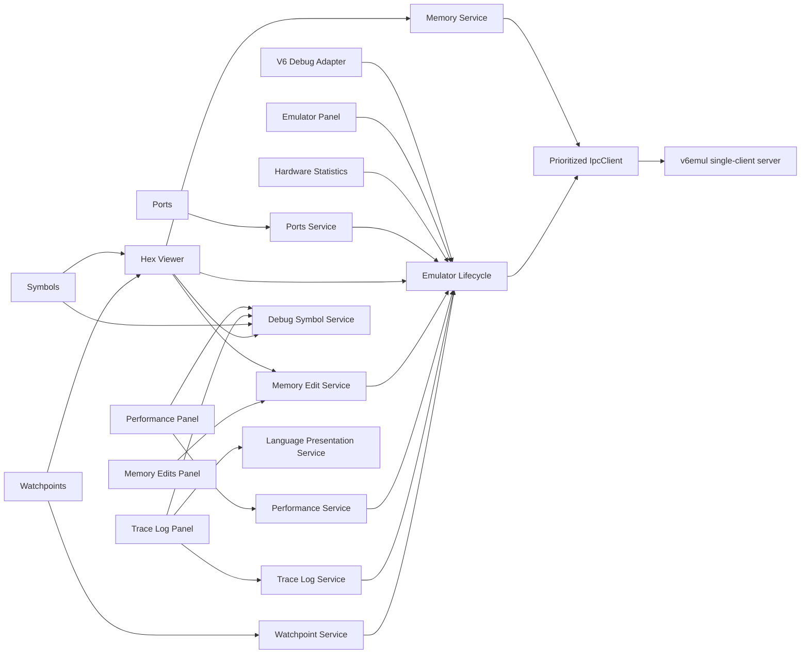

# Architecture Overview

The extension is organized into layers: platform infrastructure, configuration, and the composition root.

## Platform Layer (`src/platform/`)

Infrastructure services with no domain logic:

- **`logging/logger.ts`** — Output channel wrapper with configurable log levels (error, warn, info, debug). Reads `v6.logLevel` setting.
- **`errors/error-codes.ts`** — Typed `ErrorCode` enum: `CONFIG_INVALID`, `EMULATOR_NOT_FOUND`, `EXECUTABLE_NOT_FOUND`, `EMULATOR_LAUNCH_FAILED`, `IPC_CONNECTION_REFUSED`, `IPC_TIMEOUT`, `IPC_DECODE_ERROR`.
- **`errors/v6-error.ts`** — `V6Error extends Error` with `code` and optional `cause`.
- **`files/path-service.ts`** — Path resolution: `${extension}` token expansion, relative-to-absolute resolution, extension-rooted paths.
- **`files/workspace-service.ts`** — Thin accessor for `vscode.workspace.workspaceFolders`.
- **`process/process-runner.ts`** — Async `spawn()` wrapper returning `{ process, exitPromise }`.
- **`disposable/lifecycle.ts`** — `toDisposable(fn)` helper and `DisposableStore` for managing multiple disposables.

## Config (`src/config/`)

- **`contribution-ids.ts`** — Centralized command IDs (`v6.createProject`, `v6.runProject`), setting keys, and output channel name.

## Extension Entry Point (`src/extension.ts`)

Composition root. Creates platform and project services, registers commands, pushes all disposables onto `context.subscriptions`. On activation, project discovery and active project resolution are available on demand.

## Debug Session Boundary

`EmulatorLifecycle` is the shared process/socket owner for ordinary runs and debug launches. `V6DebugAdapter` borrows the lifecycle's `IpcClient`; `EmulatorPanel` renders frames through that same client. `IpcClient` serializes requests and orders queued work by priority, with debugger control above telemetry and display frames.

Source debugging loads a final companion ELF through `debug-artifact-loader.ts`. The immutable debug index maps source lines to CPU addresses and CPU addresses back to source locations. A shared debug-source path resolver maps relative and single-rooted DWARF paths against the active project/workspace root for Symbols, Hex Viewer, and DAP stack frames. Shared source navigation reuses visible or inactive open text tabs before creating a preview. ROM/ELF byte mismatches fail metadata loading before source breakpoints can be verified.

The Hex Viewer is a standalone editor `WebviewPanel` opened from the `v6emul` view container or Command Palette. `MemoryService` validates negotiated bank-aware read capabilities, owns a complete validity-tracked cache for Main RAM and 32 RAM-disk banks, and requests only the selected bank's visible interval. `DebugSymbolService` exposes validated metadata for symbol search and exact source navigation without coupling the panel to the DAP adapter. `HexViewerProvider` owns session orchestration, persistence, clipboard access, and webview message validation; browser assets own virtualization and keyboard interaction.

The Memory Edits tool is a standalone editor `WebviewPanel` backed by the same `MemoryEditService` used for Hex Viewer writes. The service validates memory-edit schema 1 and advertised limits, serializes mutations, rejects stale connection responses, and replaces its immutable state from `DEBUG_MEMORY_EDIT_GET_ALL` after every mutation. Original/current values remain server-owned; panel disposal stops polling without changing backend records.

The Performance tool is a standalone editor `WebviewPanel` backed by `PerformanceService`. The service validates CodePerf schema 1 and advertised limits, serializes ID-based mutations, rejects stale connection responses, and replaces immutable state from `DEBUG_CODE_PERF_GET_ALL` after every mutation. Start and end fields use the shared symbol-expression evaluator; the panel preserves the exact entered expressions by server ID while sending only evaluated numeric addresses over IPC. Visible panels poll once per second for sampled statistics; source navigation resolves the acknowledged start address through `DebugSymbolService`.

The Trace Log tool is a standalone editor `WebviewPanel` backed by `TraceLogService`. The service validates trace-log schema 1, creates paused-only immutable filters, retrieves aligned indexed windows, and rejects stale session/filter generations. Host and browser caches retain three windows; the browser renders only visible fixed-height rows. `TraceLogPanel` resolves exact address metadata and delegates source or standalone listing preparation to `LanguagePresentationService`, keeping protocol, language, and DOM ownership separate.

The Scripts tool is a standalone editor `WebviewPanel` backed by `ScriptService`. The service validates script schema 1, portable path inputs, compilation/runtime unions, stable IDs, and collection revisions; it serializes mutations, applies coherent mutation responses, and refreshes after collection-only operations or revision changes. `ScriptsPanel` owns lifecycle, persistence, confirmations, and clipboard access, while its webview owns local glob filtering, drafts, focus, menus, and error-row presentation.

The Symbols tool is a standalone editor `WebviewPanel` backed by the same `DebugSymbolService` as Hex Viewer. Its pure query module unions configurable name matching with exact expression-value matches while preserving duplicate symbols through generation-scoped IDs. The provider owns artifact loading, clipboard/source actions, persistence, and typed Hex Viewer handoff; its webview owns history, incremental list rendering, and accessible menus.

The Watchpoints tool is another standalone editor `WebviewPanel`. A session-scoped `WatchpointService` validates schema-1 payloads, serializes mutations, and reconciles every mutation with the backend's authoritative ID-ordered snapshot. The provider validates webview messages, performs bounded memory previews, and hands typed ranges to Hex Viewer. Accurate DAP data-breakpoint stop attribution remains disabled until v6emul exposes watchpoint hit identity.

Hardware Statistics is a Run and Debug `WebviewView`. `HardwareStatisticsService` validates schema-1 snapshots, rejects stale session generations, coalesces refreshes, and serializes verified palette/FDD mutations. `HardwareStatisticsProvider` owns clipboard and file-dialog access, dirty-image decisions, and the typed webview message boundary.

Ports is an independent editor `WebviewPanel`. `PortsService` validates complete 256-byte In/Out payloads, coalesces visible paused refreshes, rejects stale session responses, and derives changed addresses from consecutive accepted snapshots. `PortsProvider` owns panel lifecycle and posts immutable table snapshots to the webview.
